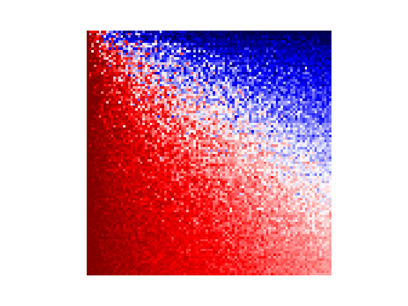
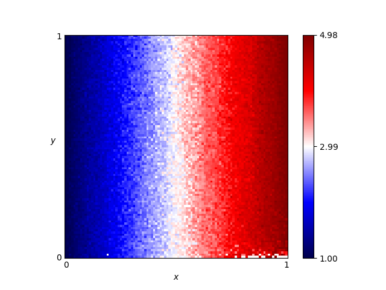

# Ashlock fingerprints

See:
[axelrod.readthedocs.io/en/latest/tutorials/further_topics/fingerprinting.html#fingerprinting] (http://axelrod.readthedocs.io/en/latest/tutorials/further_topics/fingerprinting.html#fingerprinting)

All strategies included from Axelrod version 1.19.0.

This README.md file is autogenerated by running:

```python
$ python update_fingerprints.py
```

Each individual fingerprint can be obtained by running:

```python
import axelrod as axl
fp = axl.AshlockFingerprint(strategy, probe)
fp.fingerprint()
fp.plot()
```
    

## Adaptive


    

## Adaptive Tit For Tat


    

## Aggravater


    

## ALLCorALLD


    