# Ashlock fingerprints

See:
[axelrod.readthedocs.io/en/latest/tutorials/further_topics/fingerprinting.html#fingerprinting](http://axelrod.readthedocs.io/en/latest/tutorials/further_topics/fingerprinting.html#fingerprinting)

All strategies included from Axelrod version 3.5.0 and all strategies from
axelrod_fortran version 0.3.1

This README.md file is autogenerated by running:

```
$ python update_fingerprints.py
```

Each individual fingerprint can be obtained by running:

```python
import axelrod as axl
fp = axl.AshlockFingerprint(strategy, probe)
fp.fingerprint(turns=200, repetitions=100)
fp.plot()
```

# Axelrod library fingerprints

    

## Adaptive


[data (csv)](./assets/Adaptive.csv)
    

## Adaptive Tit For Tat


[data (csv)](./assets/Adaptive_Tit_For_Tat.csv)
    

## Aggravater


[data (csv)](./assets/Aggravater.csv)
    

## Alexei

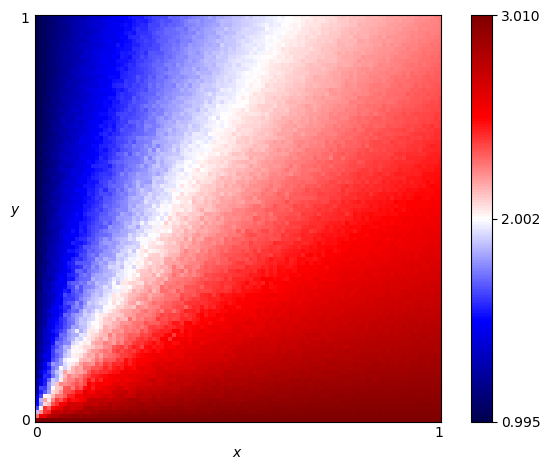

[data (csv)](./assets/Alexei.csv)
    

## ALLCorALLD


[data (csv)](./assets/ALLCorALLD.csv)
    

## Alternator


[data (csv)](./assets/Alternator.csv)
    

## Alternator Hunter


[data (csv)](./assets/Alternator_Hunter.csv)
    

## AntiCycler


[data (csv)](./assets/AntiCycler.csv)
    

## Anti Tit For Tat


[data (csv)](./assets/Anti_Tit_For_Tat.csv)
    

## Adaptive Pavlov 2006

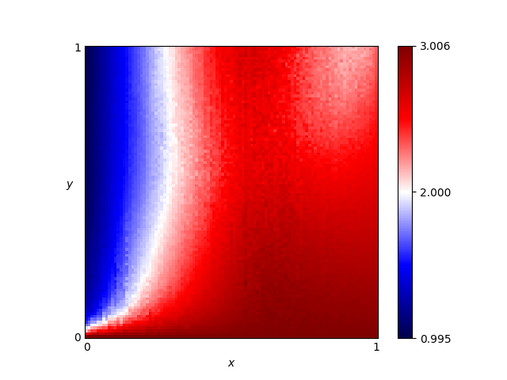

[data (csv)](./assets/Adaptive_Pavlov_2006.csv)
    

## Adaptive Pavlov 2011

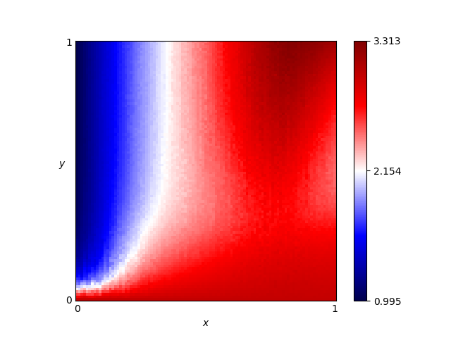

[data (csv)](./assets/Adaptive_Pavlov_2011.csv)
    

## Appeaser


[data (csv)](./assets/Appeaser.csv)
    

## Arrogant QLearner


[data (csv)](./assets/Arrogant_QLearner.csv)
    

## Average Copier


[data (csv)](./assets/Average_Copier.csv)
    

## Better and Better

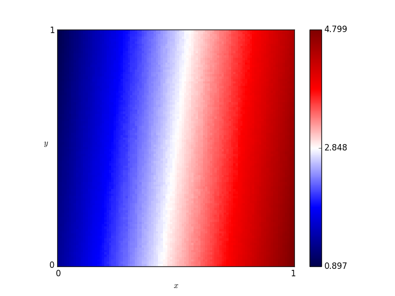

[data (csv)](./assets/Better_and_Better.csv)
    

## BackStabber


[data (csv)](./assets/BackStabber.csv)
    

## Bully


[data (csv)](./assets/Bully.csv)
    

## Calculator


[data (csv)](./assets/Calculator.csv)
    

## Cautious QLearner


[data (csv)](./assets/Cautious_QLearner.csv)
    

## Champion


[data (csv)](./assets/Champion.csv)
    

## CollectiveStrategy


[data (csv)](./assets/CollectiveStrategy.csv)
    

## Contrite Tit For Tat


[data (csv)](./assets/Contrite_Tit_For_Tat.csv)
    

## Cooperator


[data (csv)](./assets/Cooperator.csv)
    

## Cooperator Hunter


[data (csv)](./assets/Cooperator_Hunter.csv)
    

## Cycle Hunter


[data (csv)](./assets/Cycle_Hunter.csv)
    

## Cycler CCCCCD


[data (csv)](./assets/Cycler_CCCCCD.csv)
    

## Cycler CCCD


[data (csv)](./assets/Cycler_CCCD.csv)
    

## Cycler CCD


[data (csv)](./assets/Cycler_CCD.csv)
    

## Cycler DC


[data (csv)](./assets/Cycler_DC.csv)
    

## Cycler DDC


[data (csv)](./assets/Cycler_DDC.csv)
    

## Cycler CCCDCD


[data (csv)](./assets/Cycler_CCCDCD.csv)
    

## Davis


[data (csv)](./assets/Davis.csv)
    

## DBS

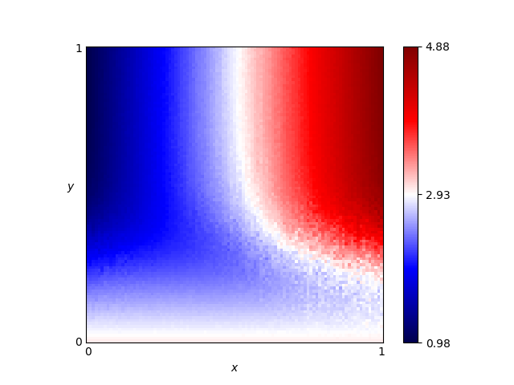

[data (csv)](./assets/DBS.csv)
    

## Defector


[data (csv)](./assets/Defector.csv)
    

## Defector Hunter


[data (csv)](./assets/Defector_Hunter.csv)
    

## Desperate


[data (csv)](./assets/Desperate.csv)
    

## DoubleCrosser


[data (csv)](./assets/DoubleCrosser.csv)
    

## Doubler


[data (csv)](./assets/Doubler.csv)
    

## DoubleResurrection

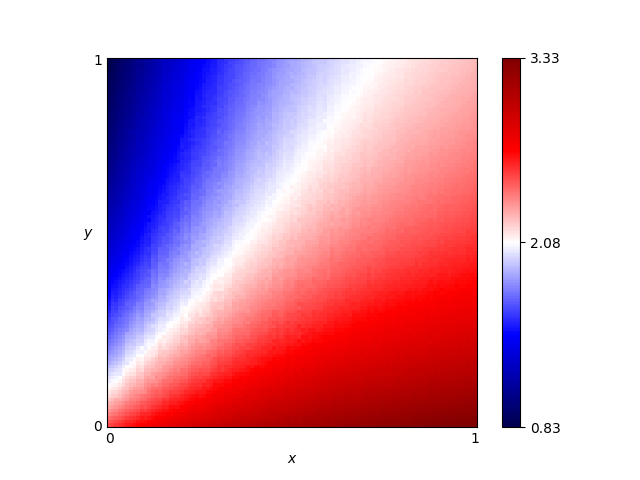

[data (csv)](./assets/DoubleResurrection.csv)
    

## EasyGo


[data (csv)](./assets/EasyGo.csv)
    

## Eatherley


[data (csv)](./assets/Eatherley.csv)
    

## EugineNier


[data (csv)](./assets/EugineNier.csv)
    

## Eventual Cycle Hunter


[data (csv)](./assets/Eventual_Cycle_Hunter.csv)
    

## Evolved ANN

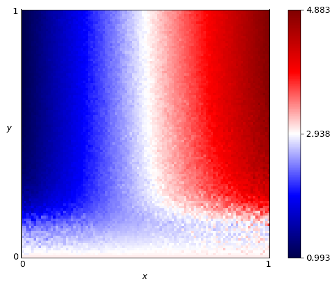

[data (csv)](./assets/Evolved_ANN.csv)
    

## Evolved ANN 5

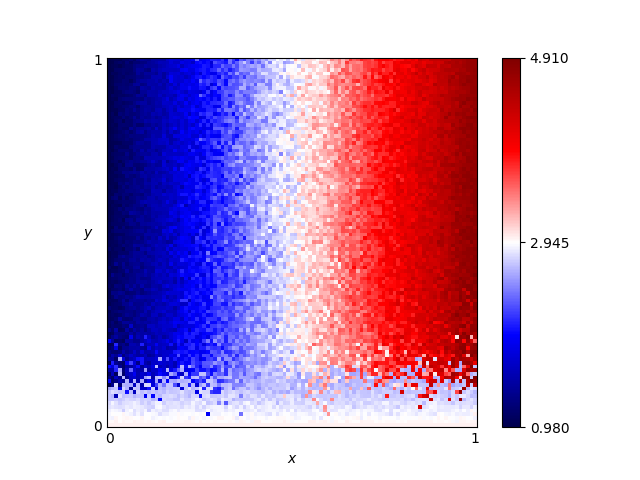

[data (csv)](./assets/Evolved_ANN_5.csv)
    

## Evolved ANN 5 Noise 05


[data (csv)](./assets/Evolved_ANN_5_Noise_05.csv)
    

## Evolved FSM 4

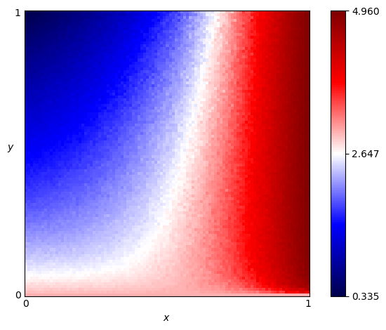

[data (csv)](./assets/Evolved_FSM_4.csv)
    

## Evolved FSM 16

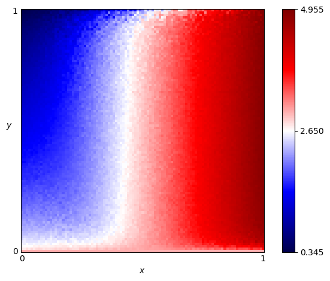

[data (csv)](./assets/Evolved_FSM_16.csv)
    

## Evolved FSM 16 Noise 05

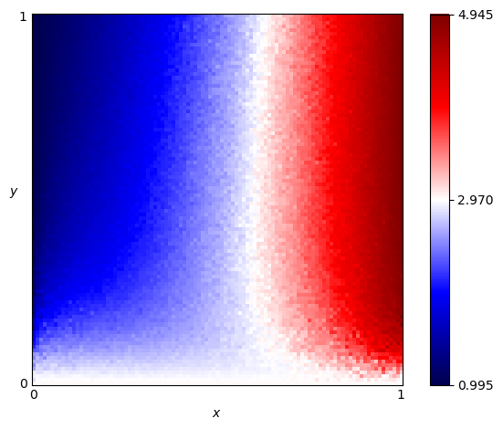

[data (csv)](./assets/Evolved_FSM_16_Noise_05.csv)
    

## EvolvedLookerUp1_1_1

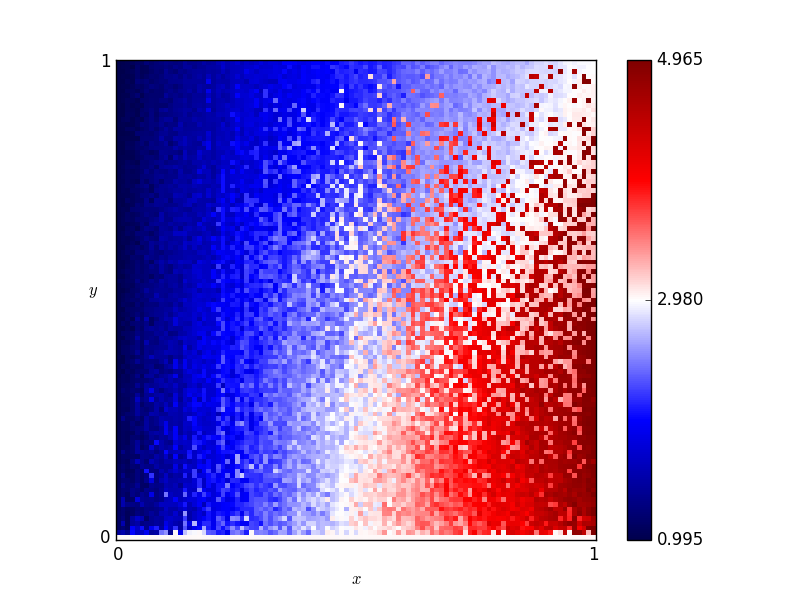

[data (csv)](./assets/EvolvedLookerUp1_1_1.csv)
    

## EvolvedLookerUp2_2_2

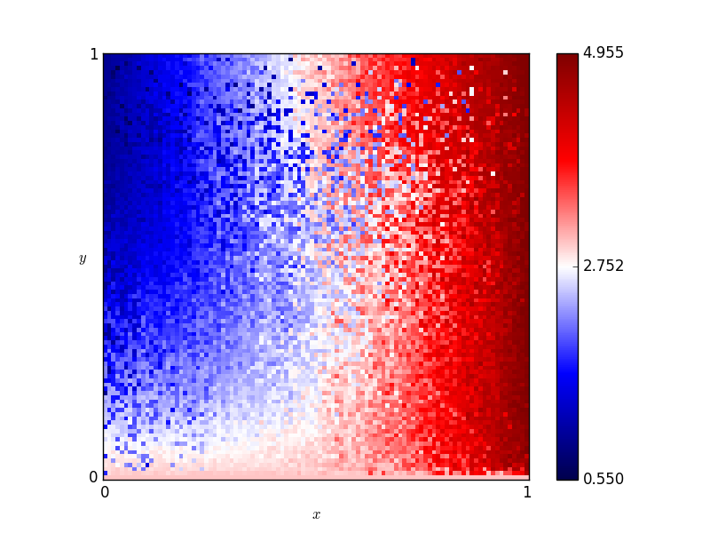

[data (csv)](./assets/EvolvedLookerUp2_2_2.csv)
    

## Evolved HMM 5

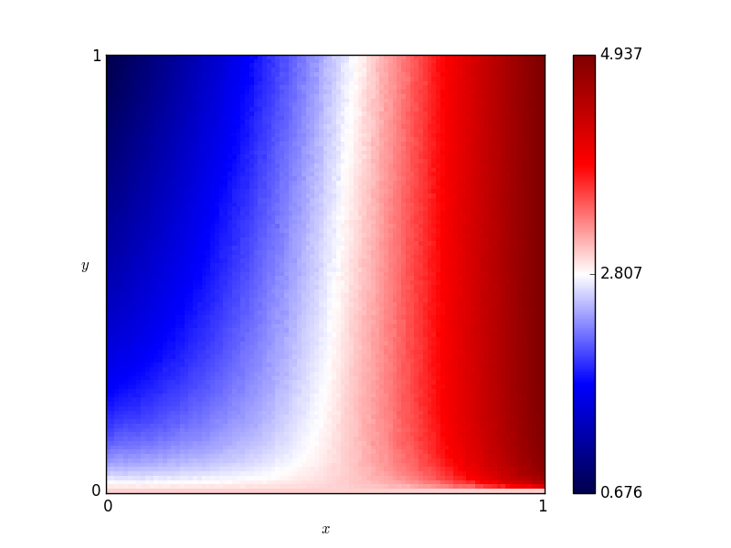

[data (csv)](./assets/Evolved_HMM_5.csv)
    

## Feld


[data (csv)](./assets/Feld.csv)
    

## Firm But Fair


[data (csv)](./assets/Firm_But_Fair.csv)
    

## Fool Me Forever


[data (csv)](./assets/Fool_Me_Forever.csv)
    

## Fool Me Once


[data (csv)](./assets/Fool_Me_Once.csv)
    

## Forgetful Fool Me Once


[data (csv)](./assets/Forgetful_Fool_Me_Once.csv)
    

## Forgetful Grudger


[data (csv)](./assets/Forgetful_Grudger.csv)
    

## Forgiver


[data (csv)](./assets/Forgiver.csv)
    

## Forgiving Tit For Tat


[data (csv)](./assets/Forgiving_Tit_For_Tat.csv)
    

## Fortress3


[data (csv)](./assets/Fortress3.csv)
    

## Fortress4


[data (csv)](./assets/Fortress4.csv)
    

## GTFT


[data (csv)](./assets/GTFT.csv)
    

## General Soft Grudger

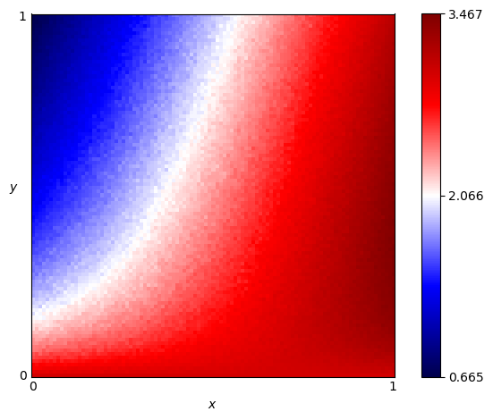

[data (csv)](./assets/General_Soft_Grudger.csv)
    

## Gladstein

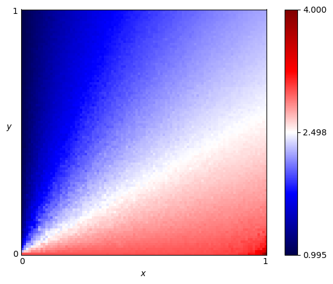

[data (csv)](./assets/Gladstein.csv)
    

## Go By Majority

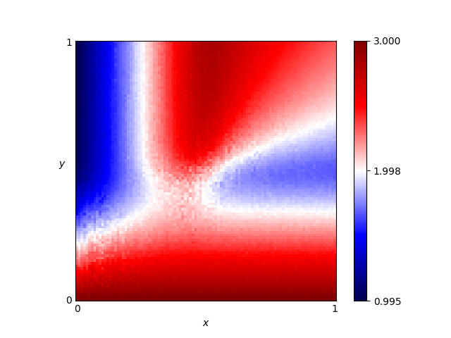

[data (csv)](./assets/Go_By_Majority.csv)
    

## Go By Majority 10


[data (csv)](./assets/Go_By_Majority_10.csv)
    

## Go By Majority 20


[data (csv)](./assets/Go_By_Majority_20.csv)
    

## Go By Majority 40


[data (csv)](./assets/Go_By_Majority_40.csv)
    

## Go By Majority 5


[data (csv)](./assets/Go_By_Majority_5.csv)
    

## $\phi$


[data (csv)](./assets/phi.csv)
    

## Gradual


[data (csv)](./assets/Gradual.csv)
    

## Gradual Killer


[data (csv)](./assets/Gradual_Killer.csv)
    

## Grofman


[data (csv)](./assets/Grofman.csv)
    

## Grudger


[data (csv)](./assets/Grudger.csv)
    

## GrudgerAlternator


[data (csv)](./assets/GrudgerAlternator.csv)
    

## Grumpy


[data (csv)](./assets/Grumpy.csv)
    

## Handshake


[data (csv)](./assets/Handshake.csv)
    

## Hard Go By Majority


[data (csv)](./assets/Hard_Go_By_Majority.csv)
    

## Hard Go By Majority 10


[data (csv)](./assets/Hard_Go_By_Majority_10.csv)
    

## Hard Go By Majority 20


[data (csv)](./assets/Hard_Go_By_Majority_20.csv)
    

## Hard Go By Majority 40


[data (csv)](./assets/Hard_Go_By_Majority_40.csv)
    

## Hard Go By Majority 5


[data (csv)](./assets/Hard_Go_By_Majority_5.csv)
    

## Hard Prober


[data (csv)](./assets/Hard_Prober.csv)
    

## Hard Tit For 2 Tats


[data (csv)](./assets/Hard_Tit_For_2_Tats.csv)
    

## Hard Tit For Tat


[data (csv)](./assets/Hard_Tit_For_Tat.csv)
    

## Hesitant QLearner


[data (csv)](./assets/Hesitant_QLearner.csv)
    

## Hopeless


[data (csv)](./assets/Hopeless.csv)
    

## Inverse


[data (csv)](./assets/Inverse.csv)
    

## Inverse Punisher


[data (csv)](./assets/Inverse_Punisher.csv)
    

## Joss


[data (csv)](./assets/Joss.csv)
    

## Knowledgeable Worse and Worse


[data (csv)](./assets/Knowledgeable_Worse_and_Worse.csv)
    

## Level Punisher

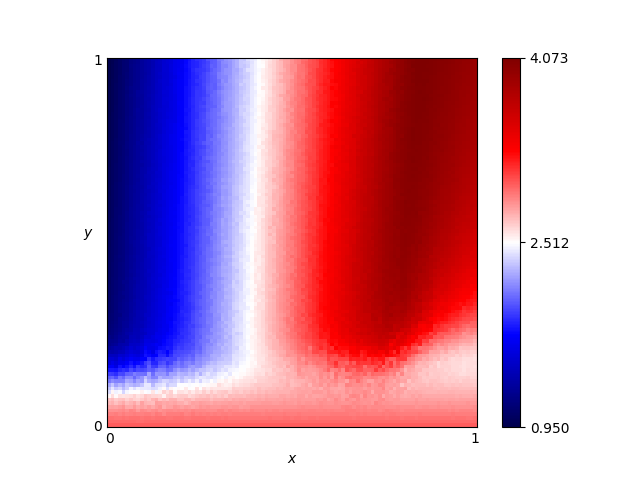

[data (csv)](./assets/Level_Punisher.csv)
    

## Limited Retaliate


[data (csv)](./assets/Limited_Retaliate.csv)
    

## Limited Retaliate 2


[data (csv)](./assets/Limited_Retaliate_2.csv)
    

## Limited Retaliate 3


[data (csv)](./assets/Limited_Retaliate_3.csv)
    

## Math Constant Hunter


[data (csv)](./assets/Math_Constant_Hunter.csv)
    

## Naive Prober


[data (csv)](./assets/Naive_Prober.csv)
    

## MEM2

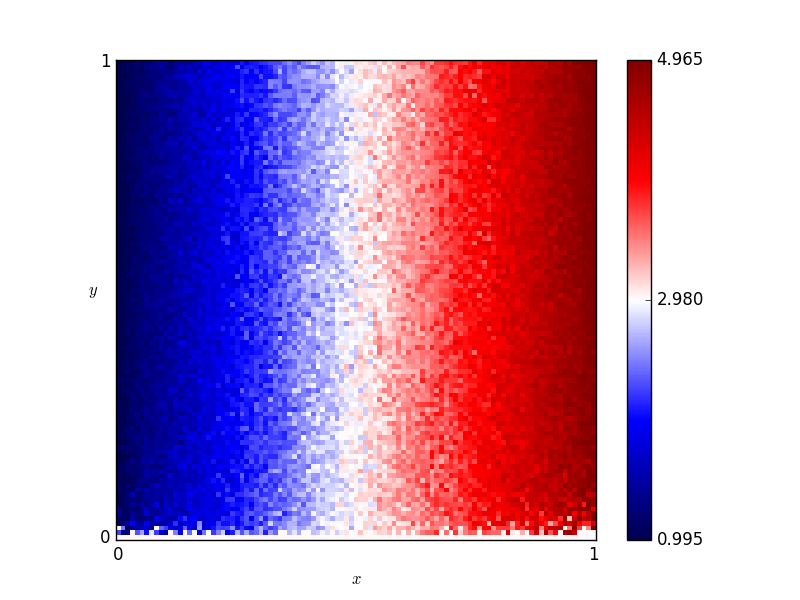

[data (csv)](./assets/MEM2.csv)
    

## Michaelos

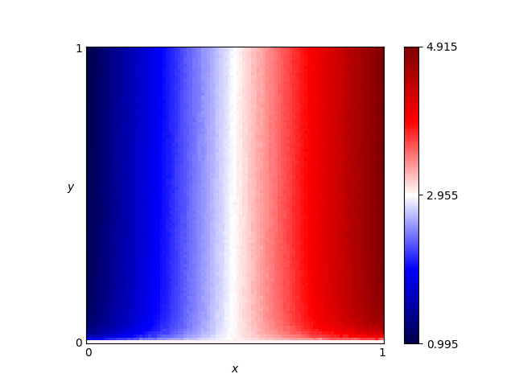

[data (csv)](./assets/Michaelos.csv)
    

## Negation


[data (csv)](./assets/Negation.csv)
    

## Nice Average Copier


[data (csv)](./assets/Nice_Average_Copier.csv)
    

## N Tit(s) For M Tat(s)

_For_M_Tat(s).png)

[data (csv)](./assets/N_Tit(s)_For_M_Tat(s).csv)
    

## Nydegger


[data (csv)](./assets/Nydegger.csv)
    

## Omega TFT


[data (csv)](./assets/Omega_TFT.csv)
    

## Once Bitten


[data (csv)](./assets/Once_Bitten.csv)
    

## Opposite Grudger


[data (csv)](./assets/Opposite_Grudger.csv)
    

## $\pi$


[data (csv)](./assets/pi.csv)
    

## Predator


[data (csv)](./assets/Predator.csv)
    

## Prober


[data (csv)](./assets/Prober.csv)
    

## Prober 2


[data (csv)](./assets/Prober_2.csv)
    

## Prober 3


[data (csv)](./assets/Prober_3.csv)
    

## Prober 4


[data (csv)](./assets/Prober_4.csv)
    

## Pun1

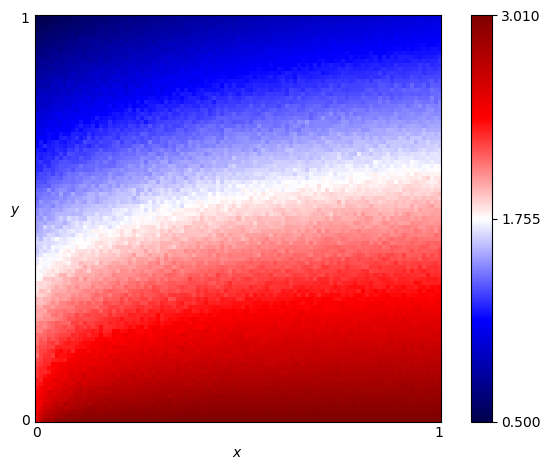

[data (csv)](./assets/Pun1.csv)
    

## PSO Gambler 1_1_1

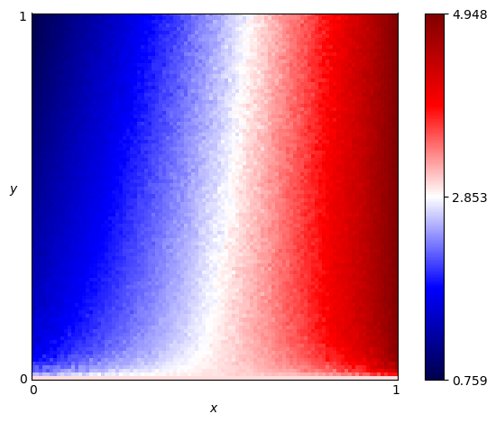

[data (csv)](./assets/PSO_Gambler_1_1_1.csv)
    

## PSO Gambler 2_2_2

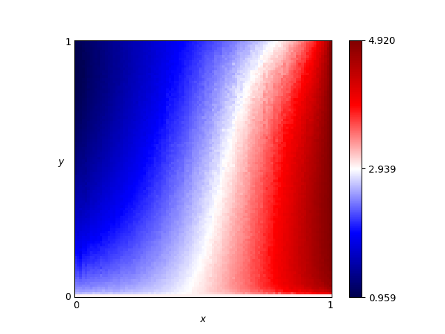

[data (csv)](./assets/PSO_Gambler_2_2_2.csv)
    

## PSO Gambler 2_2_2 Noise 05

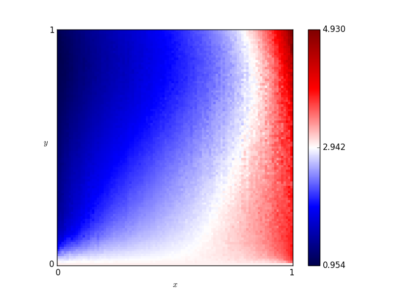

[data (csv)](./assets/PSO_Gambler_2_2_2_Noise_05.csv)
    

## PSO Gambler Mem1

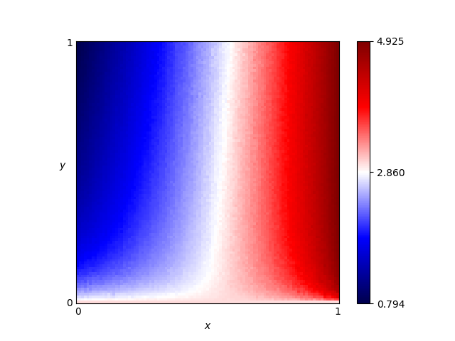

[data (csv)](./assets/PSO_Gambler_Mem1.csv)
    

## Punisher


[data (csv)](./assets/Punisher.csv)
    

## Raider


[data (csv)](./assets/Raider.csv)
    

## Random


[data (csv)](./assets/Random.csv)
    

## Random Hunter


[data (csv)](./assets/Random_Hunter.csv)
    

## Remorseful Prober


[data (csv)](./assets/Remorseful_Prober.csv)
    

## Resurrection

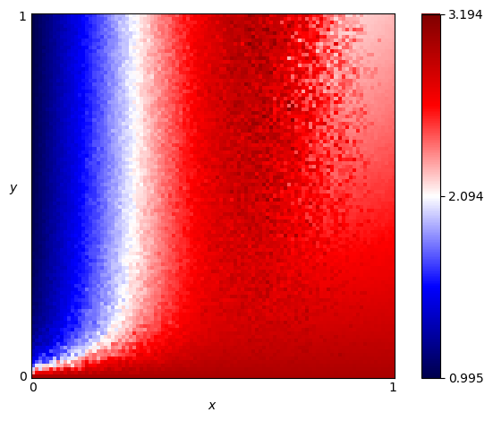

[data (csv)](./assets/Resurrection.csv)
    

## Retaliate


[data (csv)](./assets/Retaliate.csv)
    

## Retaliate 2


[data (csv)](./assets/Retaliate_2.csv)
    

## Retaliate 3


[data (csv)](./assets/Retaliate_3.csv)
    

## Revised Downing

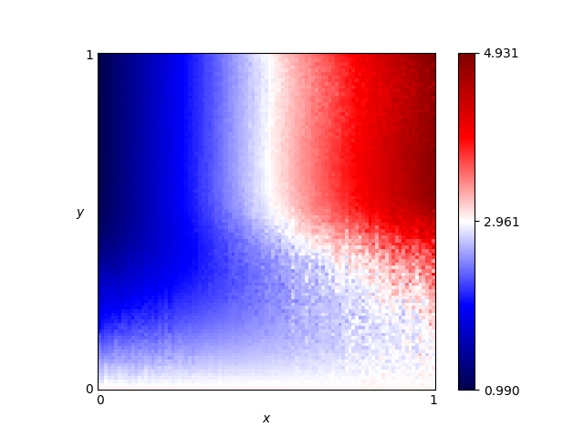

[data (csv)](./assets/Revised_Downing.csv)
    

## Ripoff


[data (csv)](./assets/Ripoff.csv)
    

## Risky QLearner


[data (csv)](./assets/Risky_QLearner.csv)
    

## SelfSteem

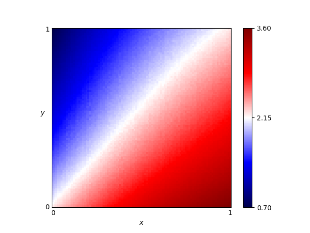

[data (csv)](./assets/SelfSteem.csv)
    

## ShortMem

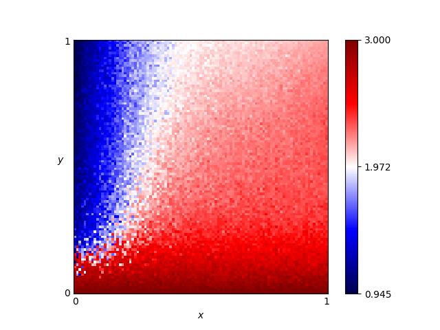

[data (csv)](./assets/ShortMem.csv)
    

## Shubik


[data (csv)](./assets/Shubik.csv)
    

## Slow Tit For Two Tats 2

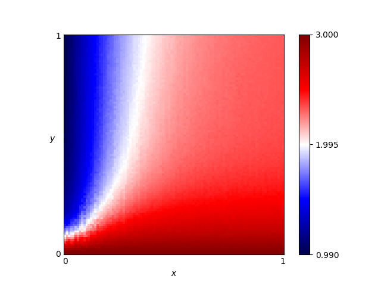

[data (csv)](./assets/Slow_Tit_For_Two_Tats_2.csv)
    

## Sneaky Tit For Tat


[data (csv)](./assets/Sneaky_Tit_For_Tat.csv)
    

## Soft Grudger


[data (csv)](./assets/Soft_Grudger.csv)
    

## Soft Joss


[data (csv)](./assets/Soft_Joss.csv)
    

## SolutionB1


[data (csv)](./assets/SolutionB1.csv)
    

## SolutionB5


[data (csv)](./assets/SolutionB5.csv)
    

## Spiteful Tit For Tat


[data (csv)](./assets/Spiteful_Tit_For_Tat.csv)
    

## Stalker

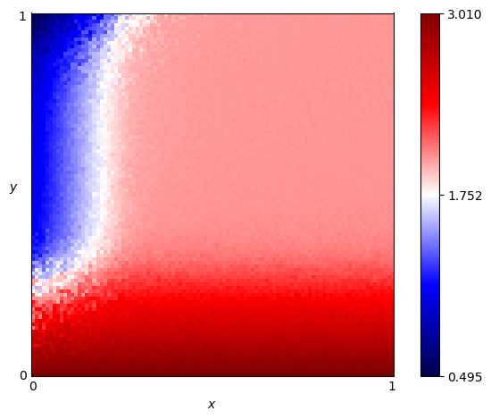

[data (csv)](./assets/Stalker.csv)
    

## Stein and Rapoport

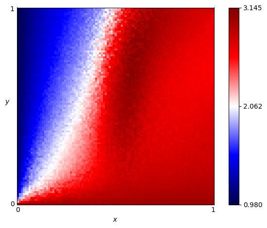

[data (csv)](./assets/Stein_and_Rapoport.csv)
    

## Stochastic Cooperator


[data (csv)](./assets/Stochastic_Cooperator.csv)
    

## Stochastic WSLS


[data (csv)](./assets/Stochastic_WSLS.csv)
    

## Suspicious Tit For Tat


[data (csv)](./assets/Suspicious_Tit_For_Tat.csv)
    

## Tester


[data (csv)](./assets/Tester.csv)
    

## TF1

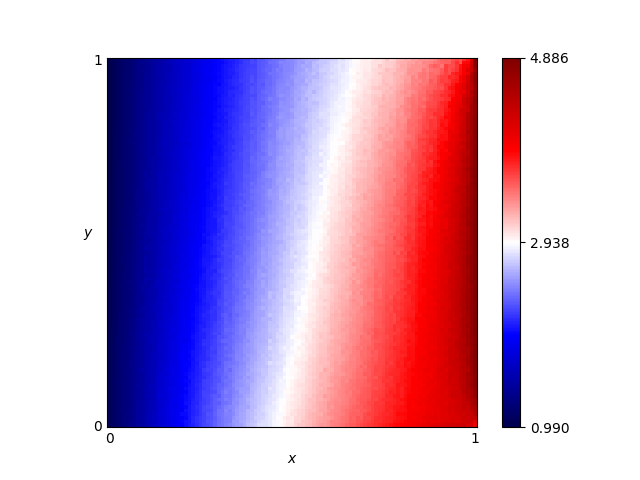

[data (csv)](./assets/TF1.csv)
    

## TF2

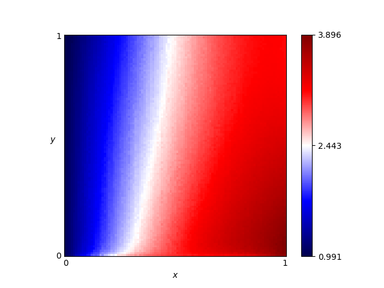

[data (csv)](./assets/TF2.csv)
    

## TF3

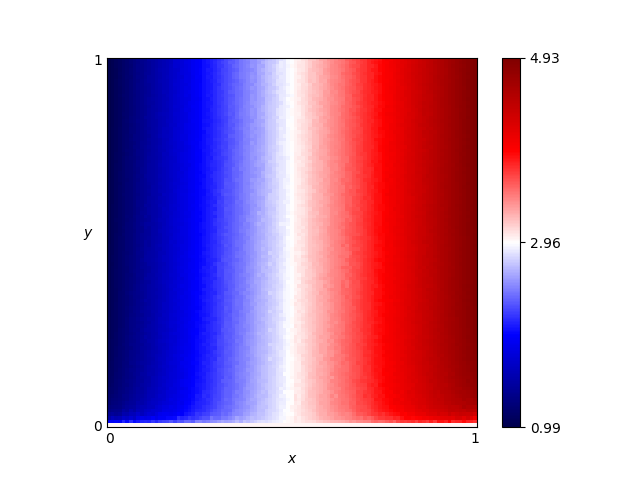

[data (csv)](./assets/TF3.csv)
    

## ThueMorse


[data (csv)](./assets/ThueMorse.csv)
    

## ThueMorseInverse


[data (csv)](./assets/ThueMorseInverse.csv)
    

## Thumper


[data (csv)](./assets/Thumper.csv)
    

## Tideman and Chieruzzi

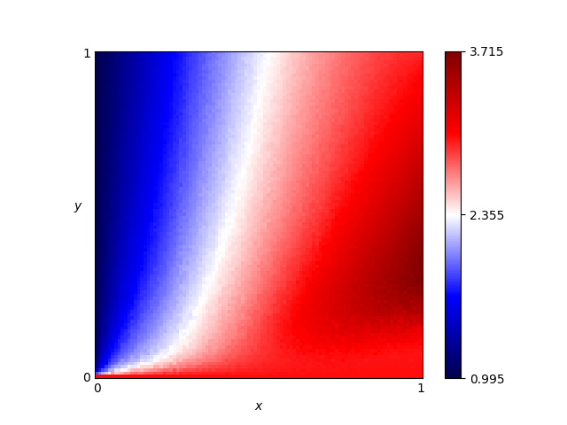

[data (csv)](./assets/Tideman_and_Chieruzzi.csv)
    

## Tit For Tat


[data (csv)](./assets/Tit_For_Tat.csv)
    

## Tit For 2 Tats


[data (csv)](./assets/Tit_For_2_Tats.csv)
    

## Tricky Cooperator


[data (csv)](./assets/Tricky_Cooperator.csv)
    

## Tricky Defector


[data (csv)](./assets/Tricky_Defector.csv)
    

## Tullock


[data (csv)](./assets/Tullock.csv)
    

## Two Tits For Tat


[data (csv)](./assets/Two_Tits_For_Tat.csv)
    

## VeryBad

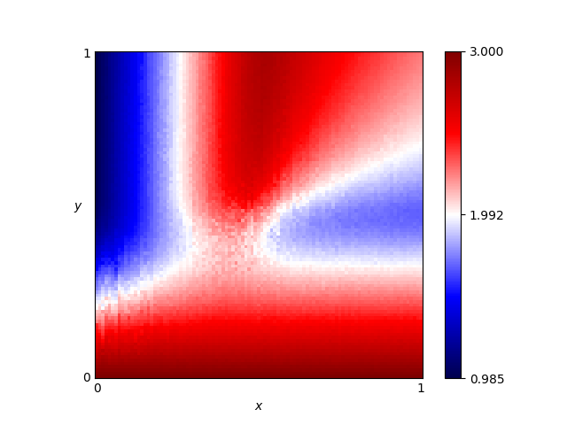

[data (csv)](./assets/VeryBad.csv)
    

## Willing


[data (csv)](./assets/Willing.csv)
    

## Winner12

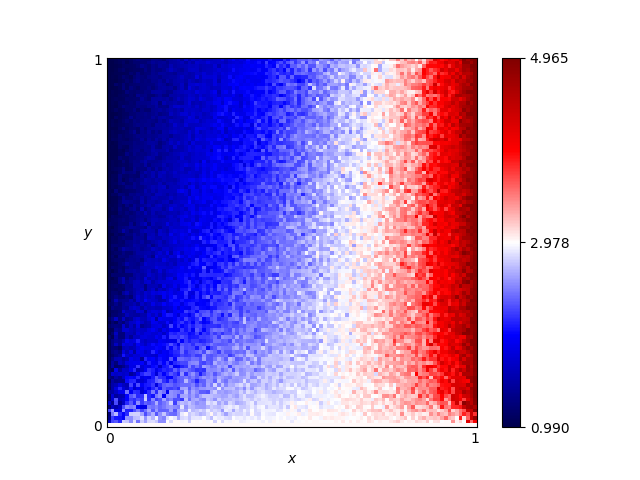

[data (csv)](./assets/Winner12.csv)
    

## Winner21

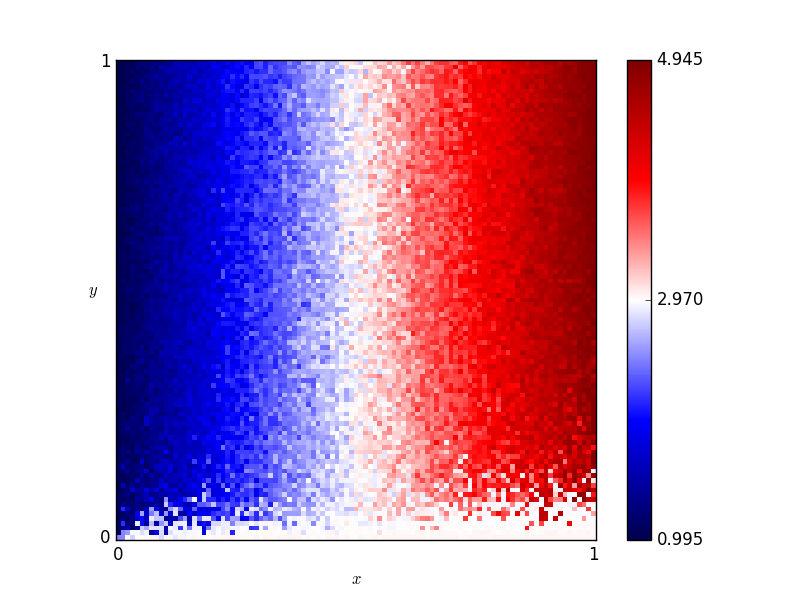

[data (csv)](./assets/Winner21.csv)
    

## Win-Shift Lose-Stay


[data (csv)](./assets/Win-Shift_Lose-Stay.csv)
    

## Win-Stay Lose-Shift


[data (csv)](./assets/Win-Stay_Lose-Shift.csv)
    

## Worse and Worse


[data (csv)](./assets/Worse_and_Worse.csv)
    

## Worse and Worse 2

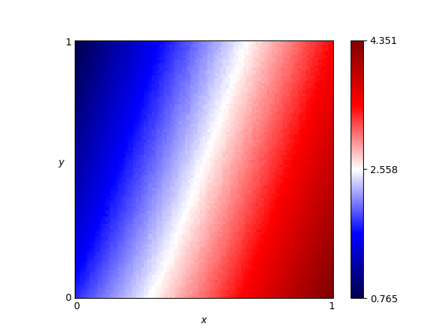

[data (csv)](./assets/Worse_and_Worse_2.csv)
    

## Worse and Worse 3


[data (csv)](./assets/Worse_and_Worse_3.csv)
    

## ZD-Extortion

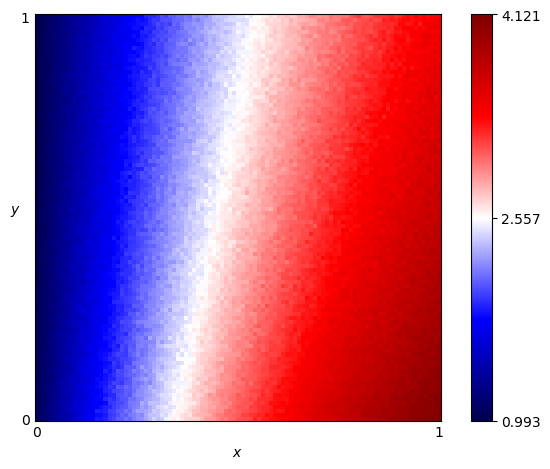

[data (csv)](./assets/ZD-Extortion.csv)
    

## ZD-Extort-2


[data (csv)](./assets/ZD-Extort-2.csv)
    

## ZD-Extort3

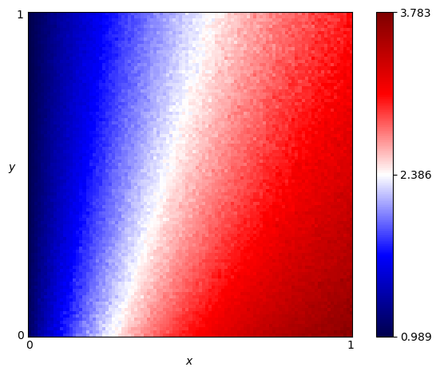

[data (csv)](./assets/ZD-Extort3.csv)
    

## ZD-Extort-2 v2


[data (csv)](./assets/ZD-Extort-2_v2.csv)
    

## ZD-Extort-4


[data (csv)](./assets/ZD-Extort-4.csv)
    

## ZD-GTFT-2


[data (csv)](./assets/ZD-GTFT-2.csv)
    

## ZD-GEN-2


[data (csv)](./assets/ZD-GEN-2.csv)
    

## ZD-Mem2

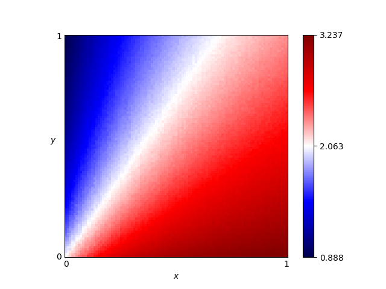

[data (csv)](./assets/ZD-Mem2.csv)
    

## ZD-Mischief

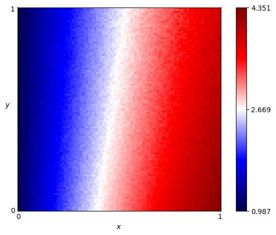

[data (csv)](./assets/ZD-Mischief.csv)
    

## ZD-SET-2


[data (csv)](./assets/ZD-SET-2.csv)
    

## $e$


[data (csv)](./assets/e.csv)
    

## Dynamic Two Tits For Tat

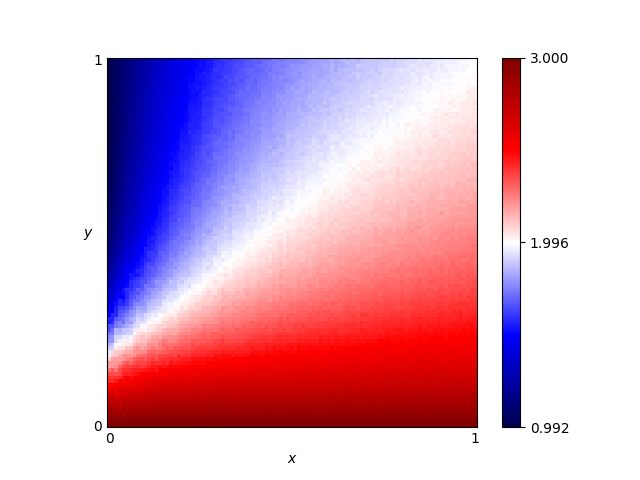

[data (csv)](./assets/Dynamic_Two_Tits_For_Tat.csv)
    

## Meta Hunter


[data (csv)](./assets/Meta_Hunter.csv)
    

## Meta Hunter Aggressive

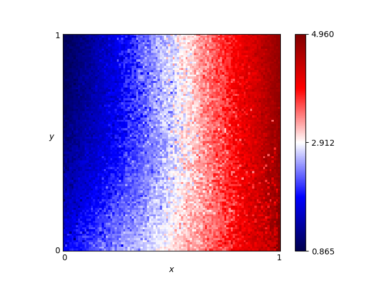

[data (csv)](./assets/Meta_Hunter_Aggressive.csv)
    

## Meta Majority


[data (csv)](./assets/Meta_Majority.csv)
    

## Meta Majority Memory One


[data (csv)](./assets/Meta_Majority_Memory_One.csv)
    

## Meta Majority Finite Memory


[data (csv)](./assets/Meta_Majority_Finite_Memory.csv)
    

## Meta Majority Long Memory


[data (csv)](./assets/Meta_Majority_Long_Memory.csv)
    

## Meta Minority


[data (csv)](./assets/Meta_Minority.csv)
    

## Meta Mixer


[data (csv)](./assets/Meta_Mixer.csv)
    

## Meta Winner


[data (csv)](./assets/Meta_Winner.csv)
    

## Meta Winner Deterministic

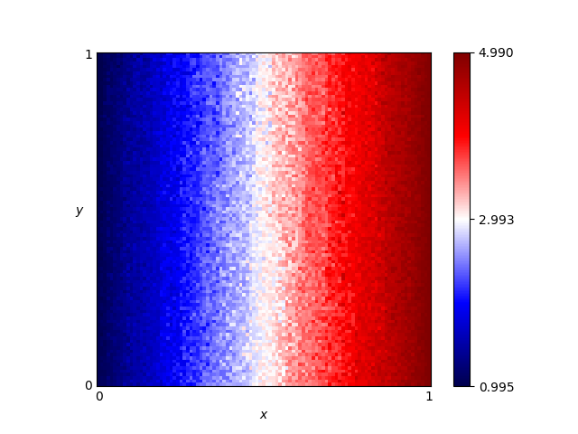

[data (csv)](./assets/Meta_Winner_Deterministic.csv)
    

## Meta Winner Ensemble


[data (csv)](./assets/Meta_Winner_Ensemble.csv)
    

## Meta Winner Memory One


[data (csv)](./assets/Meta_Winner_Memory_One.csv)
    

## Meta Winner Finite Memory


[data (csv)](./assets/Meta_Winner_Finite_Memory.csv)
    

## Meta Winner Long Memory


[data (csv)](./assets/Meta_Winner_Long_Memory.csv)
    

## Meta Winner Stochastic

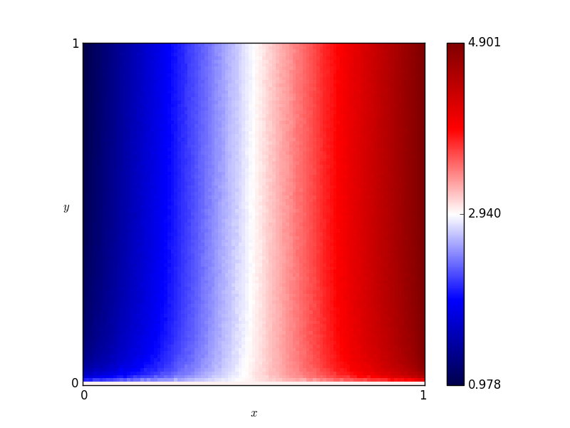

[data (csv)](./assets/Meta_Winner_Stochastic.csv)
    

## NMWE Deterministic

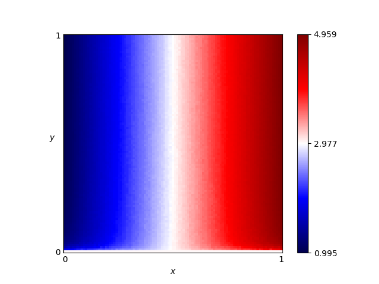

[data (csv)](./assets/NMWE_Deterministic.csv)
    

## NMWE Finite Memory

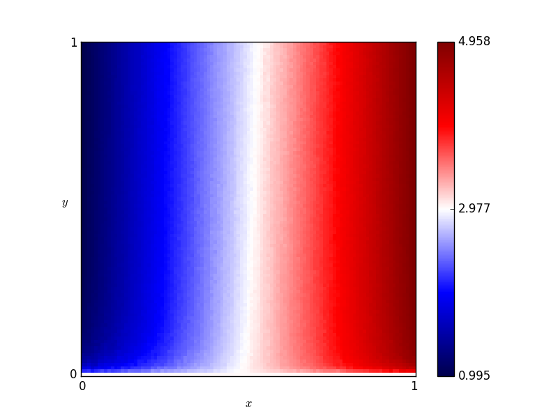

[data (csv)](./assets/NMWE_Finite_Memory.csv)
    

## NMWE Long Memory


[data (csv)](./assets/NMWE_Long_Memory.csv)
    

## NMWE Memory One


[data (csv)](./assets/NMWE_Memory_One.csv)
    

## NMWE Stochastic


[data (csv)](./assets/NMWE_Stochastic.csv)
    

## Nice Meta Winner


[data (csv)](./assets/Nice_Meta_Winner.csv)
    

## Nice Meta Winner Ensemble


[data (csv)](./assets/Nice_Meta_Winner_Ensemble.csv)
    

# Second tournament fortran strategy fingerprints


## k77r


[data (csv)](./assets/k77r.csv)
    

## k64r


[data (csv)](./assets/k64r.csv)
    

## k48r


[data (csv)](./assets/k48r.csv)
    

## k74rxx


[data (csv)](./assets/k74rxx.csv)
    

## k55r


[data (csv)](./assets/k55r.csv)
    

## k34r


[data (csv)](./assets/k34r.csv)
    

## k78r


[data (csv)](./assets/k78r.csv)
    

## kpavlovc


[data (csv)](./assets/kpavlovc.csv)
    

## k37r


[data (csv)](./assets/k37r.csv)
    

## k49r


[data (csv)](./assets/k49r.csv)
    

## k57r


[data (csv)](./assets/k57r.csv)
    

## k74r


[data (csv)](./assets/k74r.csv)
    

## k85r


[data (csv)](./assets/k85r.csv)
    

## k75r


[data (csv)](./assets/k75r.csv)
    

## k66r


[data (csv)](./assets/k66r.csv)
    

## k39r


[data (csv)](./assets/k39r.csv)
    

## k79r


[data (csv)](./assets/k79r.csv)
    

## k91r


[data (csv)](./assets/k91r.csv)
    

## k81r


[data (csv)](./assets/k81r.csv)
    

## k83r


[data (csv)](./assets/k83r.csv)
    

## k38r


[data (csv)](./assets/k38r.csv)
    

## k47r


[data (csv)](./assets/k47r.csv)
    

## k93r


[data (csv)](./assets/k93r.csv)
    

## k45r


[data (csv)](./assets/k45r.csv)
    

## k60r


[data (csv)](./assets/k60r.csv)
    

## k53r


[data (csv)](./assets/k53r.csv)
    

## k84r


[data (csv)](./assets/k84r.csv)
    

## k69r


[data (csv)](./assets/k69r.csv)
    

## k32r


[data (csv)](./assets/k32r.csv)
    

## k87r


[data (csv)](./assets/k87r.csv)
    

## k92r


[data (csv)](./assets/k92r.csv)
    

## k46r


[data (csv)](./assets/k46r.csv)
    

## grasr


[data (csv)](./assets/grasr.csv)
    

## ktitfortatc


[data (csv)](./assets/ktitfortatc.csv)
    

## k86r


[data (csv)](./assets/k86r.csv)
    

## k90r


[data (csv)](./assets/k90r.csv)
    

## k88r


[data (csv)](./assets/k88r.csv)
    

## k59r


[data (csv)](./assets/k59r.csv)
    

## k43r


[data (csv)](./assets/k43r.csv)
    

## k31r


[data (csv)](./assets/k31r.csv)
    

## k33r


[data (csv)](./assets/k33r.csv)
    

## k56r


[data (csv)](./assets/k56r.csv)
    

## k72r


[data (csv)](./assets/k72r.csv)
    

## k73r


[data (csv)](./assets/k73r.csv)
    

## k82r


[data (csv)](./assets/k82r.csv)
    

## k52r


[data (csv)](./assets/k52r.csv)
    

## k41r


[data (csv)](./assets/k41r.csv)
    

## k80r


[data (csv)](./assets/k80r.csv)
    

## k44r


[data (csv)](./assets/k44r.csv)
    

## k65r


[data (csv)](./assets/k65r.csv)
    

## k89r


[data (csv)](./assets/k89r.csv)
    

## krandomc


[data (csv)](./assets/krandomc.csv)
    

## k51r


[data (csv)](./assets/k51r.csv)
    

## k62r


[data (csv)](./assets/k62r.csv)
    

## k42r


[data (csv)](./assets/k42r.csv)
    

## k71r


[data (csv)](./assets/k71r.csv)
    

## k54r


[data (csv)](./assets/k54r.csv)
    

## k35r


[data (csv)](./assets/k35r.csv)
    

## ktf2tc


[data (csv)](./assets/ktf2tc.csv)
    

## k70r


[data (csv)](./assets/k70r.csv)
    

## k76r


[data (csv)](./assets/k76r.csv)
    

## k58r


[data (csv)](./assets/k58r.csv)
    

## k61r


[data (csv)](./assets/k61r.csv)
    

## k50r


[data (csv)](./assets/k50r.csv)
    

## k40r


[data (csv)](./assets/k40r.csv)
    

## k67r


[data (csv)](./assets/k67r.csv)
    

## k63r


[data (csv)](./assets/k63r.csv)
    

## k36r


[data (csv)](./assets/k36r.csv)
    

## k68r


[data (csv)](./assets/k68r.csv)
    