# Ashlock and transitive fingerprints

See:
[axelrod.readthedocs.io/en/latest/tutorials/further_topics/fingerprinting.html#fingerprinting](http://axelrod.readthedocs.io/en/latest/tutorials/further_topics/fingerprinting.html#fingerprinting)

All strategies included from Axelrod version 4.3.0.

This README.md file is autogenerated by running:

```
$ python update_fingerprints.py
```

Each individual fingerprint can be obtained by running:

```python
import axelrod as axl
fp = axl.AshlockFingerprint(strategy, probe)
fp.fingerprint(turns=200, repetitions=20)
fp.plot()
```

# Axelrod library fingerprints

    

## Adaptive


[data (csv)](./assets/Adaptive.csv)

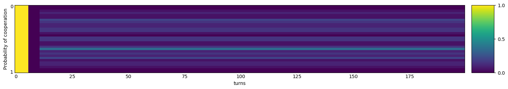

[data (csv)](./assets/transitive_Adaptive.csv)


[data (csv)](./assets/transitive_v_short_Adaptive.csv)
    

## Adaptive Tit For Tat

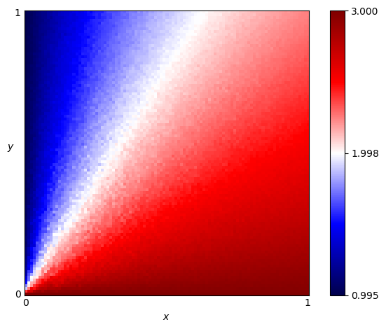

[data (csv)](./assets/Adaptive_Tit_For_Tat.csv)

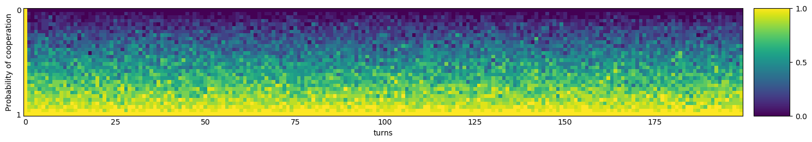

[data (csv)](./assets/transitive_Adaptive_Tit_For_Tat.csv)


[data (csv)](./assets/transitive_v_short_Adaptive_Tit_For_Tat.csv)
    

## Aggravater

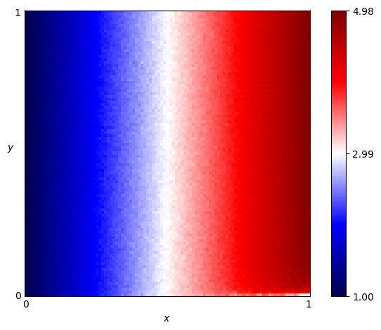

[data (csv)](./assets/Aggravater.csv)

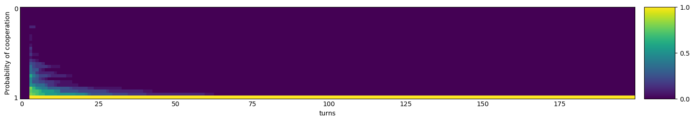

[data (csv)](./assets/transitive_Aggravater.csv)


[data (csv)](./assets/transitive_v_short_Aggravater.csv)
    

## Alexei

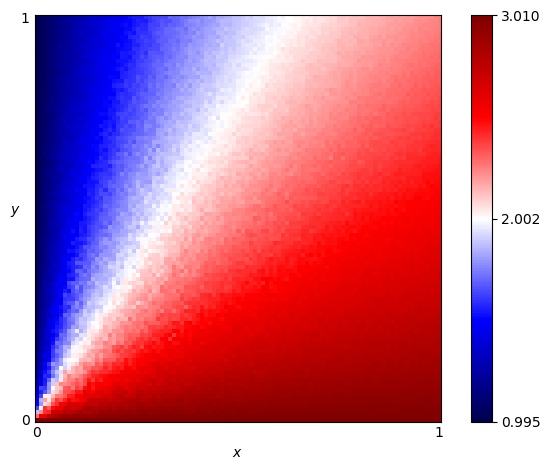

[data (csv)](./assets/Alexei.csv)

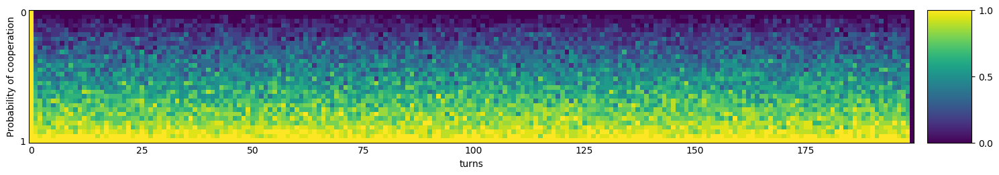

[data (csv)](./assets/transitive_Alexei.csv)


[data (csv)](./assets/transitive_v_short_Alexei.csv)
    

## ALLCorALLD


[data (csv)](./assets/ALLCorALLD.csv)

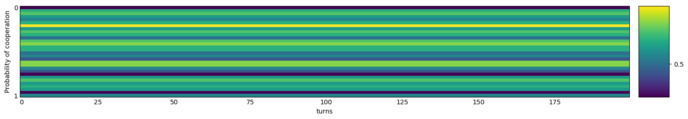

[data (csv)](./assets/transitive_ALLCorALLD.csv)


[data (csv)](./assets/transitive_v_short_ALLCorALLD.csv)
    

## Alternator

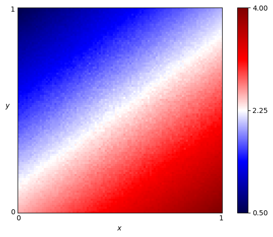

[data (csv)](./assets/Alternator.csv)

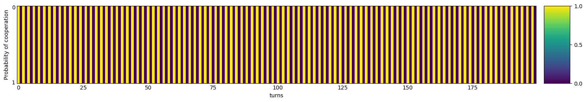

[data (csv)](./assets/transitive_Alternator.csv)


[data (csv)](./assets/transitive_v_short_Alternator.csv)
    

## Alternator Hunter


[data (csv)](./assets/Alternator_Hunter.csv)

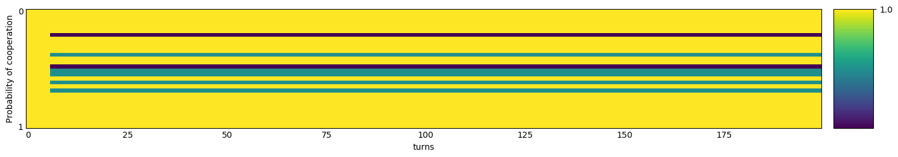

[data (csv)](./assets/transitive_Alternator_Hunter.csv)


[data (csv)](./assets/transitive_v_short_Alternator_Hunter.csv)
    

## AntiCycler


[data (csv)](./assets/AntiCycler.csv)

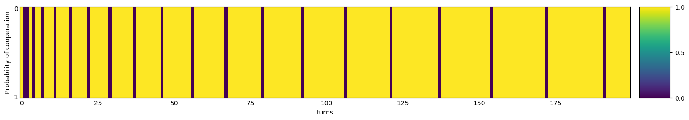

[data (csv)](./assets/transitive_AntiCycler.csv)


[data (csv)](./assets/transitive_v_short_AntiCycler.csv)
    

## Anti Tit For Tat

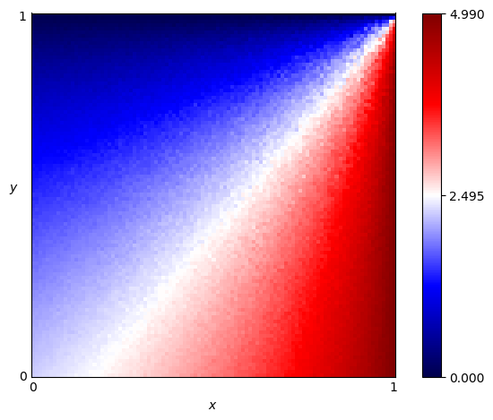

[data (csv)](./assets/Anti_Tit_For_Tat.csv)

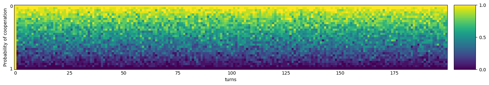

[data (csv)](./assets/transitive_Anti_Tit_For_Tat.csv)


[data (csv)](./assets/transitive_v_short_Anti_Tit_For_Tat.csv)
    

## AON2

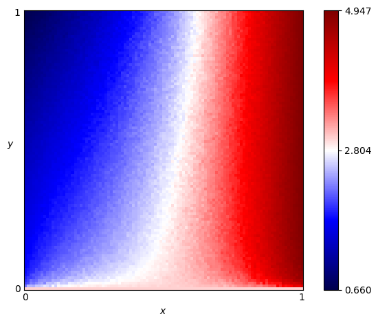

[data (csv)](./assets/AON2.csv)

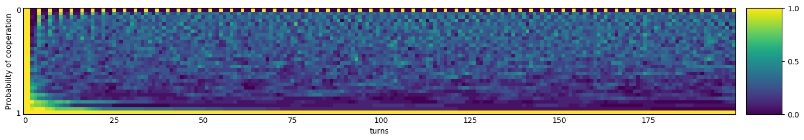

[data (csv)](./assets/transitive_AON2.csv)


[data (csv)](./assets/transitive_v_short_AON2.csv)
    

## Adaptive Pavlov 2006

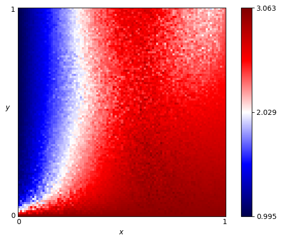

[data (csv)](./assets/Adaptive_Pavlov_2006.csv)

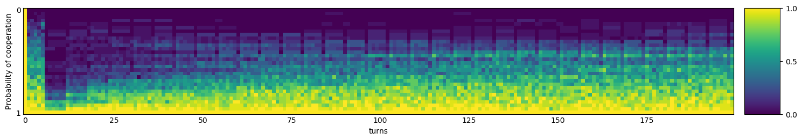

[data (csv)](./assets/transitive_Adaptive_Pavlov_2006.csv)


[data (csv)](./assets/transitive_v_short_Adaptive_Pavlov_2006.csv)
    

## Adaptive Pavlov 2011

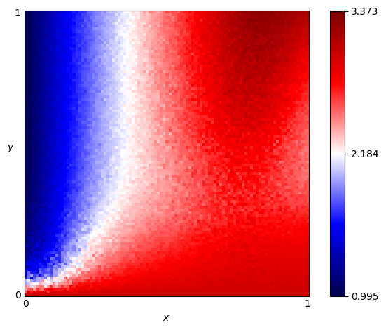

[data (csv)](./assets/Adaptive_Pavlov_2011.csv)

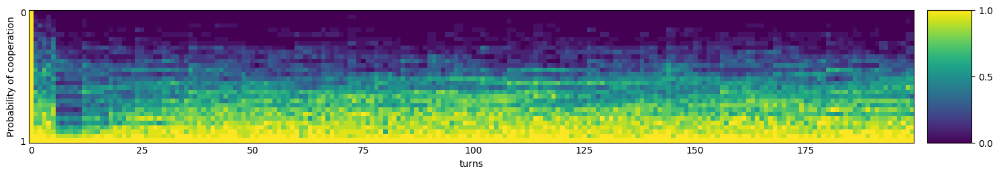

[data (csv)](./assets/transitive_Adaptive_Pavlov_2011.csv)


[data (csv)](./assets/transitive_v_short_Adaptive_Pavlov_2011.csv)
    

## Appeaser


[data (csv)](./assets/Appeaser.csv)

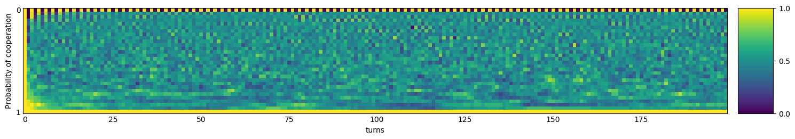

[data (csv)](./assets/transitive_Appeaser.csv)


[data (csv)](./assets/transitive_v_short_Appeaser.csv)
    

## Arrogant QLearner


[data (csv)](./assets/Arrogant_QLearner.csv)

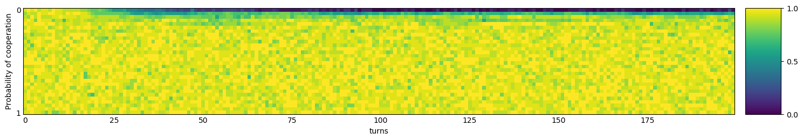

[data (csv)](./assets/transitive_Arrogant_QLearner.csv)


[data (csv)](./assets/transitive_v_short_Arrogant_QLearner.csv)
    

## Average Copier

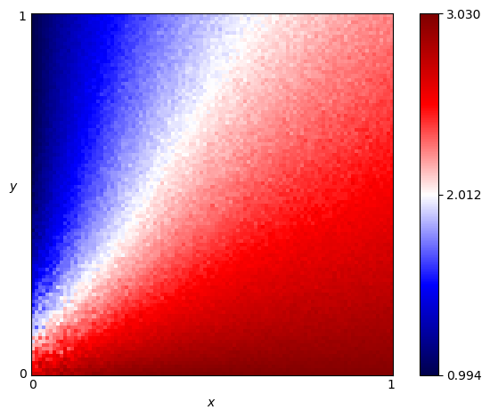

[data (csv)](./assets/Average_Copier.csv)

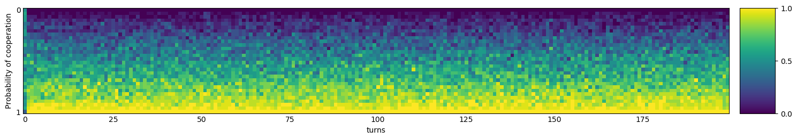

[data (csv)](./assets/transitive_Average_Copier.csv)


[data (csv)](./assets/transitive_v_short_Average_Copier.csv)
    

## BackStabber

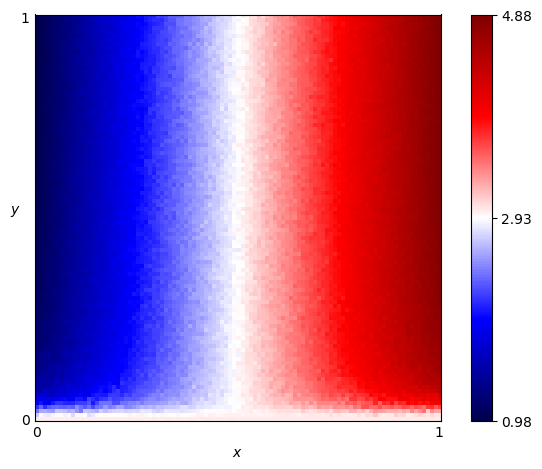

[data (csv)](./assets/BackStabber.csv)

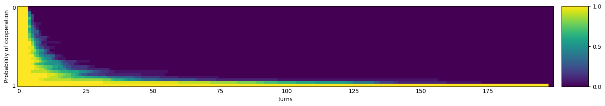

[data (csv)](./assets/transitive_BackStabber.csv)


[data (csv)](./assets/transitive_v_short_BackStabber.csv)
    

## Better and Better

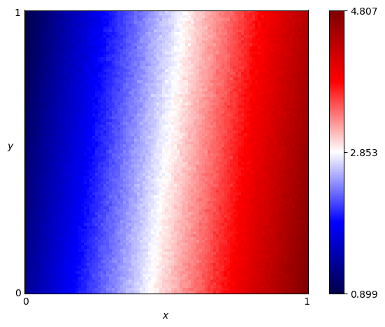

[data (csv)](./assets/Better_and_Better.csv)

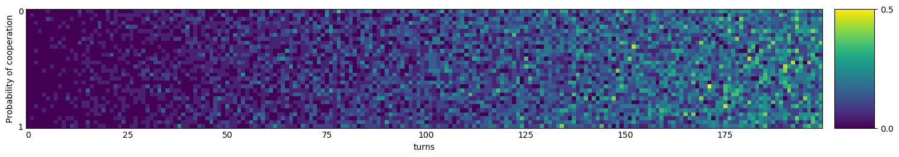

[data (csv)](./assets/transitive_Better_and_Better.csv)


[data (csv)](./assets/transitive_v_short_Better_and_Better.csv)
    

## Black

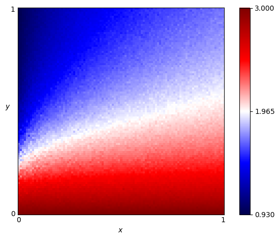

[data (csv)](./assets/Black.csv)

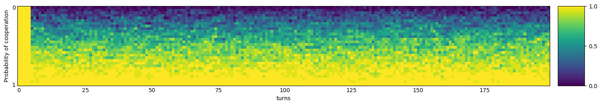

[data (csv)](./assets/transitive_Black.csv)


[data (csv)](./assets/transitive_v_short_Black.csv)
    

## Borufsen

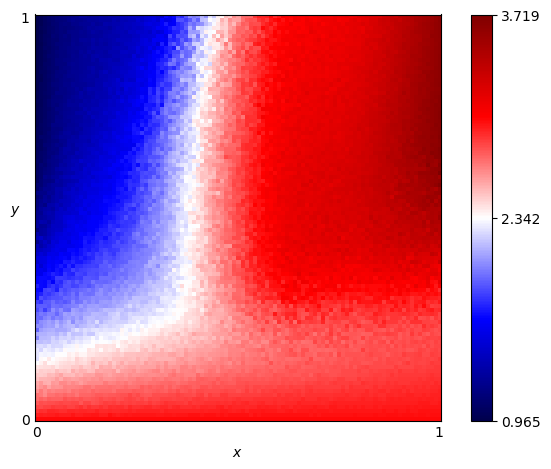

[data (csv)](./assets/Borufsen.csv)

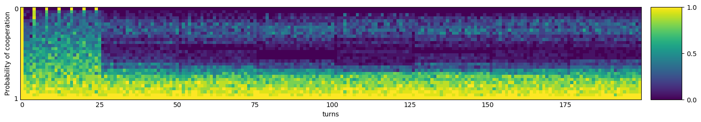

[data (csv)](./assets/transitive_Borufsen.csv)


[data (csv)](./assets/transitive_v_short_Borufsen.csv)
    

## Bully

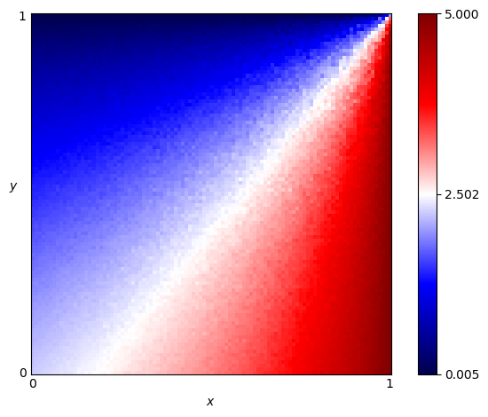

[data (csv)](./assets/Bully.csv)

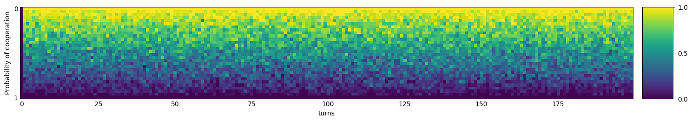

[data (csv)](./assets/transitive_Bully.csv)


[data (csv)](./assets/transitive_v_short_Bully.csv)
    

## Bush Mosteller

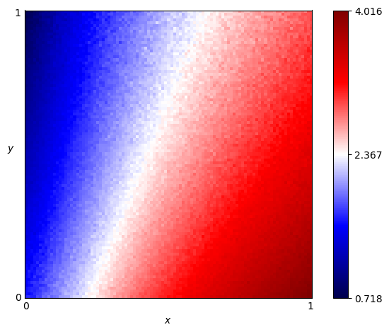

[data (csv)](./assets/Bush_Mosteller.csv)

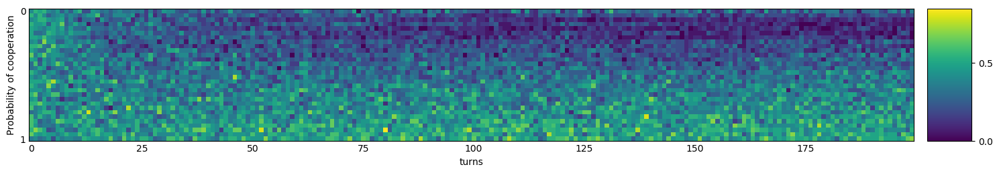

[data (csv)](./assets/transitive_Bush_Mosteller.csv)


[data (csv)](./assets/transitive_v_short_Bush_Mosteller.csv)
    

## Calculator


[data (csv)](./assets/Calculator.csv)

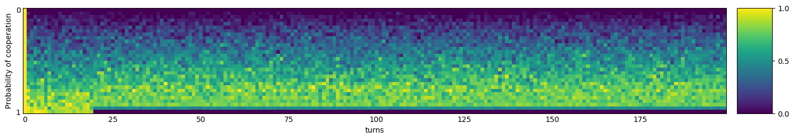

[data (csv)](./assets/transitive_Calculator.csv)


[data (csv)](./assets/transitive_v_short_Calculator.csv)
    

## Cautious QLearner


[data (csv)](./assets/Cautious_QLearner.csv)

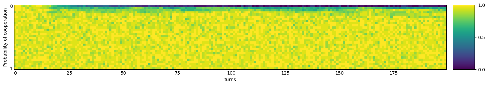

[data (csv)](./assets/transitive_Cautious_QLearner.csv)


[data (csv)](./assets/transitive_v_short_Cautious_QLearner.csv)
    

## Cave

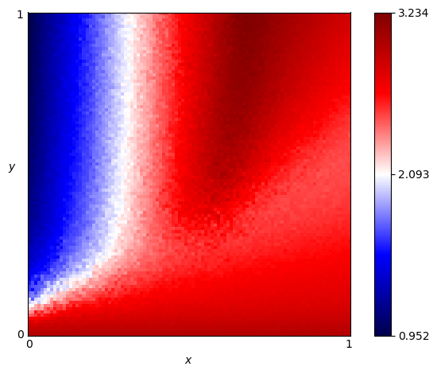

[data (csv)](./assets/Cave.csv)

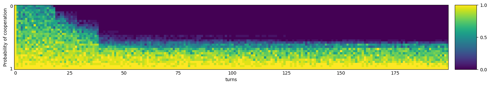

[data (csv)](./assets/transitive_Cave.csv)


[data (csv)](./assets/transitive_v_short_Cave.csv)
    

## Champion

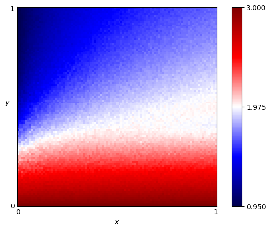

[data (csv)](./assets/Champion.csv)

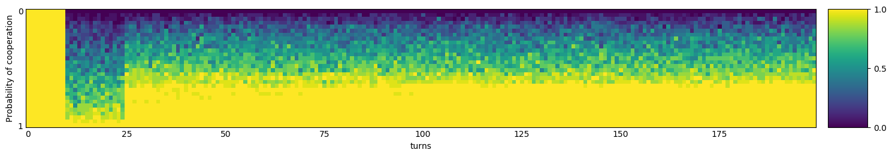

[data (csv)](./assets/transitive_Champion.csv)


[data (csv)](./assets/transitive_v_short_Champion.csv)
    

## Colbert

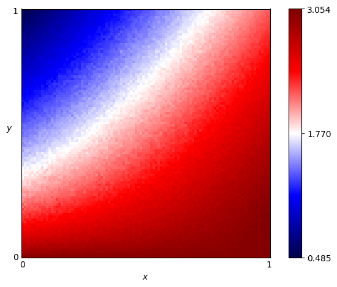

[data (csv)](./assets/Colbert.csv)

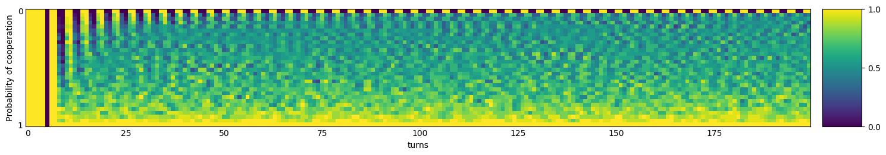

[data (csv)](./assets/transitive_Colbert.csv)


[data (csv)](./assets/transitive_v_short_Colbert.csv)
    

## CollectiveStrategy


[data (csv)](./assets/CollectiveStrategy.csv)

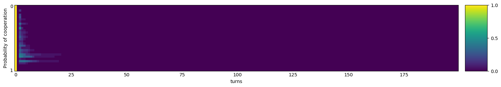

[data (csv)](./assets/transitive_CollectiveStrategy.csv)


[data (csv)](./assets/transitive_v_short_CollectiveStrategy.csv)
    

## Contrite Tit For Tat


[data (csv)](./assets/Contrite_Tit_For_Tat.csv)

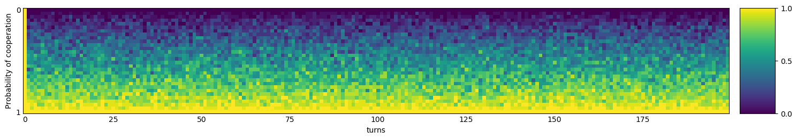

[data (csv)](./assets/transitive_Contrite_Tit_For_Tat.csv)


[data (csv)](./assets/transitive_v_short_Contrite_Tit_For_Tat.csv)
    

## Cooperator

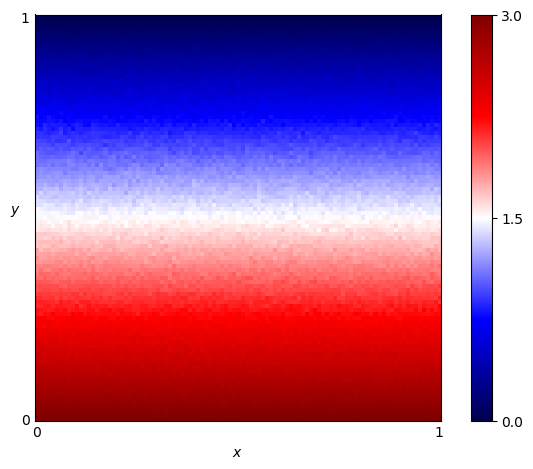

[data (csv)](./assets/Cooperator.csv)

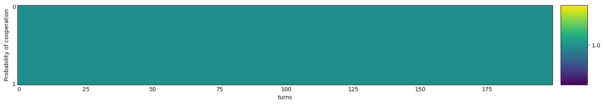

[data (csv)](./assets/transitive_Cooperator.csv)


[data (csv)](./assets/transitive_v_short_Cooperator.csv)
    

## Cooperator Hunter


[data (csv)](./assets/Cooperator_Hunter.csv)

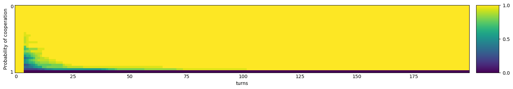

[data (csv)](./assets/transitive_Cooperator_Hunter.csv)


[data (csv)](./assets/transitive_v_short_Cooperator_Hunter.csv)
    

## Cycle Hunter

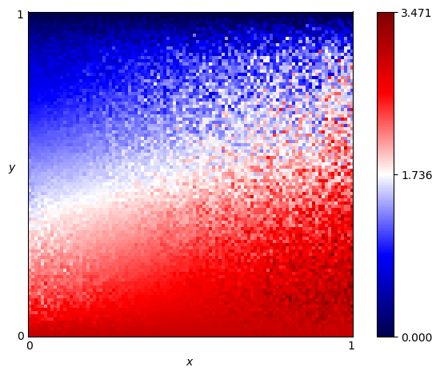

[data (csv)](./assets/Cycle_Hunter.csv)

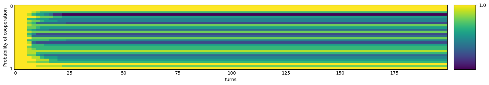

[data (csv)](./assets/transitive_Cycle_Hunter.csv)


[data (csv)](./assets/transitive_v_short_Cycle_Hunter.csv)
    

## Cycler CCCCCD

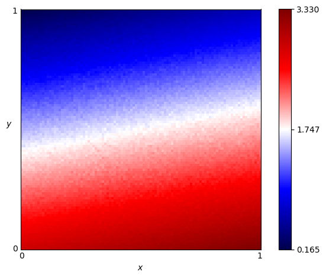

[data (csv)](./assets/Cycler_CCCCCD.csv)

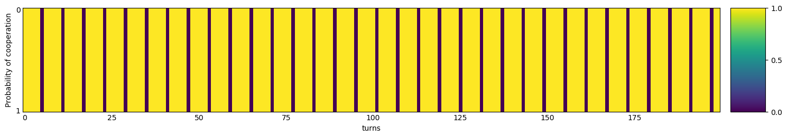

[data (csv)](./assets/transitive_Cycler_CCCCCD.csv)


[data (csv)](./assets/transitive_v_short_Cycler_CCCCCD.csv)
    

## Cycler CCCD


[data (csv)](./assets/Cycler_CCCD.csv)

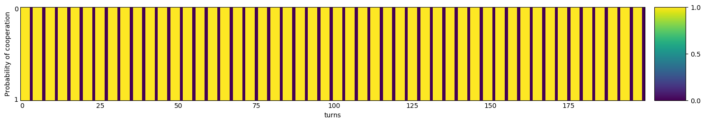

[data (csv)](./assets/transitive_Cycler_CCCD.csv)


[data (csv)](./assets/transitive_v_short_Cycler_CCCD.csv)
    

## Cycler CCD

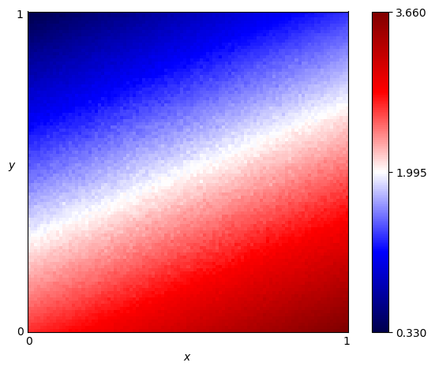

[data (csv)](./assets/Cycler_CCD.csv)

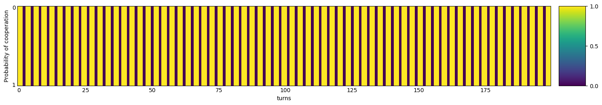

[data (csv)](./assets/transitive_Cycler_CCD.csv)


[data (csv)](./assets/transitive_v_short_Cycler_CCD.csv)
    

## Cycler DC


[data (csv)](./assets/Cycler_DC.csv)

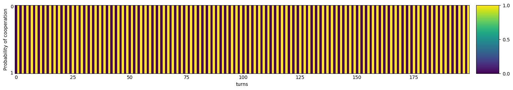

[data (csv)](./assets/transitive_Cycler_DC.csv)


[data (csv)](./assets/transitive_v_short_Cycler_DC.csv)
    

## Cycler DDC


[data (csv)](./assets/Cycler_DDC.csv)

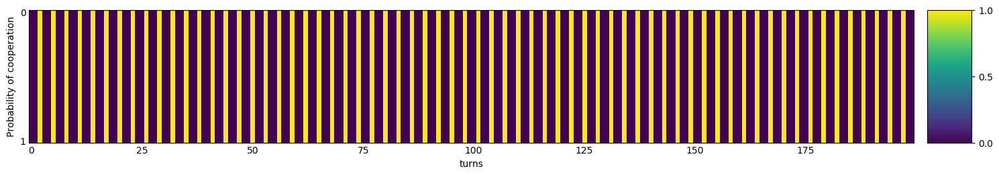

[data (csv)](./assets/transitive_Cycler_DDC.csv)


[data (csv)](./assets/transitive_v_short_Cycler_DDC.csv)
    

## Cycler CCCDCD


[data (csv)](./assets/Cycler_CCCDCD.csv)

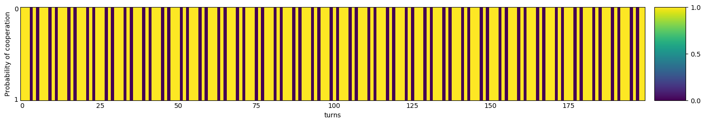

[data (csv)](./assets/transitive_Cycler_CCCDCD.csv)


[data (csv)](./assets/transitive_v_short_Cycler_CCCDCD.csv)
    

## Davis


[data (csv)](./assets/Davis.csv)

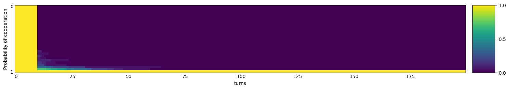

[data (csv)](./assets/transitive_Davis.csv)


[data (csv)](./assets/transitive_v_short_Davis.csv)
    

## Defector


[data (csv)](./assets/Defector.csv)

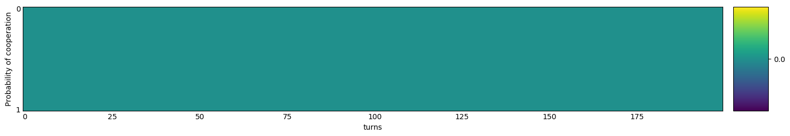

[data (csv)](./assets/transitive_Defector.csv)


[data (csv)](./assets/transitive_v_short_Defector.csv)
    

## Defector Hunter


[data (csv)](./assets/Defector_Hunter.csv)

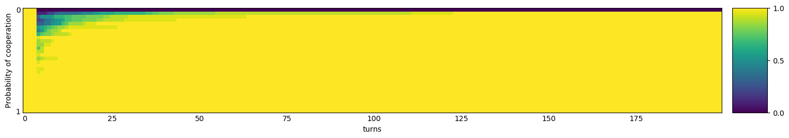

[data (csv)](./assets/transitive_Defector_Hunter.csv)


[data (csv)](./assets/transitive_v_short_Defector_Hunter.csv)
    

## Desperate


[data (csv)](./assets/Desperate.csv)

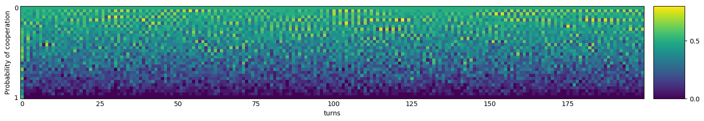

[data (csv)](./assets/transitive_Desperate.csv)


[data (csv)](./assets/transitive_v_short_Desperate.csv)
    

## Delayed AON1

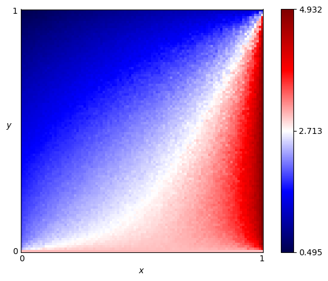

[data (csv)](./assets/Delayed_AON1.csv)

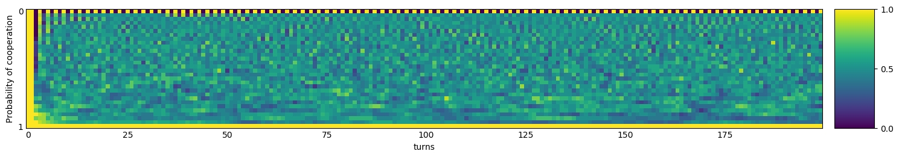

[data (csv)](./assets/transitive_Delayed_AON1.csv)


[data (csv)](./assets/transitive_v_short_Delayed_AON1.csv)
    

## DoubleCrosser


[data (csv)](./assets/DoubleCrosser.csv)

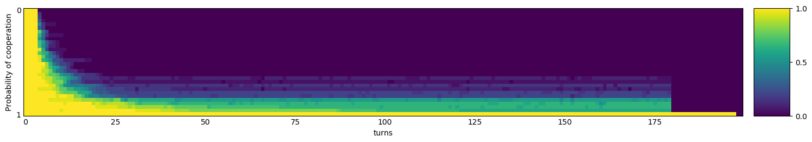

[data (csv)](./assets/transitive_DoubleCrosser.csv)


[data (csv)](./assets/transitive_v_short_DoubleCrosser.csv)
    

## Doubler


[data (csv)](./assets/Doubler.csv)

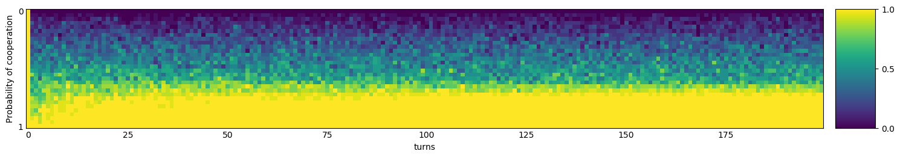

[data (csv)](./assets/transitive_Doubler.csv)


[data (csv)](./assets/transitive_v_short_Doubler.csv)
    

## DoubleResurrection


[data (csv)](./assets/DoubleResurrection.csv)

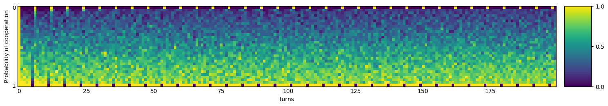

[data (csv)](./assets/transitive_DoubleResurrection.csv)


[data (csv)](./assets/transitive_v_short_DoubleResurrection.csv)
    

## EasyGo


[data (csv)](./assets/EasyGo.csv)

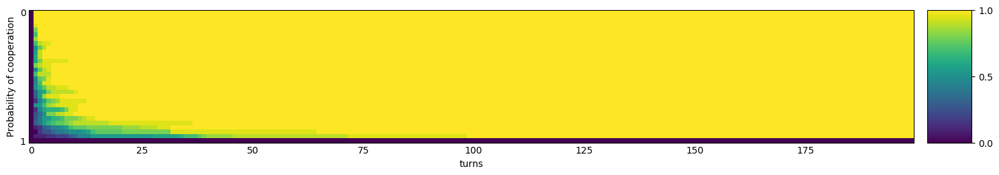

[data (csv)](./assets/transitive_EasyGo.csv)


[data (csv)](./assets/transitive_v_short_EasyGo.csv)
    

## Eatherley


[data (csv)](./assets/Eatherley.csv)

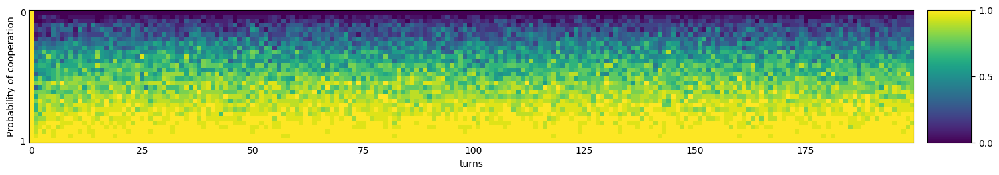

[data (csv)](./assets/transitive_Eatherley.csv)


[data (csv)](./assets/transitive_v_short_Eatherley.csv)
    

## EugineNier

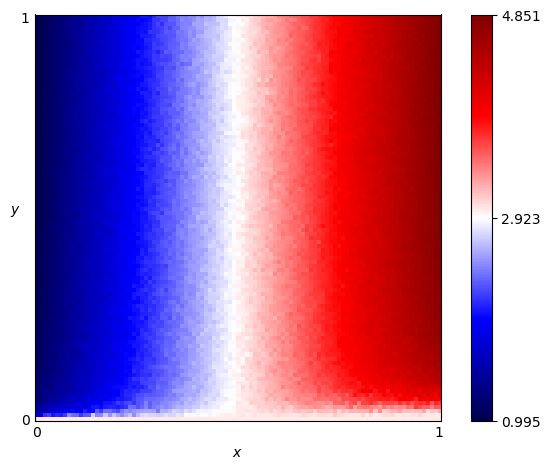

[data (csv)](./assets/EugineNier.csv)

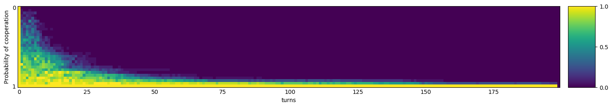

[data (csv)](./assets/transitive_EugineNier.csv)


[data (csv)](./assets/transitive_v_short_EugineNier.csv)
    

## Eventual Cycle Hunter


[data (csv)](./assets/Eventual_Cycle_Hunter.csv)

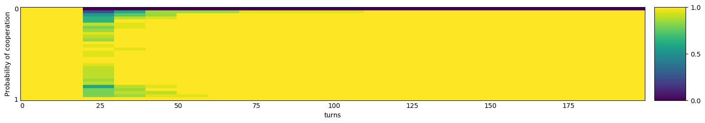

[data (csv)](./assets/transitive_Eventual_Cycle_Hunter.csv)


[data (csv)](./assets/transitive_v_short_Eventual_Cycle_Hunter.csv)
    

## Evolved ANN


[data (csv)](./assets/Evolved_ANN.csv)

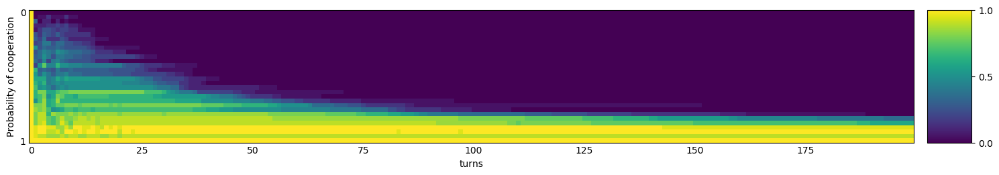

[data (csv)](./assets/transitive_Evolved_ANN.csv)


[data (csv)](./assets/transitive_v_short_Evolved_ANN.csv)
    

## Evolved ANN 5


[data (csv)](./assets/Evolved_ANN_5.csv)

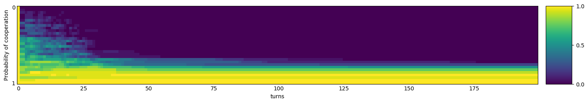

[data (csv)](./assets/transitive_Evolved_ANN_5.csv)


[data (csv)](./assets/transitive_v_short_Evolved_ANN_5.csv)
    

## Evolved ANN 5 Noise 05

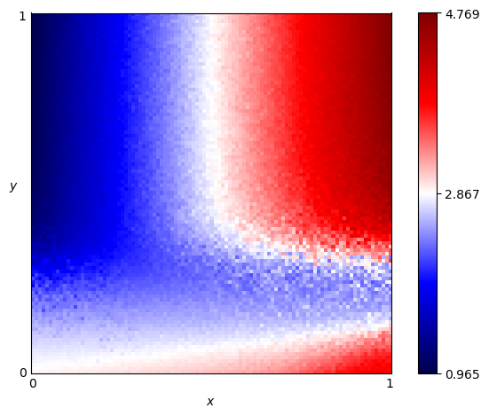

[data (csv)](./assets/Evolved_ANN_5_Noise_05.csv)

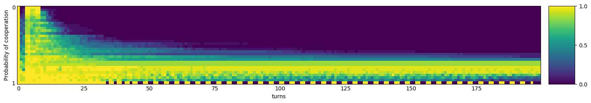

[data (csv)](./assets/transitive_Evolved_ANN_5_Noise_05.csv)


[data (csv)](./assets/transitive_v_short_Evolved_ANN_5_Noise_05.csv)
    

## Evolved FSM 4


[data (csv)](./assets/Evolved_FSM_4.csv)

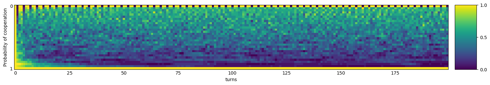

[data (csv)](./assets/transitive_Evolved_FSM_4.csv)


[data (csv)](./assets/transitive_v_short_Evolved_FSM_4.csv)
    

## Evolved FSM 16


[data (csv)](./assets/Evolved_FSM_16.csv)

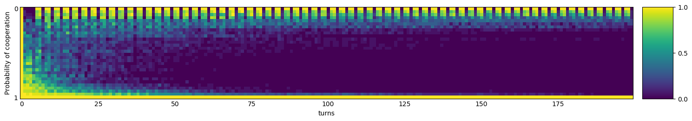

[data (csv)](./assets/transitive_Evolved_FSM_16.csv)


[data (csv)](./assets/transitive_v_short_Evolved_FSM_16.csv)
    

## Evolved FSM 16 Noise 05


[data (csv)](./assets/Evolved_FSM_16_Noise_05.csv)

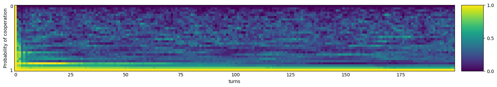

[data (csv)](./assets/transitive_Evolved_FSM_16_Noise_05.csv)


[data (csv)](./assets/transitive_v_short_Evolved_FSM_16_Noise_05.csv)
    

## EvolvedLookerUp1_1_1


[data (csv)](./assets/EvolvedLookerUp1_1_1.csv)

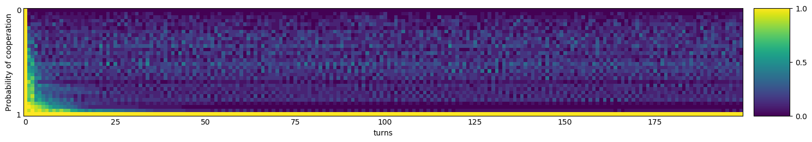

[data (csv)](./assets/transitive_EvolvedLookerUp1_1_1.csv)


[data (csv)](./assets/transitive_v_short_EvolvedLookerUp1_1_1.csv)
    

## EvolvedLookerUp2_2_2


[data (csv)](./assets/EvolvedLookerUp2_2_2.csv)

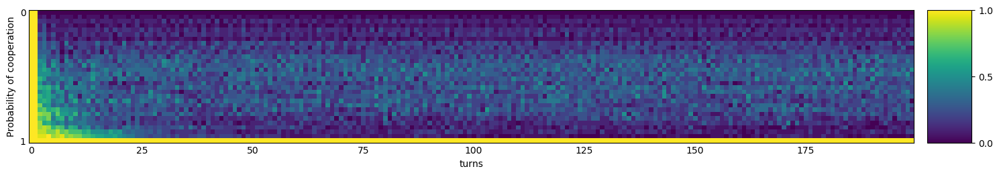

[data (csv)](./assets/transitive_EvolvedLookerUp2_2_2.csv)


[data (csv)](./assets/transitive_v_short_EvolvedLookerUp2_2_2.csv)
    

## Evolved HMM 5


[data (csv)](./assets/Evolved_HMM_5.csv)

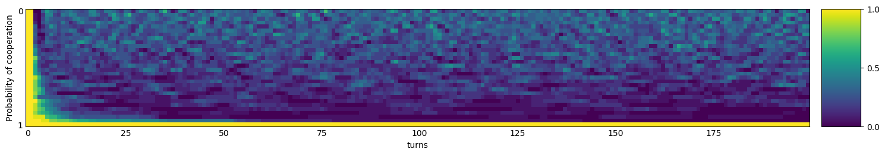

[data (csv)](./assets/transitive_Evolved_HMM_5.csv)


[data (csv)](./assets/transitive_v_short_Evolved_HMM_5.csv)
    

## Feld


[data (csv)](./assets/Feld.csv)

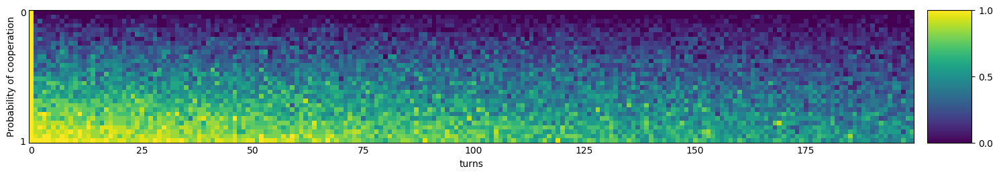

[data (csv)](./assets/transitive_Feld.csv)


[data (csv)](./assets/transitive_v_short_Feld.csv)
    

## Firm But Fair

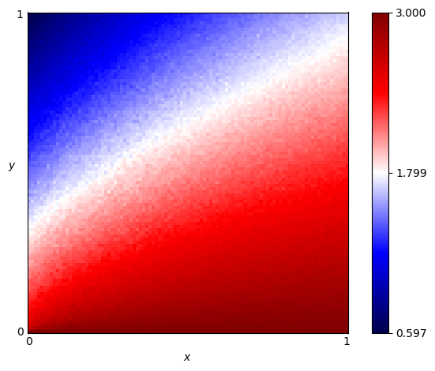

[data (csv)](./assets/Firm_But_Fair.csv)

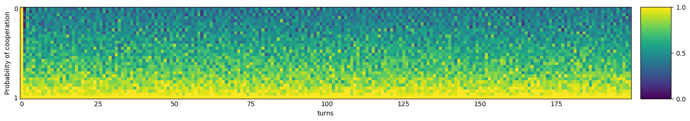

[data (csv)](./assets/transitive_Firm_But_Fair.csv)


[data (csv)](./assets/transitive_v_short_Firm_But_Fair.csv)
    

## Fool Me Forever

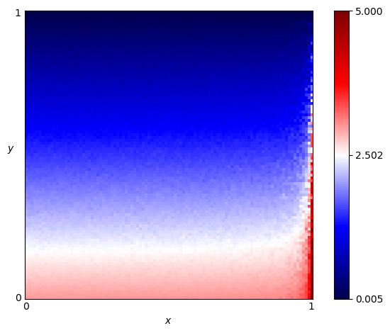

[data (csv)](./assets/Fool_Me_Forever.csv)

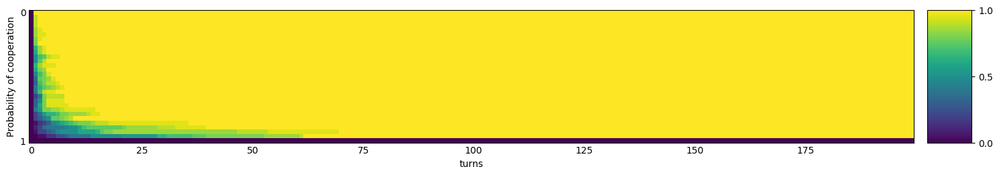

[data (csv)](./assets/transitive_Fool_Me_Forever.csv)


[data (csv)](./assets/transitive_v_short_Fool_Me_Forever.csv)
    

## Fool Me Once

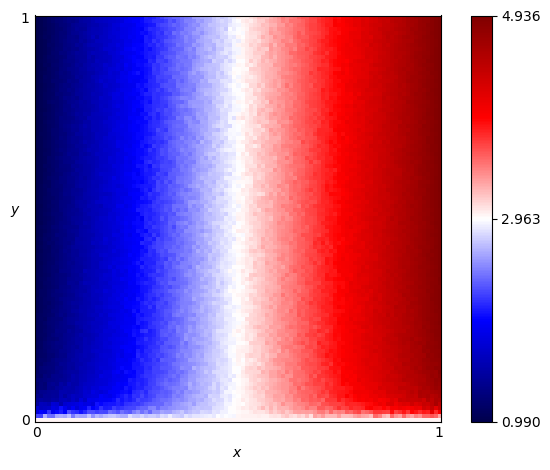

[data (csv)](./assets/Fool_Me_Once.csv)

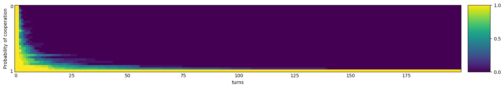

[data (csv)](./assets/transitive_Fool_Me_Once.csv)


[data (csv)](./assets/transitive_v_short_Fool_Me_Once.csv)
    

## Forgetful Fool Me Once

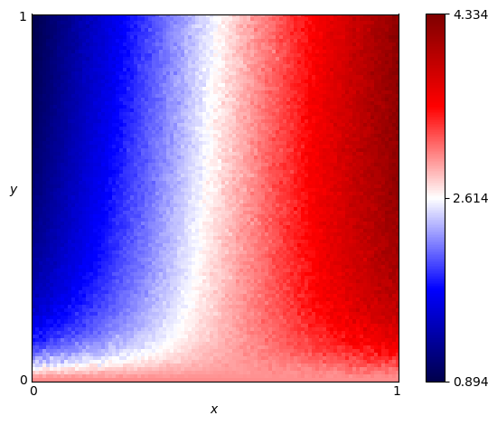

[data (csv)](./assets/Forgetful_Fool_Me_Once.csv)

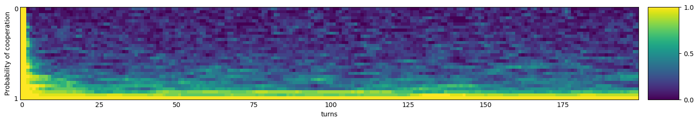

[data (csv)](./assets/transitive_Forgetful_Fool_Me_Once.csv)


[data (csv)](./assets/transitive_v_short_Forgetful_Fool_Me_Once.csv)
    

## Forgetful Grudger


[data (csv)](./assets/Forgetful_Grudger.csv)

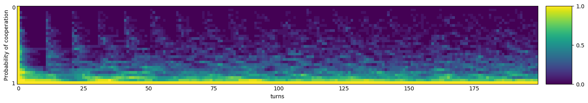

[data (csv)](./assets/transitive_Forgetful_Grudger.csv)


[data (csv)](./assets/transitive_v_short_Forgetful_Grudger.csv)
    

## Forgiver

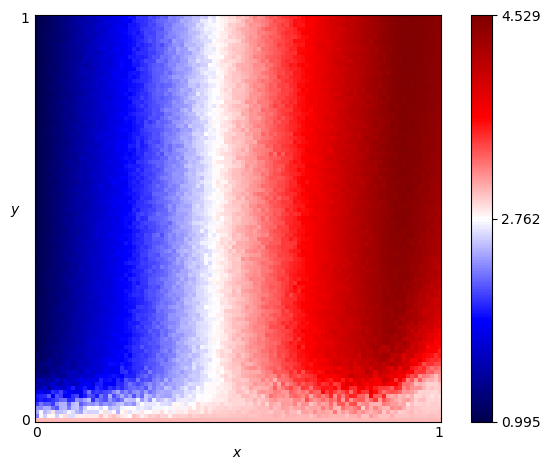

[data (csv)](./assets/Forgiver.csv)

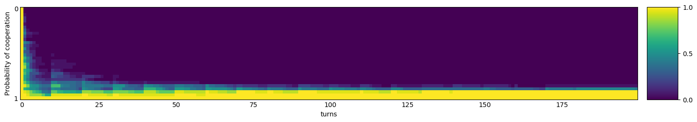

[data (csv)](./assets/transitive_Forgiver.csv)


[data (csv)](./assets/transitive_v_short_Forgiver.csv)
    

## Forgiving Tit For Tat

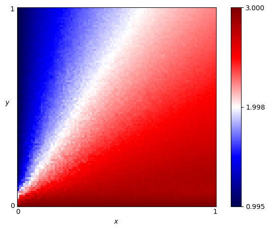

[data (csv)](./assets/Forgiving_Tit_For_Tat.csv)

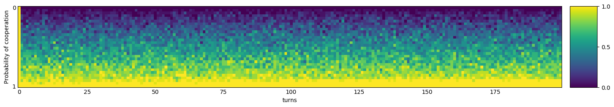

[data (csv)](./assets/transitive_Forgiving_Tit_For_Tat.csv)


[data (csv)](./assets/transitive_v_short_Forgiving_Tit_For_Tat.csv)
    

## Fortress3

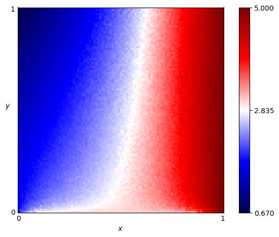

[data (csv)](./assets/Fortress3.csv)

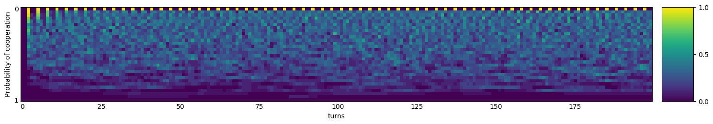

[data (csv)](./assets/transitive_Fortress3.csv)


[data (csv)](./assets/transitive_v_short_Fortress3.csv)
    

## Fortress4


[data (csv)](./assets/Fortress4.csv)

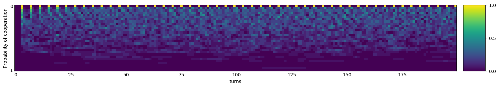

[data (csv)](./assets/transitive_Fortress4.csv)


[data (csv)](./assets/transitive_v_short_Fortress4.csv)
    

## GTFT


[data (csv)](./assets/GTFT.csv)

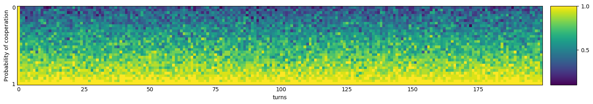

[data (csv)](./assets/transitive_GTFT.csv)


[data (csv)](./assets/transitive_v_short_GTFT.csv)
    

## General Soft Grudger

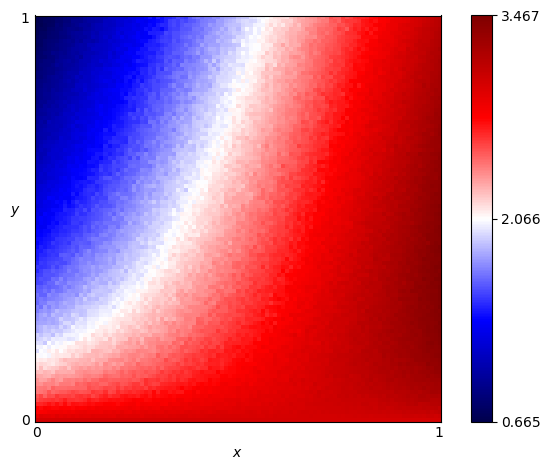

[data (csv)](./assets/General_Soft_Grudger.csv)

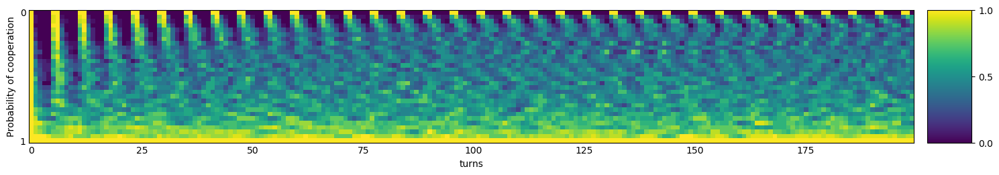

[data (csv)](./assets/transitive_General_Soft_Grudger.csv)


[data (csv)](./assets/transitive_v_short_General_Soft_Grudger.csv)
    

## Getzler

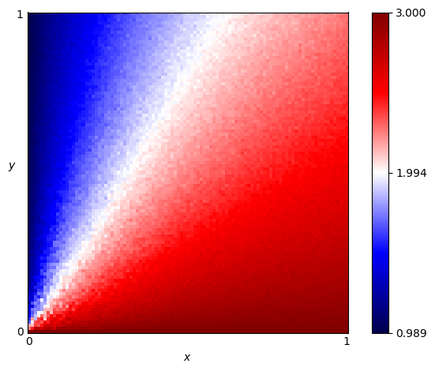

[data (csv)](./assets/Getzler.csv)

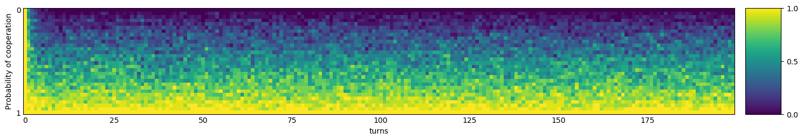

[data (csv)](./assets/transitive_Getzler.csv)


[data (csv)](./assets/transitive_v_short_Getzler.csv)
    

## Gladstein

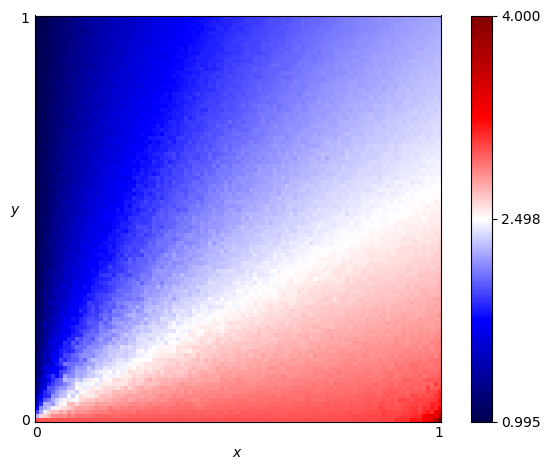

[data (csv)](./assets/Gladstein.csv)

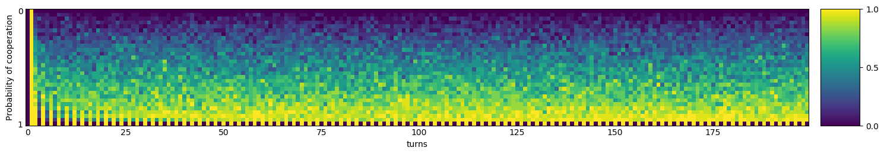

[data (csv)](./assets/transitive_Gladstein.csv)


[data (csv)](./assets/transitive_v_short_Gladstein.csv)
    

## Go By Majority

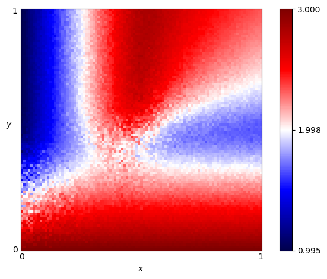

[data (csv)](./assets/Go_By_Majority.csv)

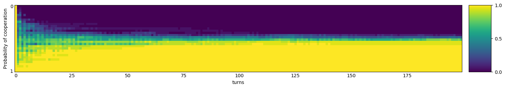

[data (csv)](./assets/transitive_Go_By_Majority.csv)


[data (csv)](./assets/transitive_v_short_Go_By_Majority.csv)
    

## Go By Majority 10


[data (csv)](./assets/Go_By_Majority_10.csv)

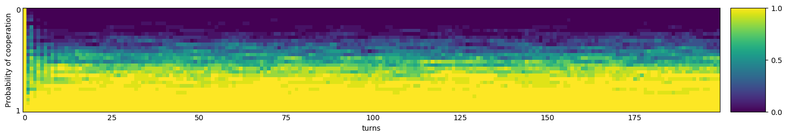

[data (csv)](./assets/transitive_Go_By_Majority_10.csv)


[data (csv)](./assets/transitive_v_short_Go_By_Majority_10.csv)
    

## Go By Majority 20

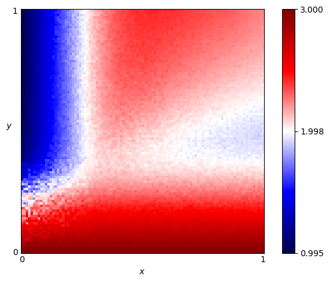

[data (csv)](./assets/Go_By_Majority_20.csv)

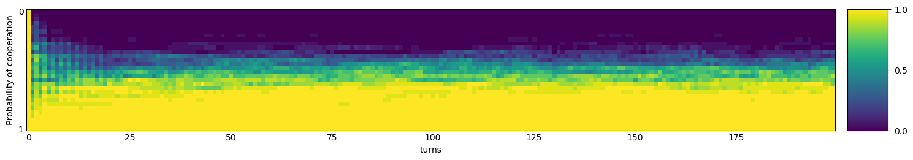

[data (csv)](./assets/transitive_Go_By_Majority_20.csv)


[data (csv)](./assets/transitive_v_short_Go_By_Majority_20.csv)
    

## Go By Majority 40


[data (csv)](./assets/Go_By_Majority_40.csv)

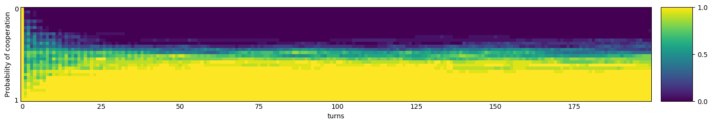

[data (csv)](./assets/transitive_Go_By_Majority_40.csv)


[data (csv)](./assets/transitive_v_short_Go_By_Majority_40.csv)
    

## Go By Majority 5


[data (csv)](./assets/Go_By_Majority_5.csv)

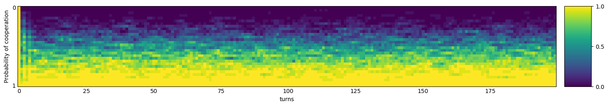

[data (csv)](./assets/transitive_Go_By_Majority_5.csv)


[data (csv)](./assets/transitive_v_short_Go_By_Majority_5.csv)
    

## $\phi$


[data (csv)](./assets/phi.csv)

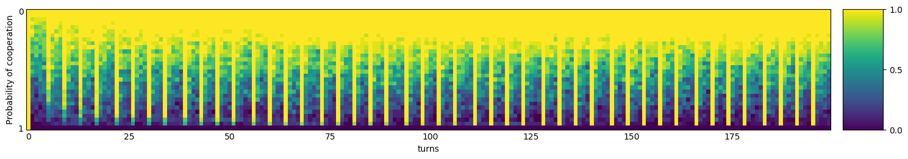

[data (csv)](./assets/transitive_phi.csv)


[data (csv)](./assets/transitive_v_short_phi.csv)
    

## GraaskampKatzen

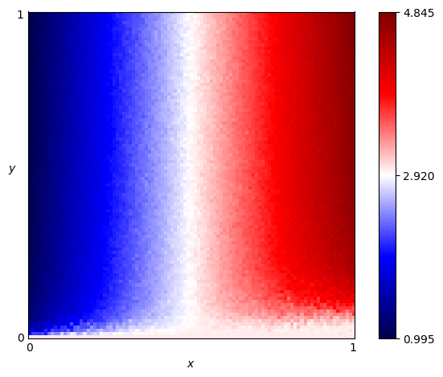

[data (csv)](./assets/GraaskampKatzen.csv)

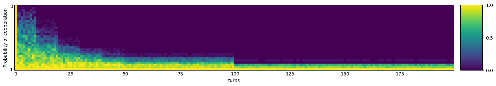

[data (csv)](./assets/transitive_GraaskampKatzen.csv)


[data (csv)](./assets/transitive_v_short_GraaskampKatzen.csv)
    

## Gradual


[data (csv)](./assets/Gradual.csv)

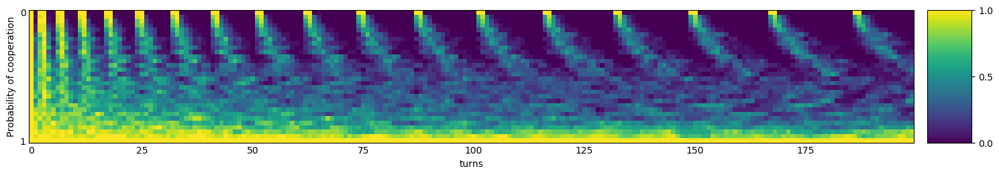

[data (csv)](./assets/transitive_Gradual.csv)


[data (csv)](./assets/transitive_v_short_Gradual.csv)
    

## Gradual Killer


[data (csv)](./assets/Gradual_Killer.csv)

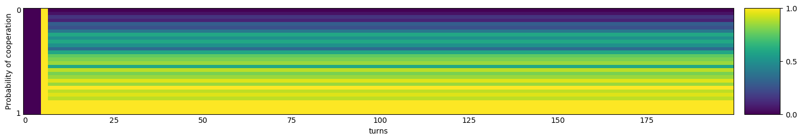

[data (csv)](./assets/transitive_Gradual_Killer.csv)


[data (csv)](./assets/transitive_v_short_Gradual_Killer.csv)
    

## Grofman


[data (csv)](./assets/Grofman.csv)

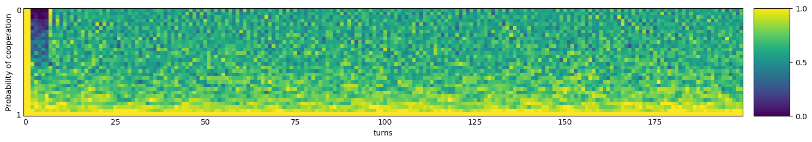

[data (csv)](./assets/transitive_Grofman.csv)


[data (csv)](./assets/transitive_v_short_Grofman.csv)
    

## Grudger


[data (csv)](./assets/Grudger.csv)

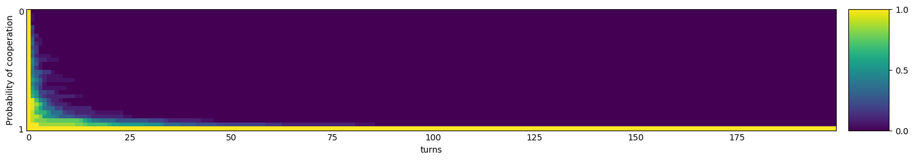

[data (csv)](./assets/transitive_Grudger.csv)


[data (csv)](./assets/transitive_v_short_Grudger.csv)
    

## GrudgerAlternator


[data (csv)](./assets/GrudgerAlternator.csv)

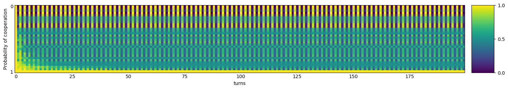

[data (csv)](./assets/transitive_GrudgerAlternator.csv)


[data (csv)](./assets/transitive_v_short_GrudgerAlternator.csv)
    

## Grumpy

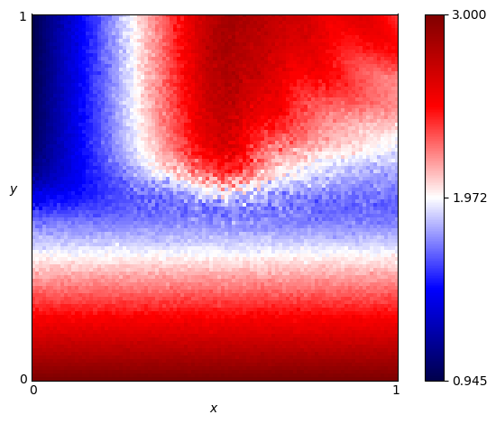

[data (csv)](./assets/Grumpy.csv)

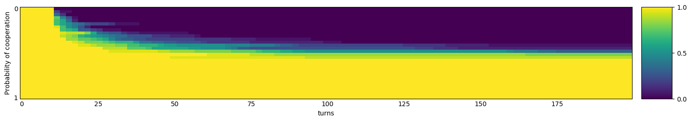

[data (csv)](./assets/transitive_Grumpy.csv)


[data (csv)](./assets/transitive_v_short_Grumpy.csv)
    

## Handshake


[data (csv)](./assets/Handshake.csv)

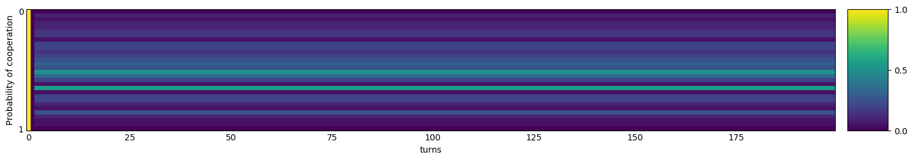

[data (csv)](./assets/transitive_Handshake.csv)


[data (csv)](./assets/transitive_v_short_Handshake.csv)
    

## Hard Go By Majority

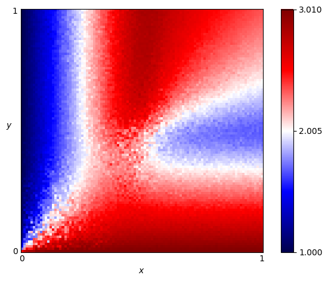

[data (csv)](./assets/Hard_Go_By_Majority.csv)

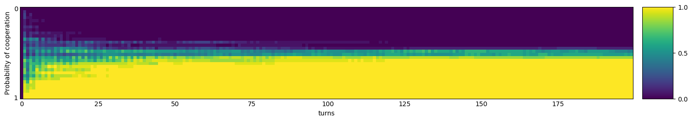

[data (csv)](./assets/transitive_Hard_Go_By_Majority.csv)


[data (csv)](./assets/transitive_v_short_Hard_Go_By_Majority.csv)
    

## Hard Go By Majority 10

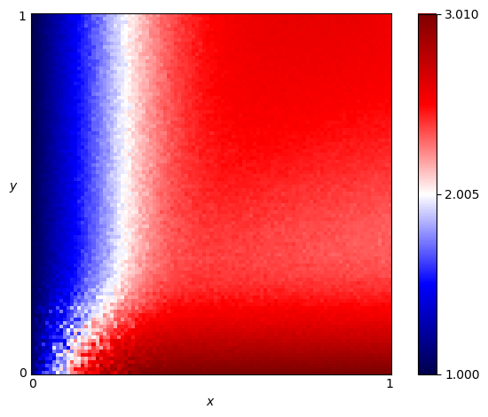

[data (csv)](./assets/Hard_Go_By_Majority_10.csv)

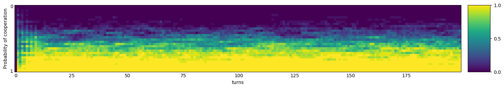

[data (csv)](./assets/transitive_Hard_Go_By_Majority_10.csv)


[data (csv)](./assets/transitive_v_short_Hard_Go_By_Majority_10.csv)
    

## Hard Go By Majority 20

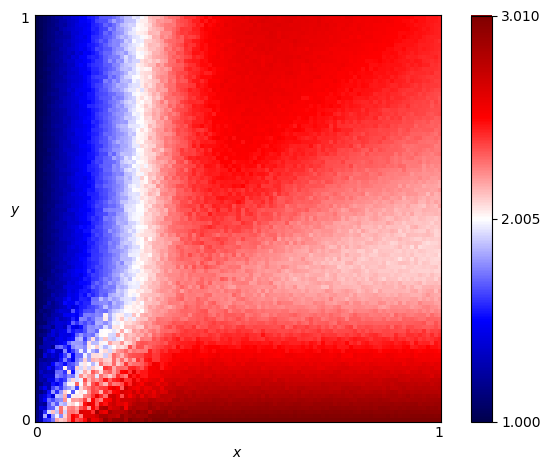

[data (csv)](./assets/Hard_Go_By_Majority_20.csv)

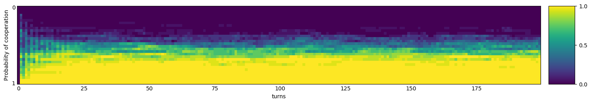

[data (csv)](./assets/transitive_Hard_Go_By_Majority_20.csv)


[data (csv)](./assets/transitive_v_short_Hard_Go_By_Majority_20.csv)
    

## Hard Go By Majority 40


[data (csv)](./assets/Hard_Go_By_Majority_40.csv)

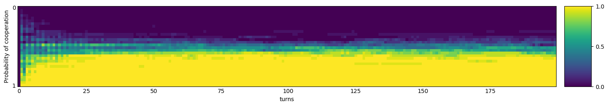

[data (csv)](./assets/transitive_Hard_Go_By_Majority_40.csv)


[data (csv)](./assets/transitive_v_short_Hard_Go_By_Majority_40.csv)
    

## Hard Go By Majority 5


[data (csv)](./assets/Hard_Go_By_Majority_5.csv)

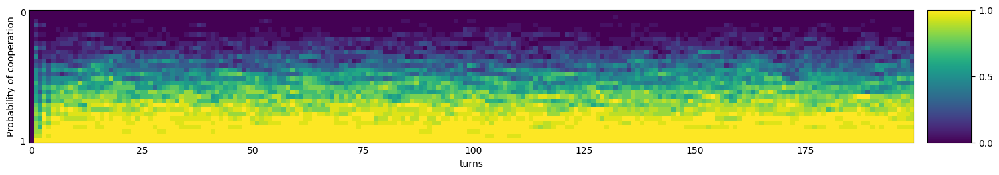

[data (csv)](./assets/transitive_Hard_Go_By_Majority_5.csv)


[data (csv)](./assets/transitive_v_short_Hard_Go_By_Majority_5.csv)
    

## Hard Prober


[data (csv)](./assets/Hard_Prober.csv)

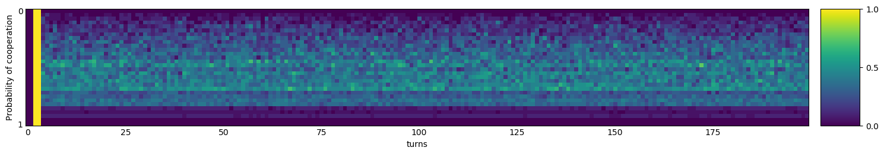

[data (csv)](./assets/transitive_Hard_Prober.csv)


[data (csv)](./assets/transitive_v_short_Hard_Prober.csv)
    

## Hard Tit For 2 Tats

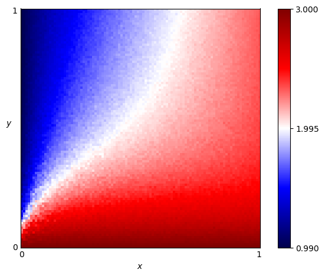

[data (csv)](./assets/Hard_Tit_For_2_Tats.csv)

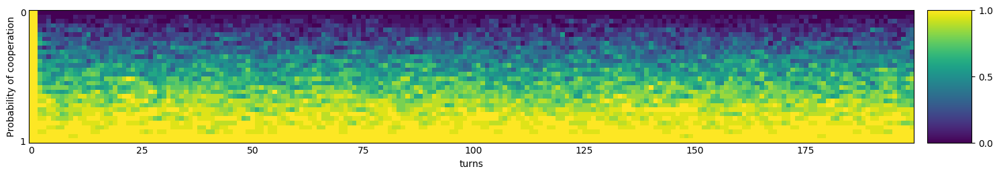

[data (csv)](./assets/transitive_Hard_Tit_For_2_Tats.csv)


[data (csv)](./assets/transitive_v_short_Hard_Tit_For_2_Tats.csv)
    

## Hard Tit For Tat


[data (csv)](./assets/Hard_Tit_For_Tat.csv)

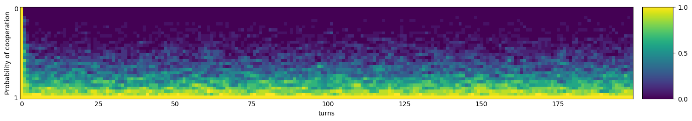

[data (csv)](./assets/transitive_Hard_Tit_For_Tat.csv)


[data (csv)](./assets/transitive_v_short_Hard_Tit_For_Tat.csv)
    

## Harrington

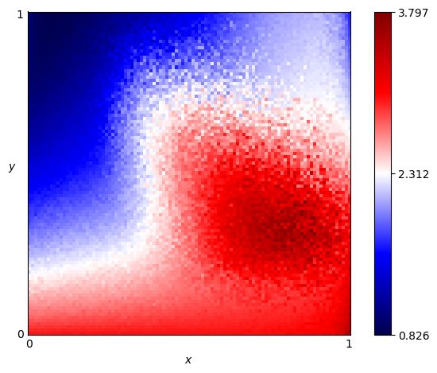

[data (csv)](./assets/Harrington.csv)

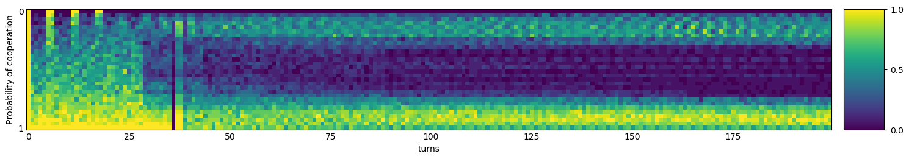

[data (csv)](./assets/transitive_Harrington.csv)


[data (csv)](./assets/transitive_v_short_Harrington.csv)
    

## Hesitant QLearner


[data (csv)](./assets/Hesitant_QLearner.csv)

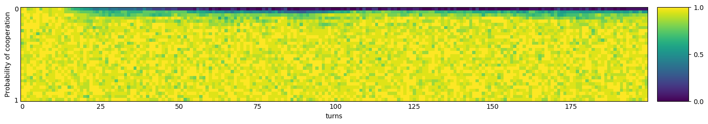

[data (csv)](./assets/transitive_Hesitant_QLearner.csv)


[data (csv)](./assets/transitive_v_short_Hesitant_QLearner.csv)
    

## Hopeless


[data (csv)](./assets/Hopeless.csv)

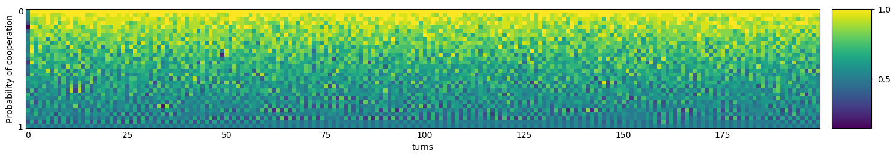

[data (csv)](./assets/transitive_Hopeless.csv)


[data (csv)](./assets/transitive_v_short_Hopeless.csv)
    

## Inverse


[data (csv)](./assets/Inverse.csv)

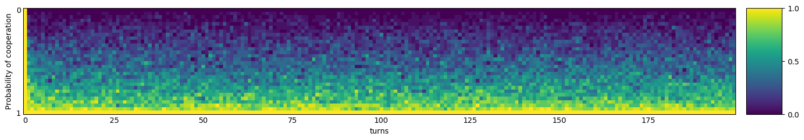

[data (csv)](./assets/transitive_Inverse.csv)


[data (csv)](./assets/transitive_v_short_Inverse.csv)
    

## Inverse Punisher

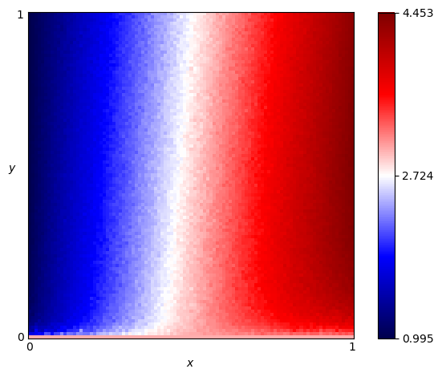

[data (csv)](./assets/Inverse_Punisher.csv)

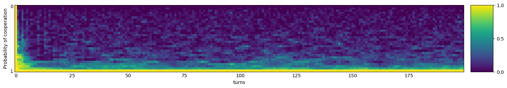

[data (csv)](./assets/transitive_Inverse_Punisher.csv)


[data (csv)](./assets/transitive_v_short_Inverse_Punisher.csv)
    

## Joss


[data (csv)](./assets/Joss.csv)

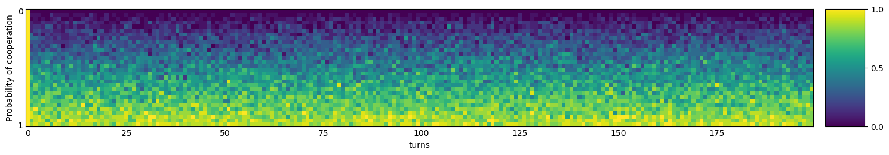

[data (csv)](./assets/transitive_Joss.csv)


[data (csv)](./assets/transitive_v_short_Joss.csv)
    

## Kluepfel

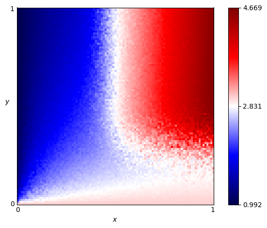

[data (csv)](./assets/Kluepfel.csv)

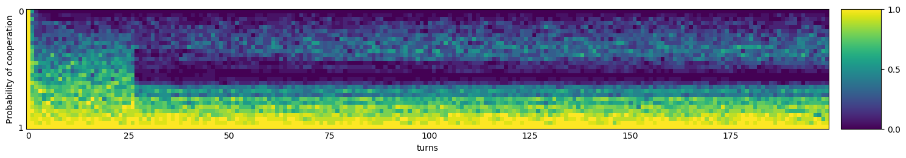

[data (csv)](./assets/transitive_Kluepfel.csv)


[data (csv)](./assets/transitive_v_short_Kluepfel.csv)
    

## Knowledgeable Worse and Worse

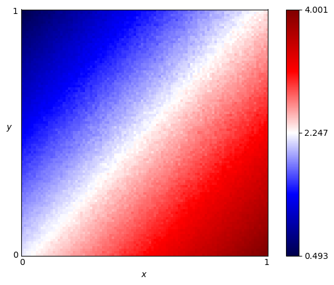

[data (csv)](./assets/Knowledgeable_Worse_and_Worse.csv)

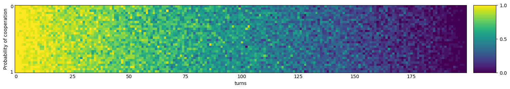

[data (csv)](./assets/transitive_Knowledgeable_Worse_and_Worse.csv)


[data (csv)](./assets/transitive_v_short_Knowledgeable_Worse_and_Worse.csv)
    

## Level Punisher


[data (csv)](./assets/Level_Punisher.csv)

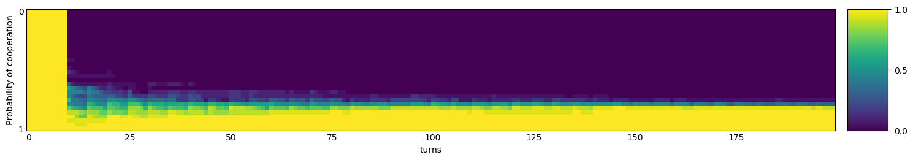

[data (csv)](./assets/transitive_Level_Punisher.csv)


[data (csv)](./assets/transitive_v_short_Level_Punisher.csv)
    

## Leyvraz

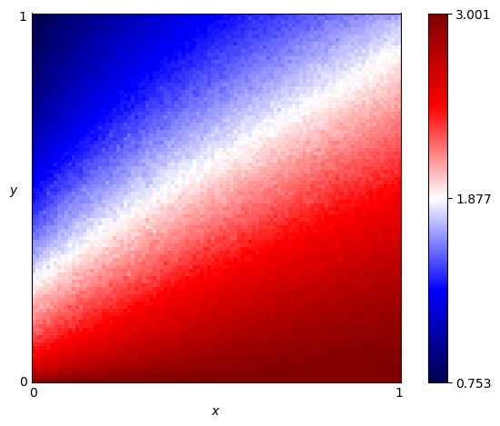

[data (csv)](./assets/Leyvraz.csv)

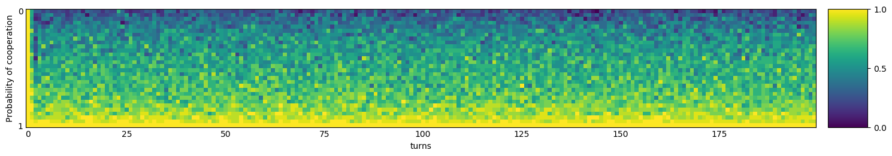

[data (csv)](./assets/transitive_Leyvraz.csv)


[data (csv)](./assets/transitive_v_short_Leyvraz.csv)
    

## Limited Retaliate

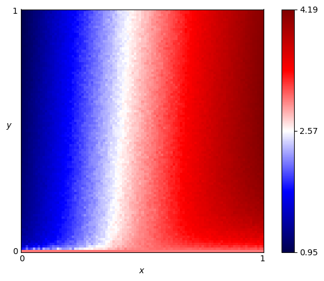

[data (csv)](./assets/Limited_Retaliate.csv)

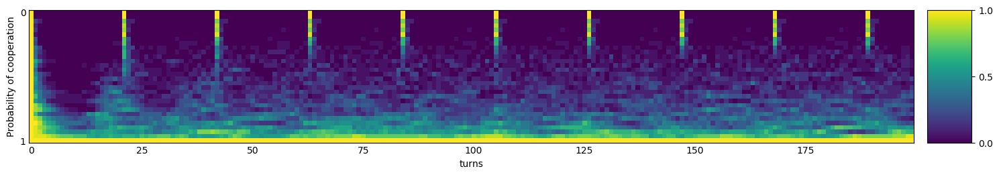

[data (csv)](./assets/transitive_Limited_Retaliate.csv)


[data (csv)](./assets/transitive_v_short_Limited_Retaliate.csv)
    

## Limited Retaliate 2


[data (csv)](./assets/Limited_Retaliate_2.csv)

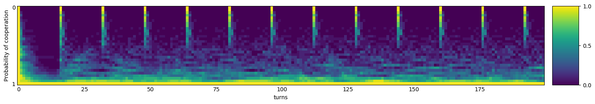

[data (csv)](./assets/transitive_Limited_Retaliate_2.csv)


[data (csv)](./assets/transitive_v_short_Limited_Retaliate_2.csv)
    

## Limited Retaliate 3

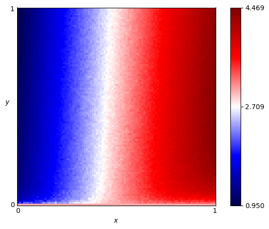

[data (csv)](./assets/Limited_Retaliate_3.csv)

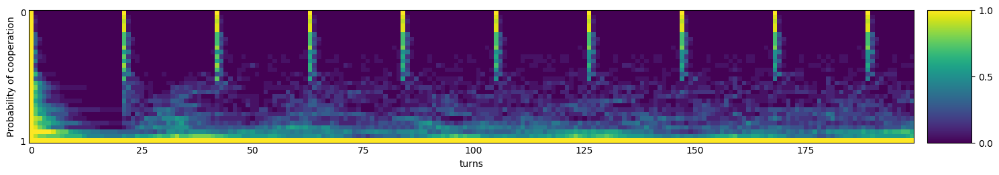

[data (csv)](./assets/transitive_Limited_Retaliate_3.csv)


[data (csv)](./assets/transitive_v_short_Limited_Retaliate_3.csv)
    

## Math Constant Hunter

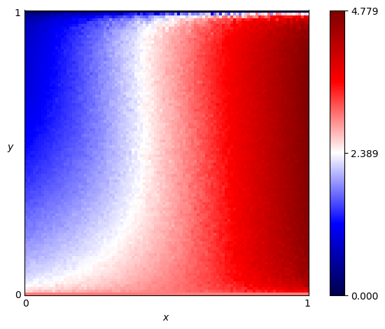

[data (csv)](./assets/Math_Constant_Hunter.csv)

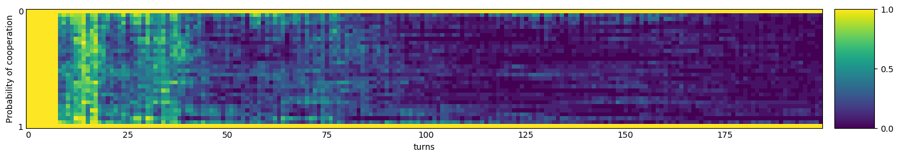

[data (csv)](./assets/transitive_Math_Constant_Hunter.csv)


[data (csv)](./assets/transitive_v_short_Math_Constant_Hunter.csv)
    

## Naive Prober


[data (csv)](./assets/Naive_Prober.csv)

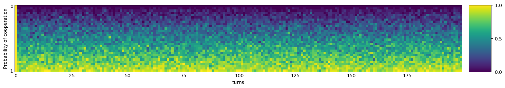

[data (csv)](./assets/transitive_Naive_Prober.csv)


[data (csv)](./assets/transitive_v_short_Naive_Prober.csv)
    

## MEM2

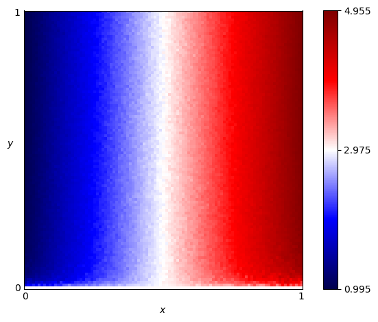

[data (csv)](./assets/MEM2.csv)

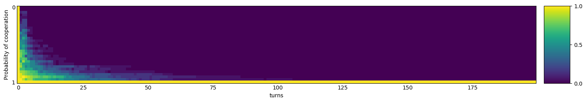

[data (csv)](./assets/transitive_MEM2.csv)


[data (csv)](./assets/transitive_v_short_MEM2.csv)
    

## Michaelos

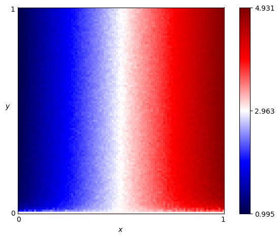

[data (csv)](./assets/Michaelos.csv)

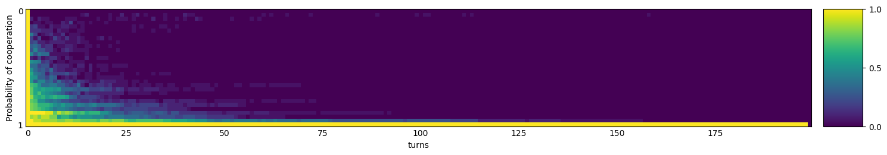

[data (csv)](./assets/transitive_Michaelos.csv)


[data (csv)](./assets/transitive_v_short_Michaelos.csv)
    

## Mikkelson

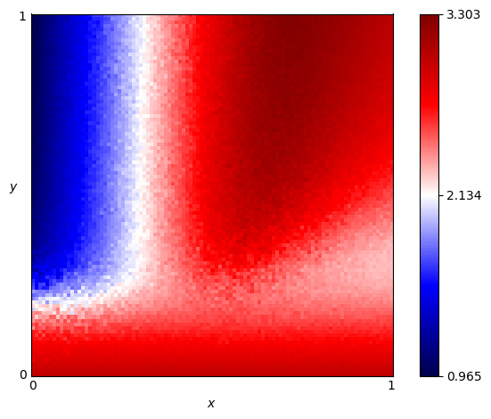

[data (csv)](./assets/Mikkelson.csv)

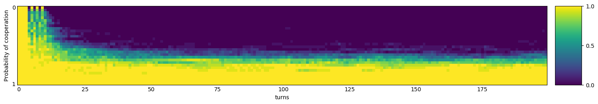

[data (csv)](./assets/transitive_Mikkelson.csv)


[data (csv)](./assets/transitive_v_short_Mikkelson.csv)
    

## MoreGrofman

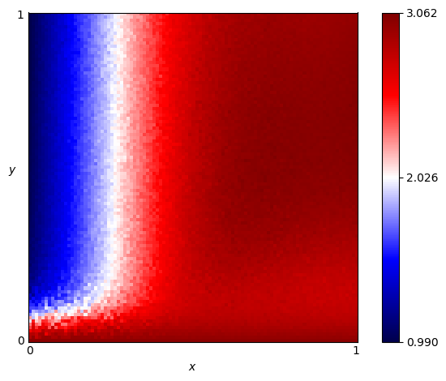

[data (csv)](./assets/MoreGrofman.csv)

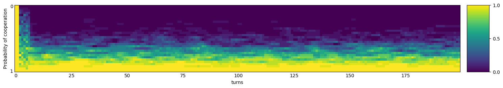

[data (csv)](./assets/transitive_MoreGrofman.csv)


[data (csv)](./assets/transitive_v_short_MoreGrofman.csv)
    

## More Tideman and Chieruzzi

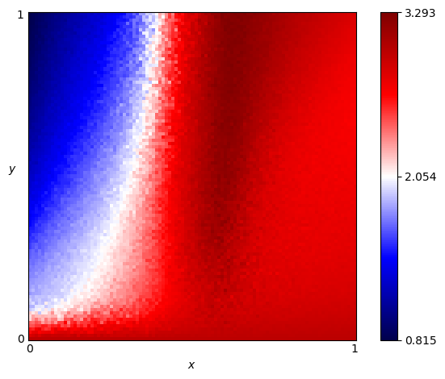

[data (csv)](./assets/More_Tideman_and_Chieruzzi.csv)

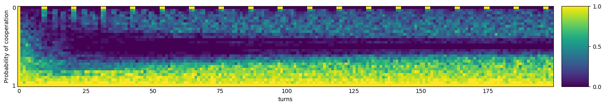

[data (csv)](./assets/transitive_More_Tideman_and_Chieruzzi.csv)


[data (csv)](./assets/transitive_v_short_More_Tideman_and_Chieruzzi.csv)
    

## Negation

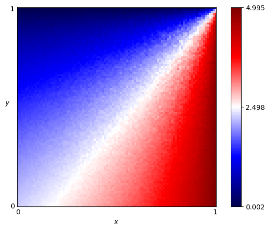

[data (csv)](./assets/Negation.csv)

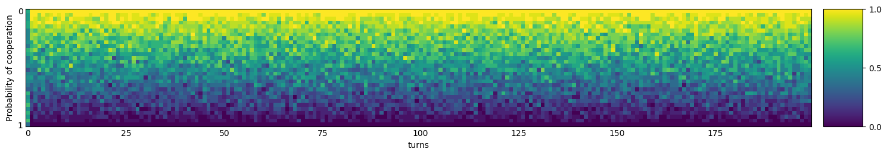

[data (csv)](./assets/transitive_Negation.csv)


[data (csv)](./assets/transitive_v_short_Negation.csv)
    

## Nice Average Copier


[data (csv)](./assets/Nice_Average_Copier.csv)

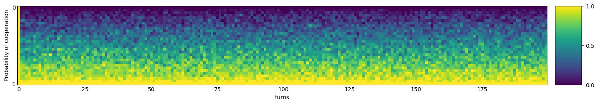

[data (csv)](./assets/transitive_Nice_Average_Copier.csv)


[data (csv)](./assets/transitive_v_short_Nice_Average_Copier.csv)
    

## N Tit(s) For M Tat(s)

_For_M_Tat(s).png)

[data (csv)](./assets/N_Tit(s)_For_M_Tat(s).csv)

_For_M_Tat(s).png)

[data (csv)](./assets/transitive_N_Tit(s)_For_M_Tat(s).csv)

_For_M_Tat(s).png)

[data (csv)](./assets/transitive_v_short_N_Tit(s)_For_M_Tat(s).csv)
    

## Nydegger


[data (csv)](./assets/Nydegger.csv)

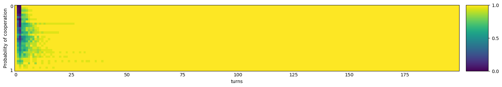

[data (csv)](./assets/transitive_Nydegger.csv)


[data (csv)](./assets/transitive_v_short_Nydegger.csv)
    

## Omega TFT


[data (csv)](./assets/Omega_TFT.csv)

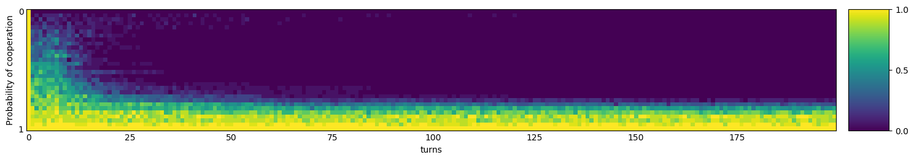

[data (csv)](./assets/transitive_Omega_TFT.csv)


[data (csv)](./assets/transitive_v_short_Omega_TFT.csv)
    

## Once Bitten


[data (csv)](./assets/Once_Bitten.csv)

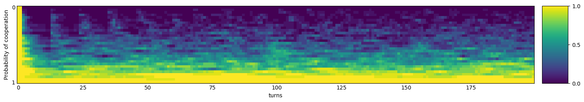

[data (csv)](./assets/transitive_Once_Bitten.csv)


[data (csv)](./assets/transitive_v_short_Once_Bitten.csv)
    

## Opposite Grudger


[data (csv)](./assets/Opposite_Grudger.csv)

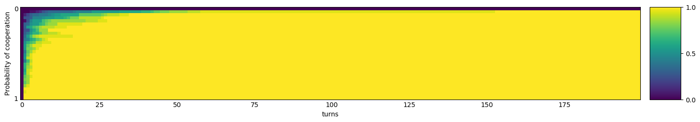

[data (csv)](./assets/transitive_Opposite_Grudger.csv)


[data (csv)](./assets/transitive_v_short_Opposite_Grudger.csv)
    

## $\pi$


[data (csv)](./assets/pi.csv)

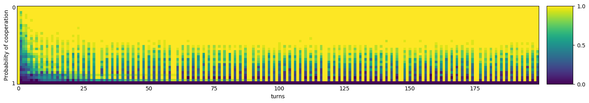

[data (csv)](./assets/transitive_pi.csv)


[data (csv)](./assets/transitive_v_short_pi.csv)
    

## Predator


[data (csv)](./assets/Predator.csv)

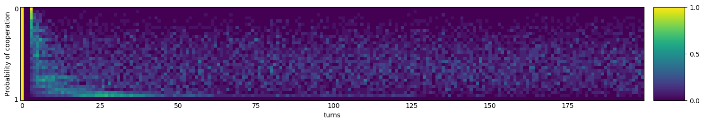

[data (csv)](./assets/transitive_Predator.csv)


[data (csv)](./assets/transitive_v_short_Predator.csv)
    

## Prober


[data (csv)](./assets/Prober.csv)

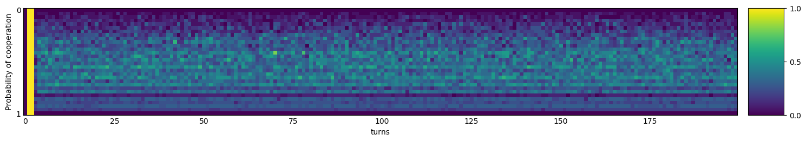

[data (csv)](./assets/transitive_Prober.csv)


[data (csv)](./assets/transitive_v_short_Prober.csv)
    

## Prober 2

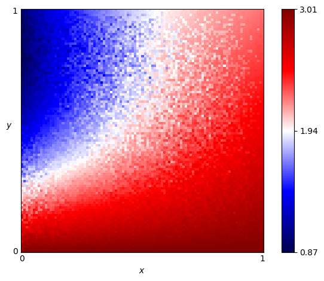

[data (csv)](./assets/Prober_2.csv)

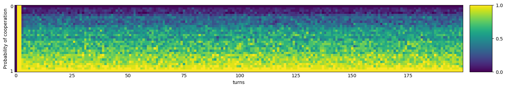

[data (csv)](./assets/transitive_Prober_2.csv)


[data (csv)](./assets/transitive_v_short_Prober_2.csv)
    

## Prober 3

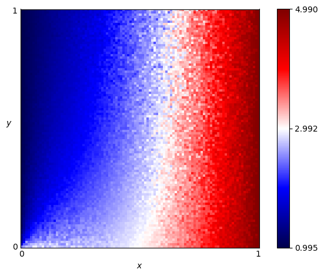

[data (csv)](./assets/Prober_3.csv)

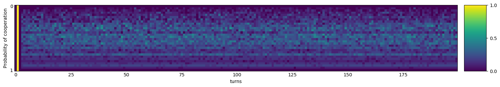

[data (csv)](./assets/transitive_Prober_3.csv)


[data (csv)](./assets/transitive_v_short_Prober_3.csv)
    

## Prober 4

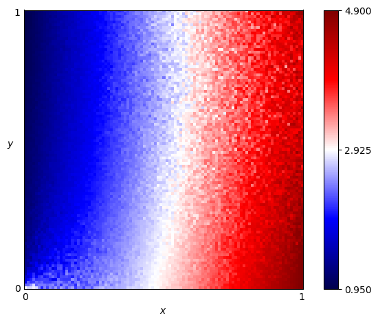

[data (csv)](./assets/Prober_4.csv)

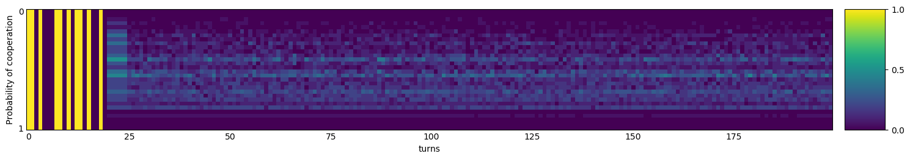

[data (csv)](./assets/transitive_Prober_4.csv)


[data (csv)](./assets/transitive_v_short_Prober_4.csv)
    

## Pun1


[data (csv)](./assets/Pun1.csv)

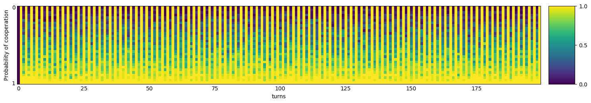

[data (csv)](./assets/transitive_Pun1.csv)


[data (csv)](./assets/transitive_v_short_Pun1.csv)
    

## PSO Gambler 1_1_1

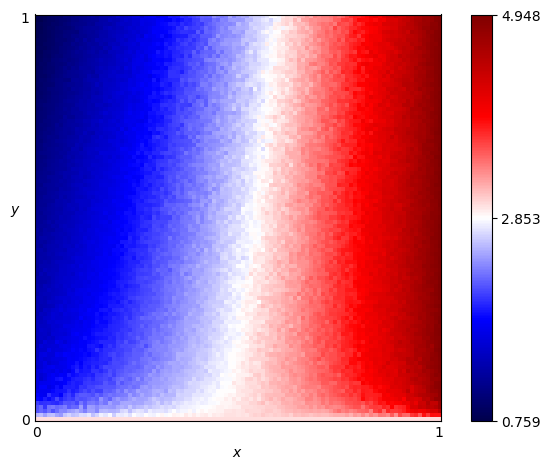

[data (csv)](./assets/PSO_Gambler_1_1_1.csv)

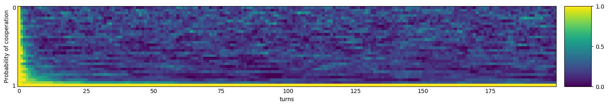

[data (csv)](./assets/transitive_PSO_Gambler_1_1_1.csv)


[data (csv)](./assets/transitive_v_short_PSO_Gambler_1_1_1.csv)
    

## PSO Gambler 2_2_2

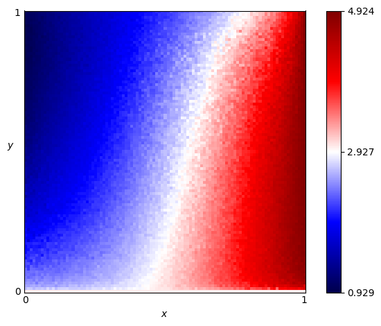

[data (csv)](./assets/PSO_Gambler_2_2_2.csv)

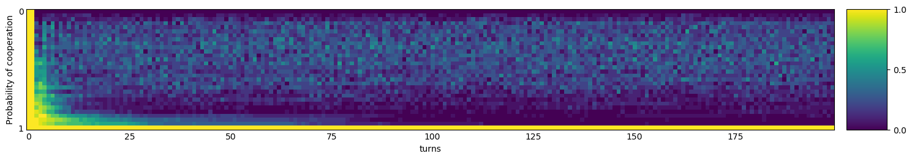

[data (csv)](./assets/transitive_PSO_Gambler_2_2_2.csv)


[data (csv)](./assets/transitive_v_short_PSO_Gambler_2_2_2.csv)
    

## PSO Gambler 2_2_2 Noise 05


[data (csv)](./assets/PSO_Gambler_2_2_2_Noise_05.csv)

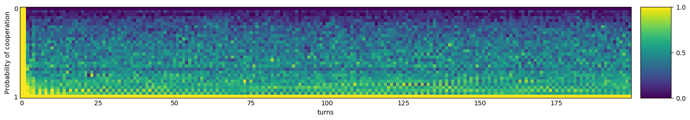

[data (csv)](./assets/transitive_PSO_Gambler_2_2_2_Noise_05.csv)


[data (csv)](./assets/transitive_v_short_PSO_Gambler_2_2_2_Noise_05.csv)
    

## PSO Gambler Mem1

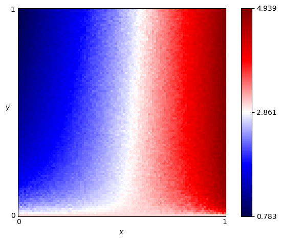

[data (csv)](./assets/PSO_Gambler_Mem1.csv)

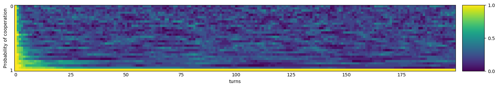

[data (csv)](./assets/transitive_PSO_Gambler_Mem1.csv)


[data (csv)](./assets/transitive_v_short_PSO_Gambler_Mem1.csv)
    

## Punisher


[data (csv)](./assets/Punisher.csv)

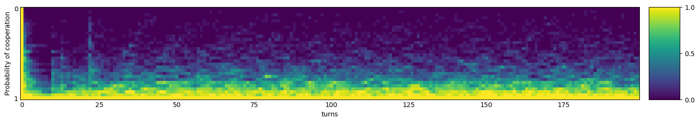

[data (csv)](./assets/transitive_Punisher.csv)


[data (csv)](./assets/transitive_v_short_Punisher.csv)
    

## Raider

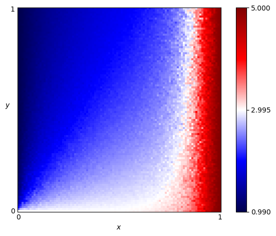

[data (csv)](./assets/Raider.csv)

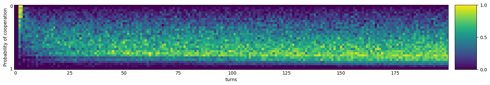

[data (csv)](./assets/transitive_Raider.csv)


[data (csv)](./assets/transitive_v_short_Raider.csv)
    

## Random


[data (csv)](./assets/Random.csv)

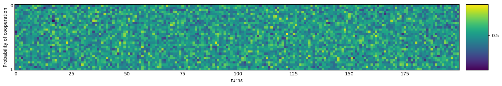

[data (csv)](./assets/transitive_Random.csv)


[data (csv)](./assets/transitive_v_short_Random.csv)
    

## Random Hunter


[data (csv)](./assets/Random_Hunter.csv)

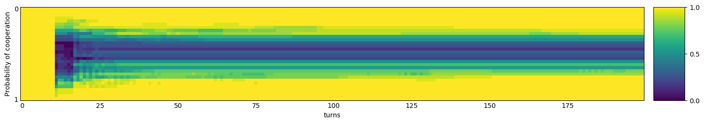

[data (csv)](./assets/transitive_Random_Hunter.csv)


[data (csv)](./assets/transitive_v_short_Random_Hunter.csv)
    

## Random Tit for Tat

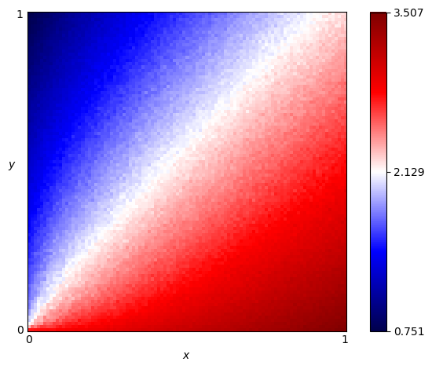

[data (csv)](./assets/Random_Tit_for_Tat.csv)

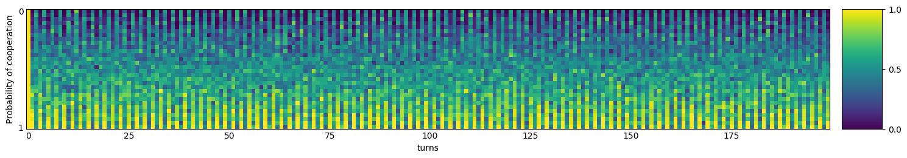

[data (csv)](./assets/transitive_Random_Tit_for_Tat.csv)


[data (csv)](./assets/transitive_v_short_Random_Tit_for_Tat.csv)
    

## Remorseful Prober

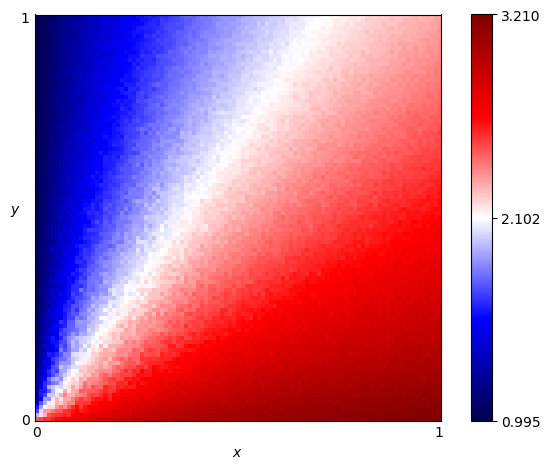

[data (csv)](./assets/Remorseful_Prober.csv)

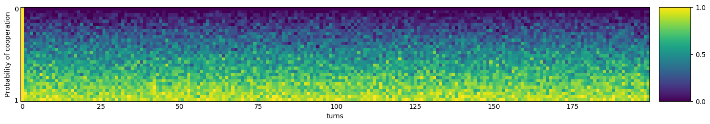

[data (csv)](./assets/transitive_Remorseful_Prober.csv)


[data (csv)](./assets/transitive_v_short_Remorseful_Prober.csv)
    

## Resurrection

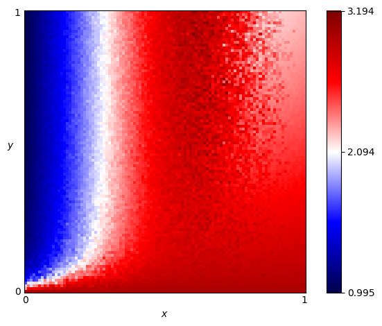

[data (csv)](./assets/Resurrection.csv)

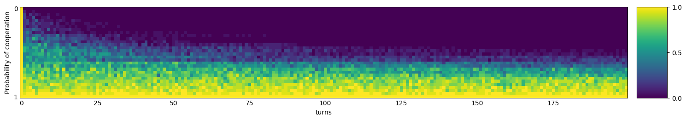

[data (csv)](./assets/transitive_Resurrection.csv)


[data (csv)](./assets/transitive_v_short_Resurrection.csv)
    

## Retaliate

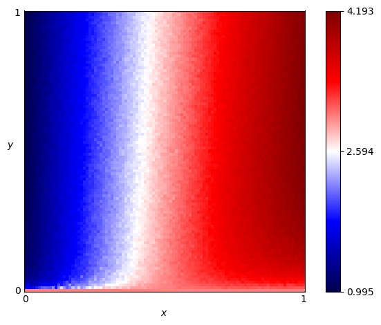

[data (csv)](./assets/Retaliate.csv)

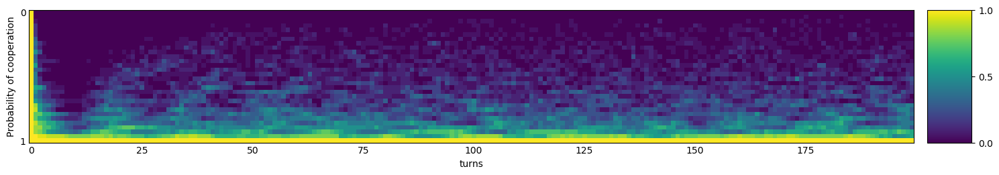

[data (csv)](./assets/transitive_Retaliate.csv)


[data (csv)](./assets/transitive_v_short_Retaliate.csv)
    

## Retaliate 2

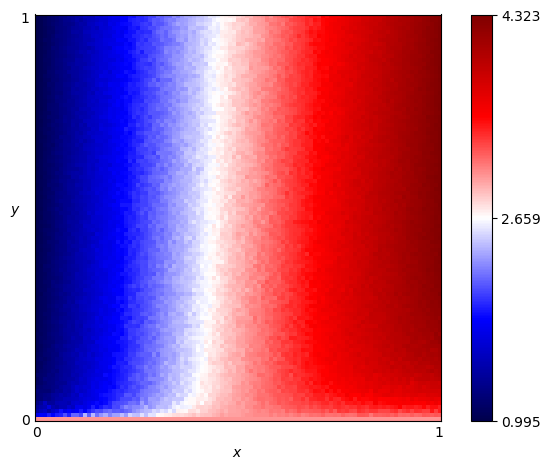

[data (csv)](./assets/Retaliate_2.csv)

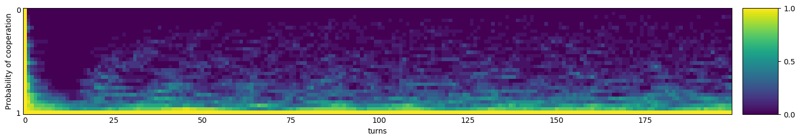

[data (csv)](./assets/transitive_Retaliate_2.csv)


[data (csv)](./assets/transitive_v_short_Retaliate_2.csv)
    

## Retaliate 3

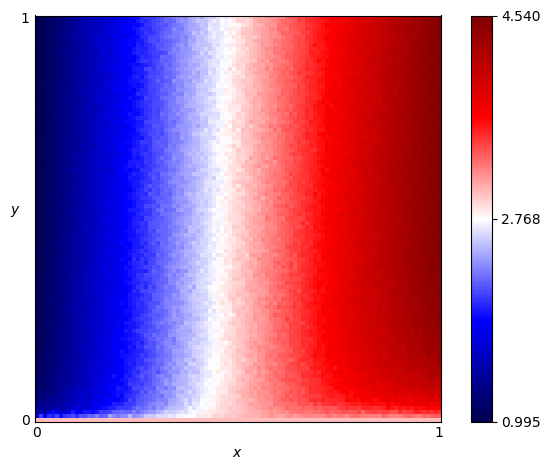

[data (csv)](./assets/Retaliate_3.csv)

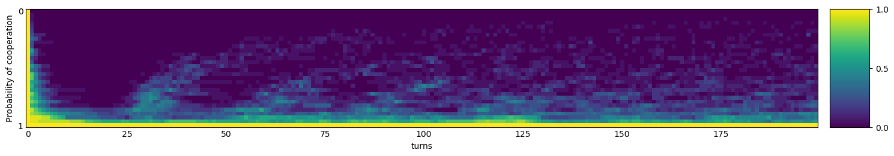

[data (csv)](./assets/transitive_Retaliate_3.csv)


[data (csv)](./assets/transitive_v_short_Retaliate_3.csv)
    

## Revised Downing

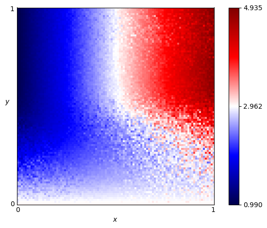

[data (csv)](./assets/Revised_Downing.csv)

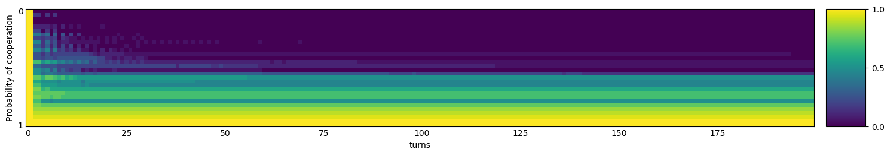

[data (csv)](./assets/transitive_Revised_Downing.csv)


[data (csv)](./assets/transitive_v_short_Revised_Downing.csv)
    

## RichardHufford

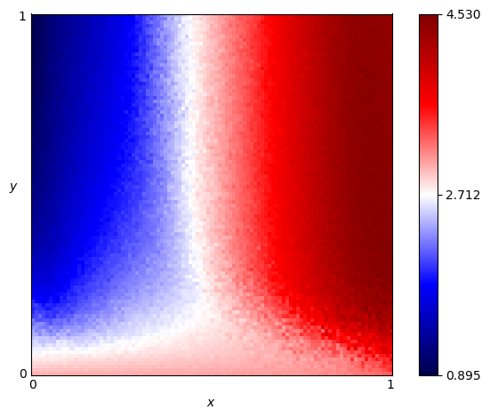

[data (csv)](./assets/RichardHufford.csv)

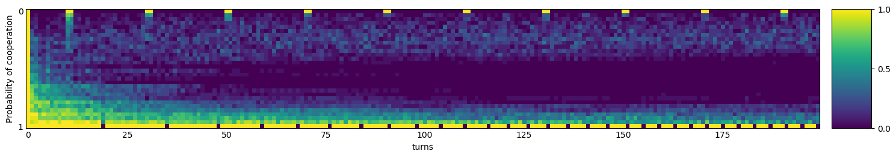

[data (csv)](./assets/transitive_RichardHufford.csv)


[data (csv)](./assets/transitive_v_short_RichardHufford.csv)
    

## Ripoff


[data (csv)](./assets/Ripoff.csv)

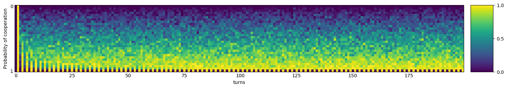

[data (csv)](./assets/transitive_Ripoff.csv)


[data (csv)](./assets/transitive_v_short_Ripoff.csv)
    

## Risky QLearner


[data (csv)](./assets/Risky_QLearner.csv)

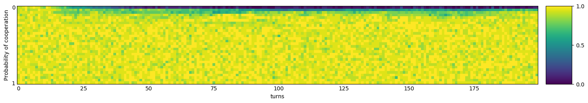

[data (csv)](./assets/transitive_Risky_QLearner.csv)


[data (csv)](./assets/transitive_v_short_Risky_QLearner.csv)
    

## SelfSteem

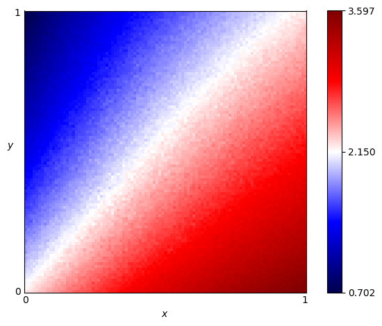

[data (csv)](./assets/SelfSteem.csv)

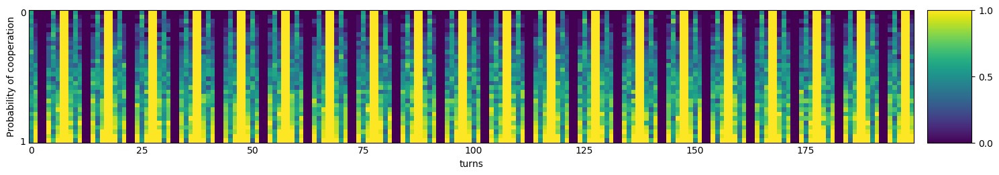

[data (csv)](./assets/transitive_SelfSteem.csv)


[data (csv)](./assets/transitive_v_short_SelfSteem.csv)
    

## ShortMem

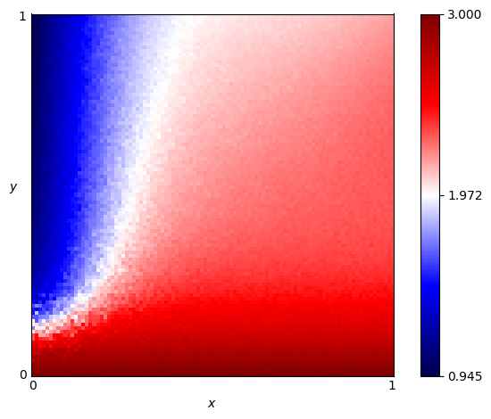

[data (csv)](./assets/ShortMem.csv)

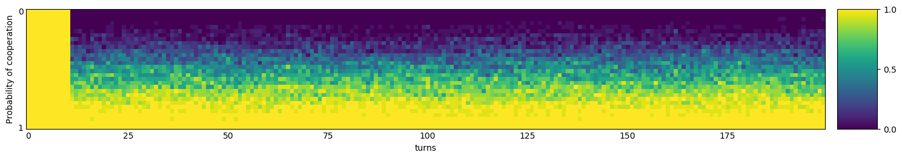

[data (csv)](./assets/transitive_ShortMem.csv)


[data (csv)](./assets/transitive_v_short_ShortMem.csv)
    

## Shubik

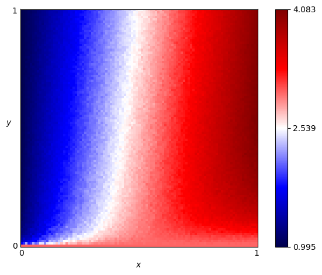

[data (csv)](./assets/Shubik.csv)

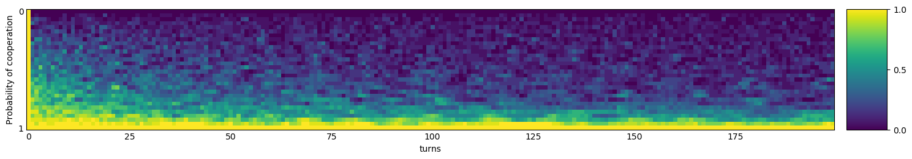

[data (csv)](./assets/transitive_Shubik.csv)


[data (csv)](./assets/transitive_v_short_Shubik.csv)
    

## Slow Tit For Two Tats 2

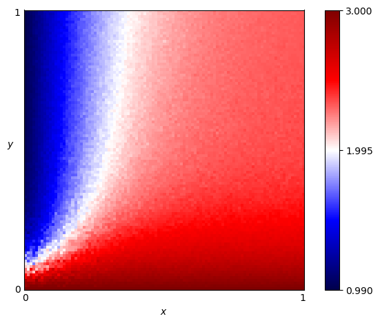

[data (csv)](./assets/Slow_Tit_For_Two_Tats_2.csv)

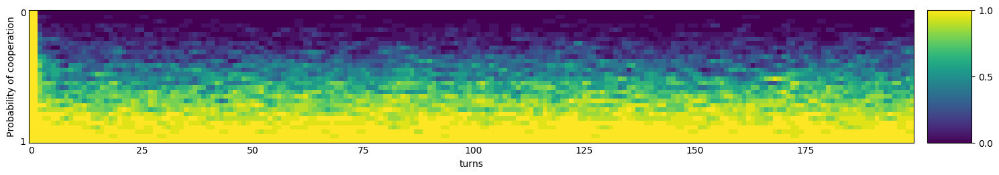

[data (csv)](./assets/transitive_Slow_Tit_For_Two_Tats_2.csv)


[data (csv)](./assets/transitive_v_short_Slow_Tit_For_Two_Tats_2.csv)
    

## Sneaky Tit For Tat


[data (csv)](./assets/Sneaky_Tit_For_Tat.csv)

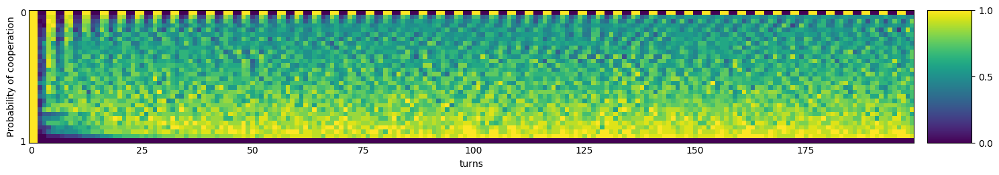

[data (csv)](./assets/transitive_Sneaky_Tit_For_Tat.csv)


[data (csv)](./assets/transitive_v_short_Sneaky_Tit_For_Tat.csv)
    

## Soft Grudger


[data (csv)](./assets/Soft_Grudger.csv)

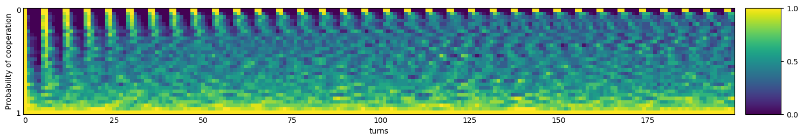

[data (csv)](./assets/transitive_Soft_Grudger.csv)


[data (csv)](./assets/transitive_v_short_Soft_Grudger.csv)
    

## Soft Joss

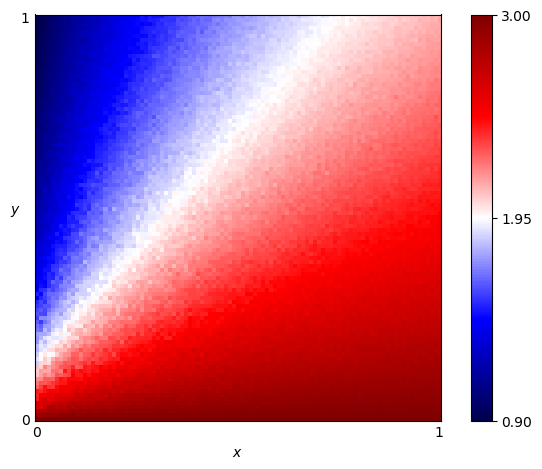

[data (csv)](./assets/Soft_Joss.csv)

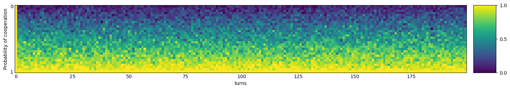

[data (csv)](./assets/transitive_Soft_Joss.csv)


[data (csv)](./assets/transitive_v_short_Soft_Joss.csv)
    

## SolutionB1


[data (csv)](./assets/SolutionB1.csv)

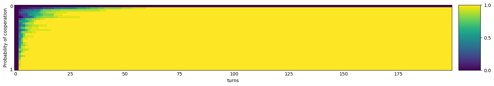

[data (csv)](./assets/transitive_SolutionB1.csv)


[data (csv)](./assets/transitive_v_short_SolutionB1.csv)
    

## SolutionB5


[data (csv)](./assets/SolutionB5.csv)

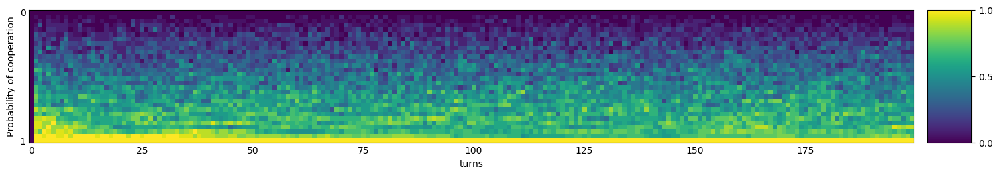

[data (csv)](./assets/transitive_SolutionB5.csv)


[data (csv)](./assets/transitive_v_short_SolutionB5.csv)
    

## Spiteful Tit For Tat


[data (csv)](./assets/Spiteful_Tit_For_Tat.csv)

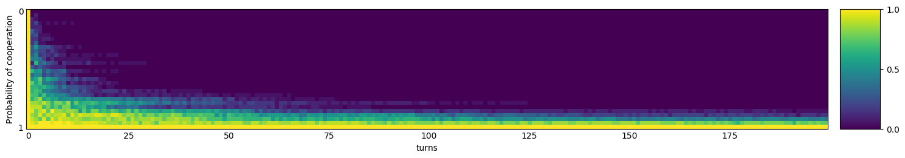

[data (csv)](./assets/transitive_Spiteful_Tit_For_Tat.csv)


[data (csv)](./assets/transitive_v_short_Spiteful_Tit_For_Tat.csv)
    

## Stalker


[data (csv)](./assets/Stalker.csv)

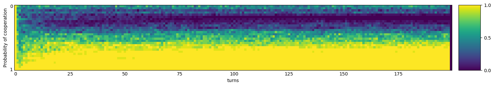

[data (csv)](./assets/transitive_Stalker.csv)


[data (csv)](./assets/transitive_v_short_Stalker.csv)
    

## Stein and Rapoport


[data (csv)](./assets/Stein_and_Rapoport.csv)

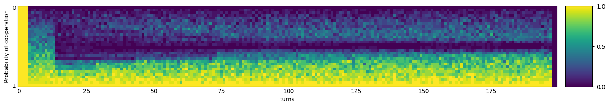

[data (csv)](./assets/transitive_Stein_and_Rapoport.csv)


[data (csv)](./assets/transitive_v_short_Stein_and_Rapoport.csv)
    

## Stochastic Cooperator


[data (csv)](./assets/Stochastic_Cooperator.csv)

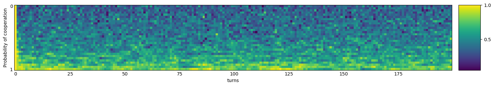

[data (csv)](./assets/transitive_Stochastic_Cooperator.csv)


[data (csv)](./assets/transitive_v_short_Stochastic_Cooperator.csv)
    

## Stochastic WSLS

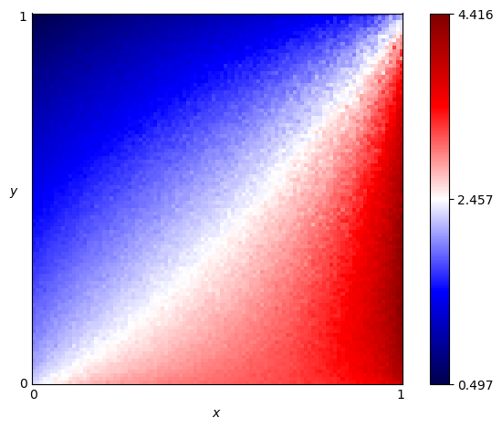

[data (csv)](./assets/Stochastic_WSLS.csv)

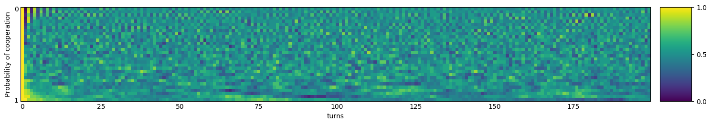

[data (csv)](./assets/transitive_Stochastic_WSLS.csv)


[data (csv)](./assets/transitive_v_short_Stochastic_WSLS.csv)
    

## Suspicious Tit For Tat

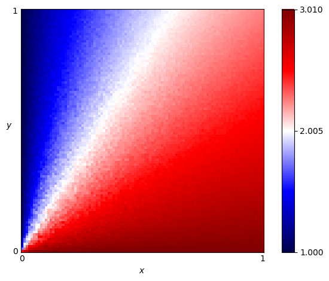

[data (csv)](./assets/Suspicious_Tit_For_Tat.csv)

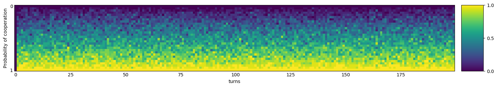

[data (csv)](./assets/transitive_Suspicious_Tit_For_Tat.csv)


[data (csv)](./assets/transitive_v_short_Suspicious_Tit_For_Tat.csv)
    

## Tester


[data (csv)](./assets/Tester.csv)

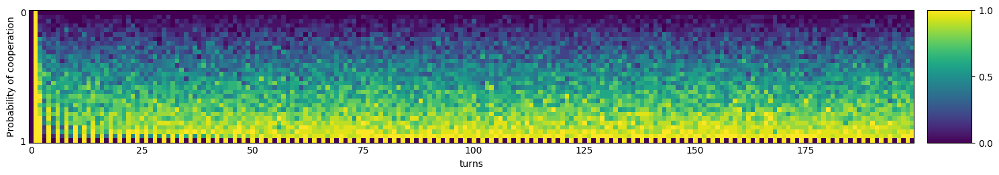

[data (csv)](./assets/transitive_Tester.csv)


[data (csv)](./assets/transitive_v_short_Tester.csv)
    

## TF1


[data (csv)](./assets/TF1.csv)

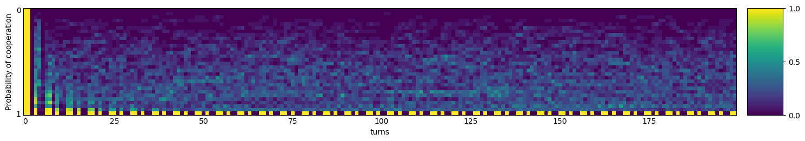

[data (csv)](./assets/transitive_TF1.csv)


[data (csv)](./assets/transitive_v_short_TF1.csv)
    

## TF2


[data (csv)](./assets/TF2.csv)

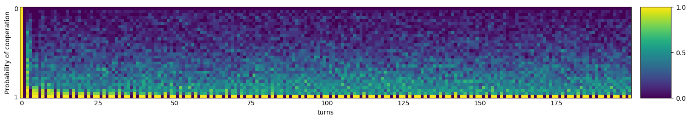

[data (csv)](./assets/transitive_TF2.csv)


[data (csv)](./assets/transitive_v_short_TF2.csv)
    

## TF3

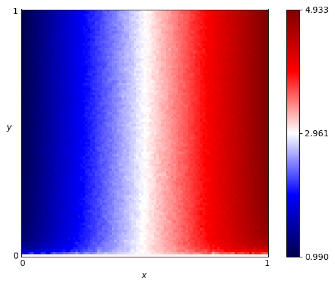

[data (csv)](./assets/TF3.csv)

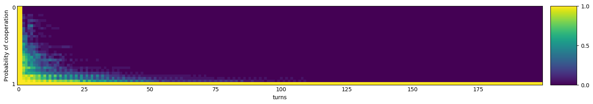

[data (csv)](./assets/transitive_TF3.csv)


[data (csv)](./assets/transitive_v_short_TF3.csv)
    

## ThueMorse


[data (csv)](./assets/ThueMorse.csv)

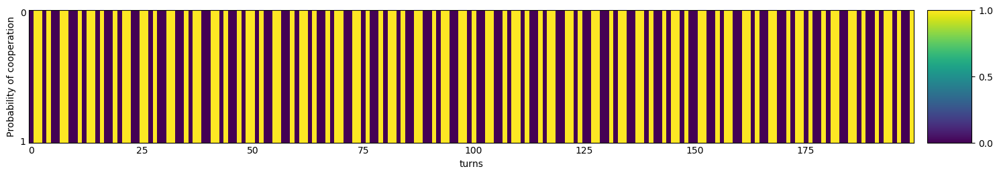

[data (csv)](./assets/transitive_ThueMorse.csv)


[data (csv)](./assets/transitive_v_short_ThueMorse.csv)
    

## ThueMorseInverse


[data (csv)](./assets/ThueMorseInverse.csv)

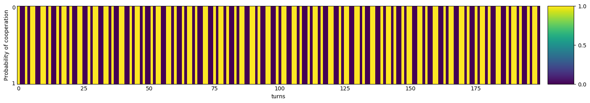

[data (csv)](./assets/transitive_ThueMorseInverse.csv)


[data (csv)](./assets/transitive_v_short_ThueMorseInverse.csv)
    

## Thumper

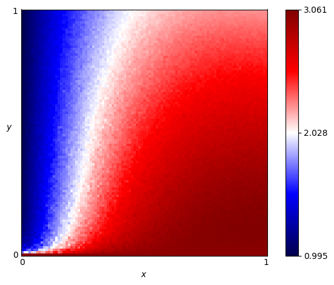

[data (csv)](./assets/Thumper.csv)

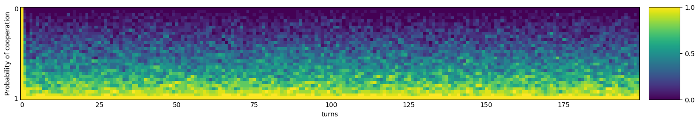

[data (csv)](./assets/transitive_Thumper.csv)


[data (csv)](./assets/transitive_v_short_Thumper.csv)
    

## Tideman and Chieruzzi

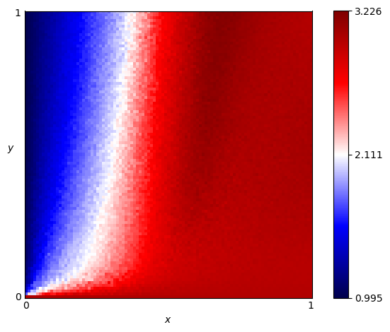

[data (csv)](./assets/Tideman_and_Chieruzzi.csv)

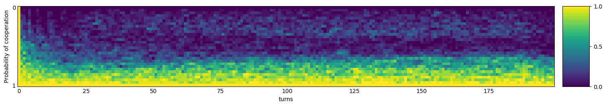

[data (csv)](./assets/transitive_Tideman_and_Chieruzzi.csv)


[data (csv)](./assets/transitive_v_short_Tideman_and_Chieruzzi.csv)
    

## Tit For Tat


[data (csv)](./assets/Tit_For_Tat.csv)

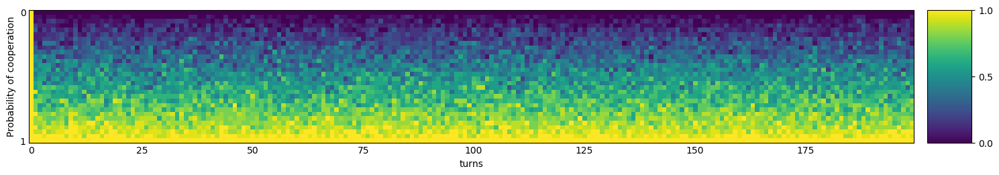

[data (csv)](./assets/transitive_Tit_For_Tat.csv)


[data (csv)](./assets/transitive_v_short_Tit_For_Tat.csv)
    

## Tit For 2 Tats


[data (csv)](./assets/Tit_For_2_Tats.csv)

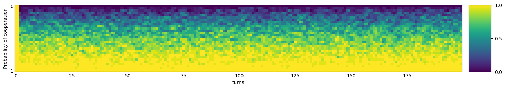

[data (csv)](./assets/transitive_Tit_For_2_Tats.csv)


[data (csv)](./assets/transitive_v_short_Tit_For_2_Tats.csv)
    

## Tranquilizer

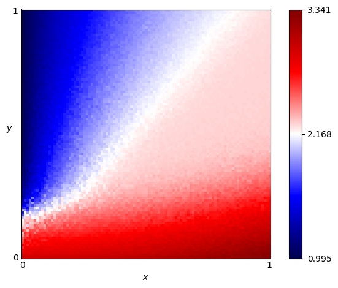

[data (csv)](./assets/Tranquilizer.csv)

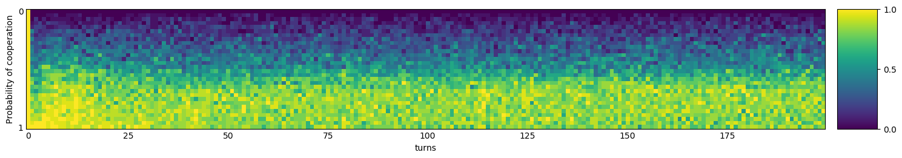

[data (csv)](./assets/transitive_Tranquilizer.csv)


[data (csv)](./assets/transitive_v_short_Tranquilizer.csv)
    

## Tricky Cooperator


[data (csv)](./assets/Tricky_Cooperator.csv)

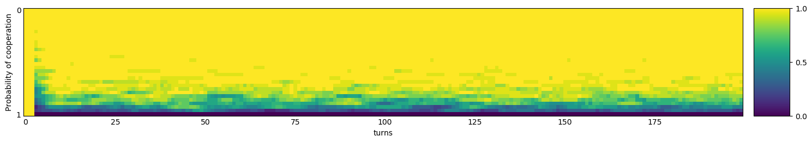

[data (csv)](./assets/transitive_Tricky_Cooperator.csv)


[data (csv)](./assets/transitive_v_short_Tricky_Cooperator.csv)
    

## Tricky Defector

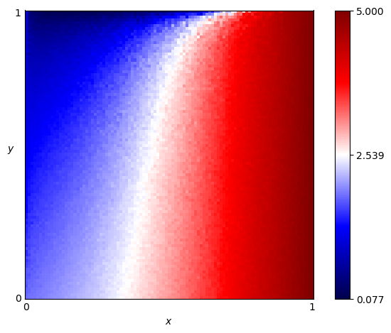

[data (csv)](./assets/Tricky_Defector.csv)

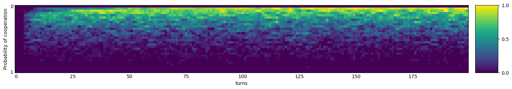

[data (csv)](./assets/transitive_Tricky_Defector.csv)


[data (csv)](./assets/transitive_v_short_Tricky_Defector.csv)
    

## Tricky Level Punisher

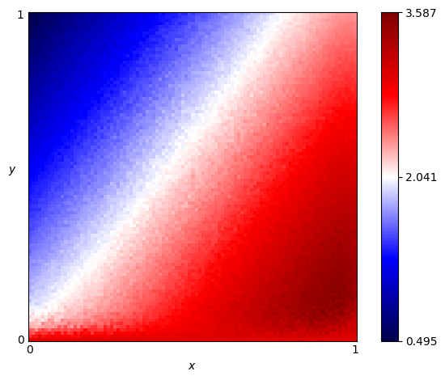

[data (csv)](./assets/Tricky_Level_Punisher.csv)

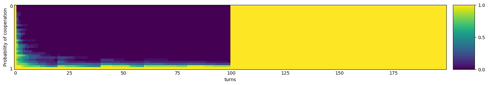

[data (csv)](./assets/transitive_Tricky_Level_Punisher.csv)


[data (csv)](./assets/transitive_v_short_Tricky_Level_Punisher.csv)
    

## Tullock


[data (csv)](./assets/Tullock.csv)

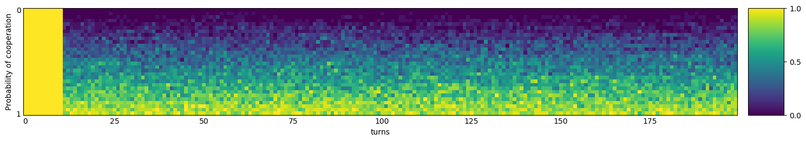

[data (csv)](./assets/transitive_Tullock.csv)


[data (csv)](./assets/transitive_v_short_Tullock.csv)
    

## Two Tits For Tat


[data (csv)](./assets/Two_Tits_For_Tat.csv)

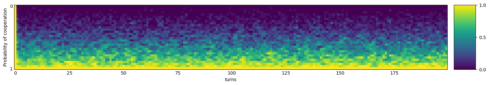

[data (csv)](./assets/transitive_Two_Tits_For_Tat.csv)


[data (csv)](./assets/transitive_v_short_Two_Tits_For_Tat.csv)
    

## VeryBad


[data (csv)](./assets/VeryBad.csv)

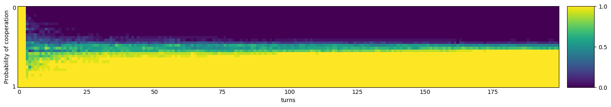

[data (csv)](./assets/transitive_VeryBad.csv)


[data (csv)](./assets/transitive_v_short_VeryBad.csv)
    

## Weiner

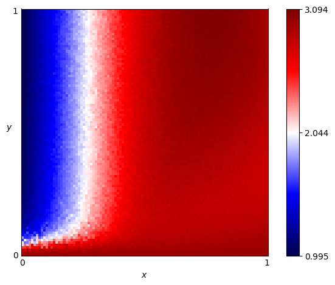

[data (csv)](./assets/Weiner.csv)

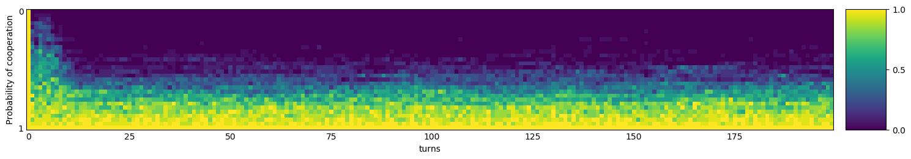

[data (csv)](./assets/transitive_Weiner.csv)


[data (csv)](./assets/transitive_v_short_Weiner.csv)
    

## White

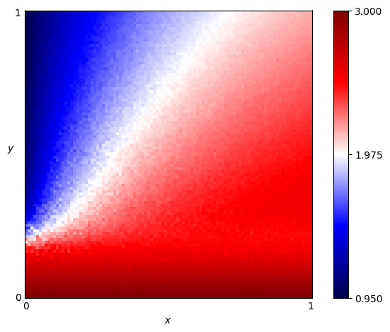

[data (csv)](./assets/White.csv)

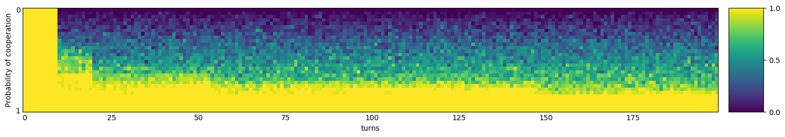

[data (csv)](./assets/transitive_White.csv)


[data (csv)](./assets/transitive_v_short_White.csv)
    

## Willing


[data (csv)](./assets/Willing.csv)

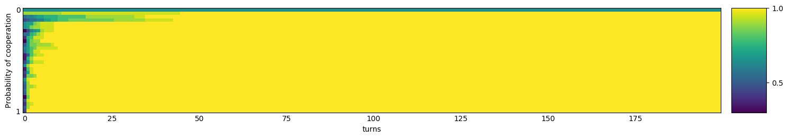

[data (csv)](./assets/transitive_Willing.csv)


[data (csv)](./assets/transitive_v_short_Willing.csv)
    

## Winner12

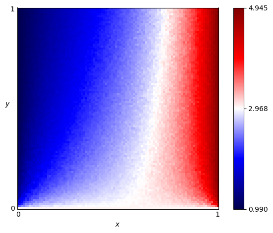

[data (csv)](./assets/Winner12.csv)

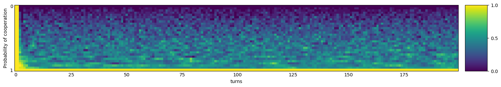

[data (csv)](./assets/transitive_Winner12.csv)


[data (csv)](./assets/transitive_v_short_Winner12.csv)
    

## Winner21


[data (csv)](./assets/Winner21.csv)

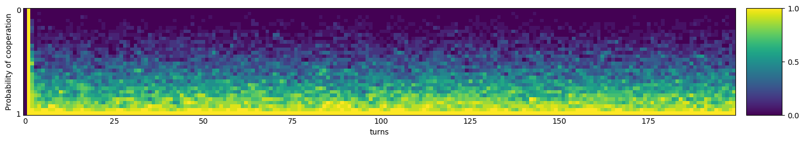

[data (csv)](./assets/transitive_Winner21.csv)


[data (csv)](./assets/transitive_v_short_Winner21.csv)
    

## Win-Shift Lose-Stay

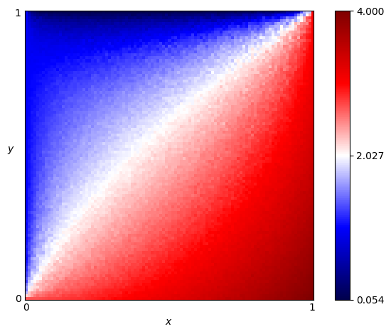

[data (csv)](./assets/Win-Shift_Lose-Stay.csv)

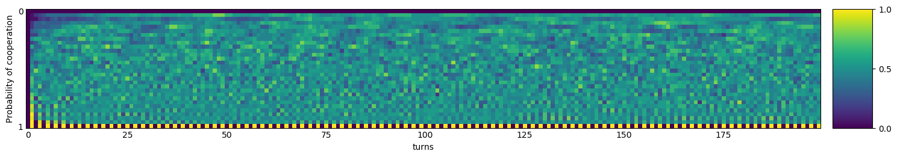

[data (csv)](./assets/transitive_Win-Shift_Lose-Stay.csv)


[data (csv)](./assets/transitive_v_short_Win-Shift_Lose-Stay.csv)
    

## Win-Stay Lose-Shift


[data (csv)](./assets/Win-Stay_Lose-Shift.csv)

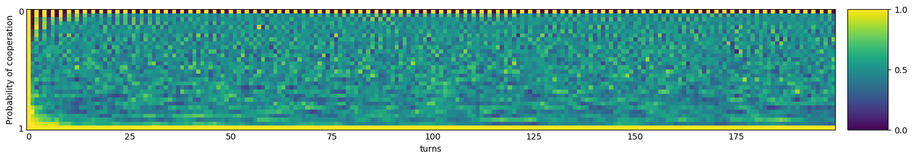

[data (csv)](./assets/transitive_Win-Stay_Lose-Shift.csv)


[data (csv)](./assets/transitive_v_short_Win-Stay_Lose-Shift.csv)
    

## WmAdams

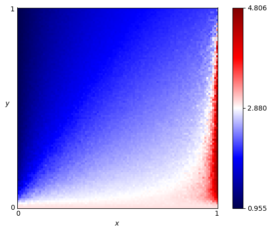

[data (csv)](./assets/WmAdams.csv)

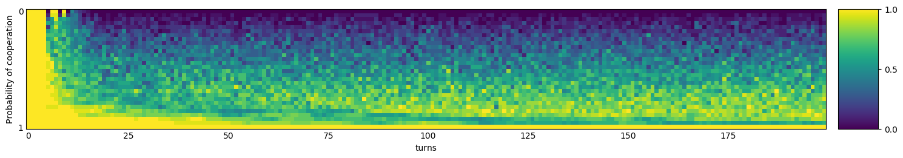

[data (csv)](./assets/transitive_WmAdams.csv)


[data (csv)](./assets/transitive_v_short_WmAdams.csv)
    

## Worse and Worse

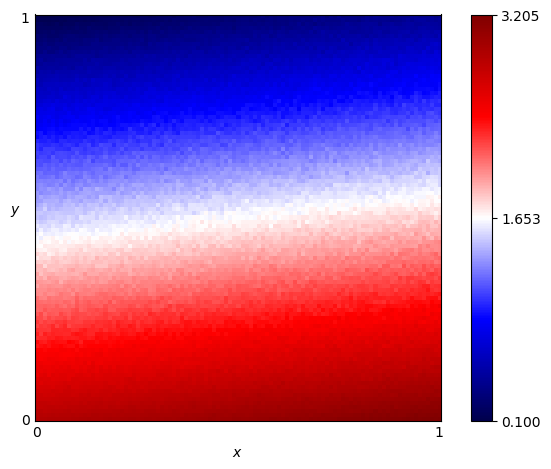

[data (csv)](./assets/Worse_and_Worse.csv)

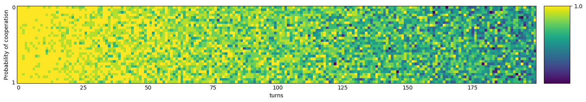

[data (csv)](./assets/transitive_Worse_and_Worse.csv)


[data (csv)](./assets/transitive_v_short_Worse_and_Worse.csv)
    

## Worse and Worse 2


[data (csv)](./assets/Worse_and_Worse_2.csv)

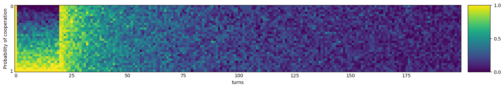

[data (csv)](./assets/transitive_Worse_and_Worse_2.csv)


[data (csv)](./assets/transitive_v_short_Worse_and_Worse_2.csv)
    

## Worse and Worse 3


[data (csv)](./assets/Worse_and_Worse_3.csv)

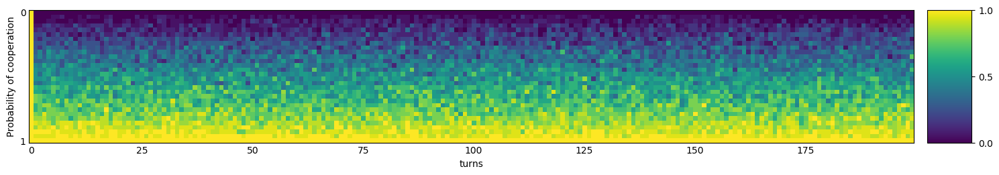

[data (csv)](./assets/transitive_Worse_and_Worse_3.csv)


[data (csv)](./assets/transitive_v_short_Worse_and_Worse_3.csv)
    

## Yamachi

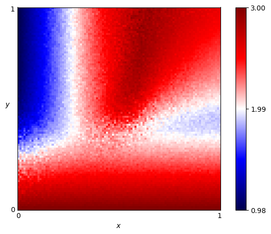

[data (csv)](./assets/Yamachi.csv)

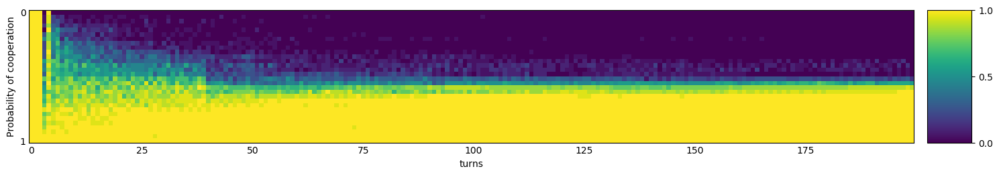

[data (csv)](./assets/transitive_Yamachi.csv)


[data (csv)](./assets/transitive_v_short_Yamachi.csv)
    

## ZD-Extortion

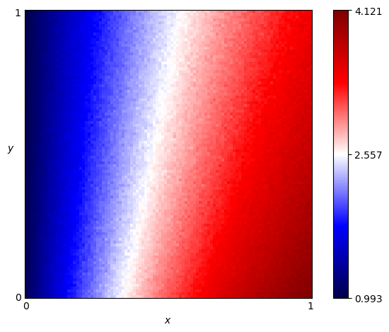

[data (csv)](./assets/ZD-Extortion.csv)

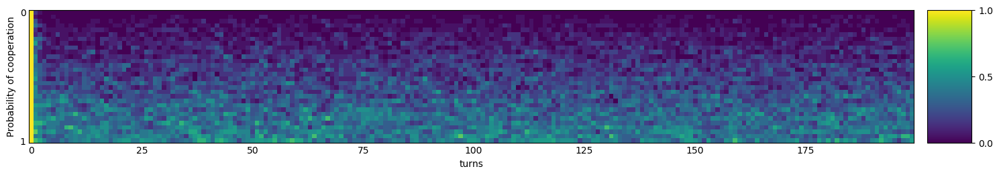

[data (csv)](./assets/transitive_ZD-Extortion.csv)


[data (csv)](./assets/transitive_v_short_ZD-Extortion.csv)
    

## ZD-Extort-2

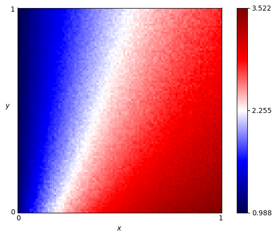

[data (csv)](./assets/ZD-Extort-2.csv)

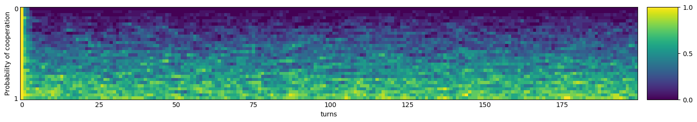

[data (csv)](./assets/transitive_ZD-Extort-2.csv)


[data (csv)](./assets/transitive_v_short_ZD-Extort-2.csv)
    

## ZD-Extort3

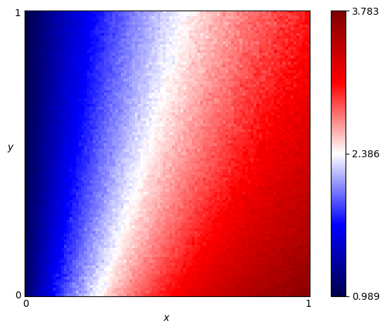

[data (csv)](./assets/ZD-Extort3.csv)

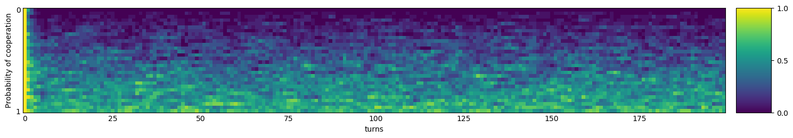

[data (csv)](./assets/transitive_ZD-Extort3.csv)


[data (csv)](./assets/transitive_v_short_ZD-Extort3.csv)
    

## ZD-Extort-2 v2


[data (csv)](./assets/ZD-Extort-2_v2.csv)

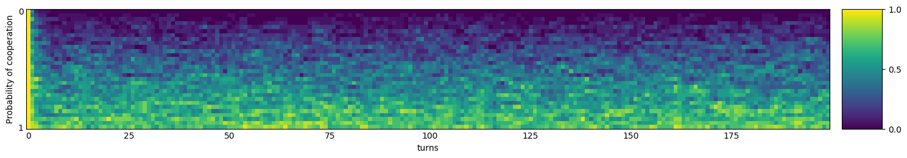

[data (csv)](./assets/transitive_ZD-Extort-2_v2.csv)


[data (csv)](./assets/transitive_v_short_ZD-Extort-2_v2.csv)
    

## ZD-Extort-4

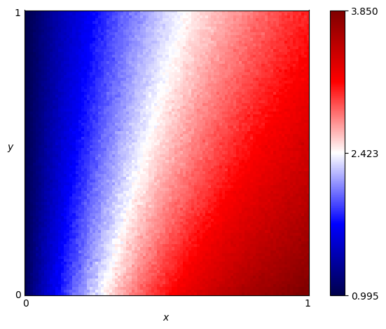

[data (csv)](./assets/ZD-Extort-4.csv)

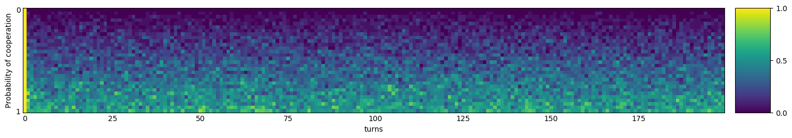

[data (csv)](./assets/transitive_ZD-Extort-4.csv)


[data (csv)](./assets/transitive_v_short_ZD-Extort-4.csv)
    

## ZD-GTFT-2

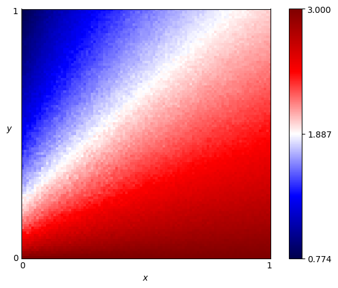

[data (csv)](./assets/ZD-GTFT-2.csv)

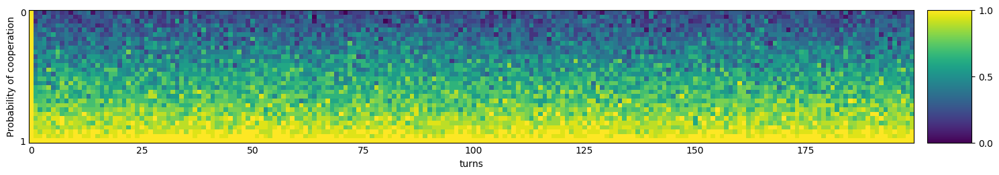

[data (csv)](./assets/transitive_ZD-GTFT-2.csv)


[data (csv)](./assets/transitive_v_short_ZD-GTFT-2.csv)
    

## ZD-GEN-2


[data (csv)](./assets/ZD-GEN-2.csv)

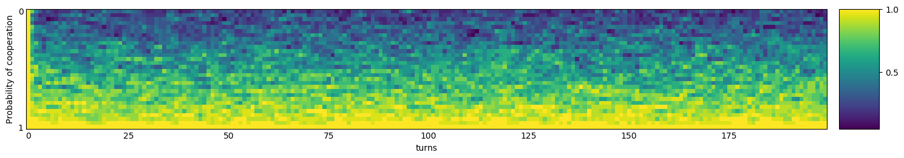

[data (csv)](./assets/transitive_ZD-GEN-2.csv)


[data (csv)](./assets/transitive_v_short_ZD-GEN-2.csv)
    

## ZD-Mem2

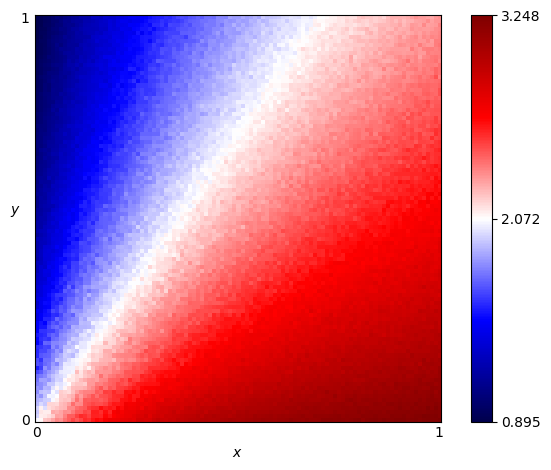

[data (csv)](./assets/ZD-Mem2.csv)

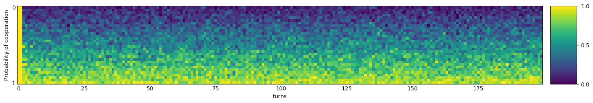

[data (csv)](./assets/transitive_ZD-Mem2.csv)


[data (csv)](./assets/transitive_v_short_ZD-Mem2.csv)
    

## ZD-Mischief

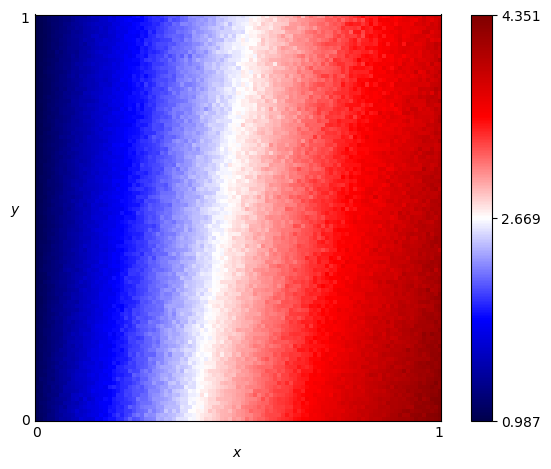

[data (csv)](./assets/ZD-Mischief.csv)

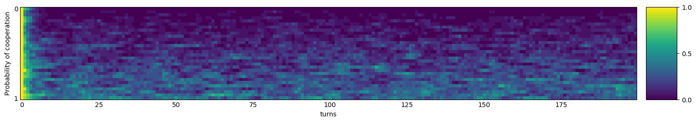

[data (csv)](./assets/transitive_ZD-Mischief.csv)


[data (csv)](./assets/transitive_v_short_ZD-Mischief.csv)
    

## ZD-SET-2


[data (csv)](./assets/ZD-SET-2.csv)

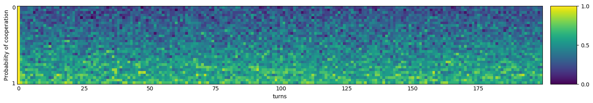

[data (csv)](./assets/transitive_ZD-SET-2.csv)


[data (csv)](./assets/transitive_v_short_ZD-SET-2.csv)
    

## $e$


[data (csv)](./assets/e.csv)

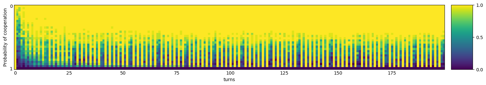

[data (csv)](./assets/transitive_e.csv)


[data (csv)](./assets/transitive_v_short_e.csv)
    

## Dynamic Two Tits For Tat


[data (csv)](./assets/Dynamic_Two_Tits_For_Tat.csv)

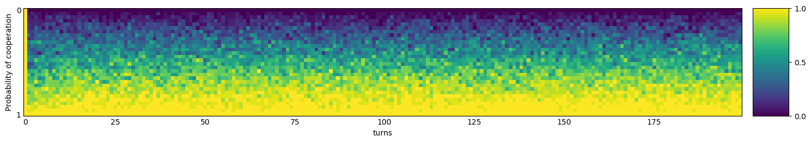

[data (csv)](./assets/transitive_Dynamic_Two_Tits_For_Tat.csv)


[data (csv)](./assets/transitive_v_short_Dynamic_Two_Tits_For_Tat.csv)
    

## Meta Hunter

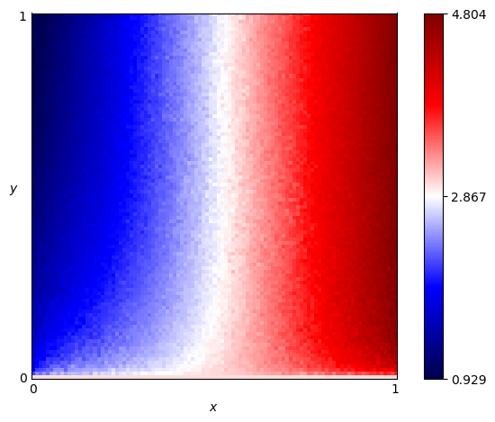

[data (csv)](./assets/Meta_Hunter.csv)

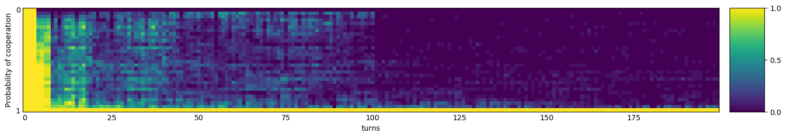

[data (csv)](./assets/transitive_Meta_Hunter.csv)


[data (csv)](./assets/transitive_v_short_Meta_Hunter.csv)
    

## Meta Hunter Aggressive

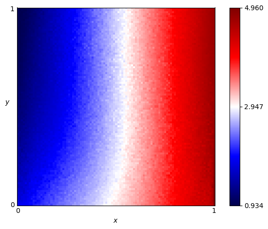

[data (csv)](./assets/Meta_Hunter_Aggressive.csv)

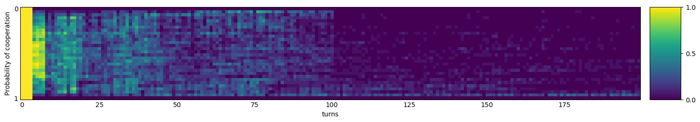

[data (csv)](./assets/transitive_Meta_Hunter_Aggressive.csv)


[data (csv)](./assets/transitive_v_short_Meta_Hunter_Aggressive.csv)
    

## Meta Majority Memory One


[data (csv)](./assets/Meta_Majority_Memory_One.csv)

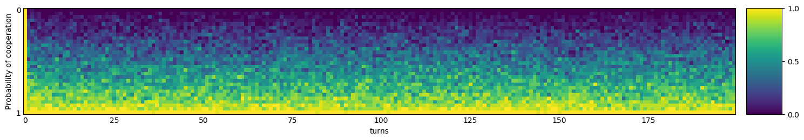

[data (csv)](./assets/transitive_Meta_Majority_Memory_One.csv)


[data (csv)](./assets/transitive_v_short_Meta_Majority_Memory_One.csv)
    

## Meta Winner Memory One


[data (csv)](./assets/Meta_Winner_Memory_One.csv)

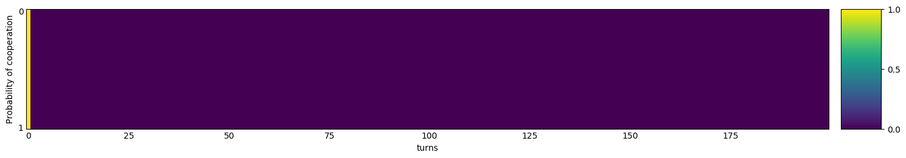

[data (csv)](./assets/transitive_Meta_Winner_Memory_One.csv)


[data (csv)](./assets/transitive_v_short_Meta_Winner_Memory_One.csv)
    

## NMWE Memory One

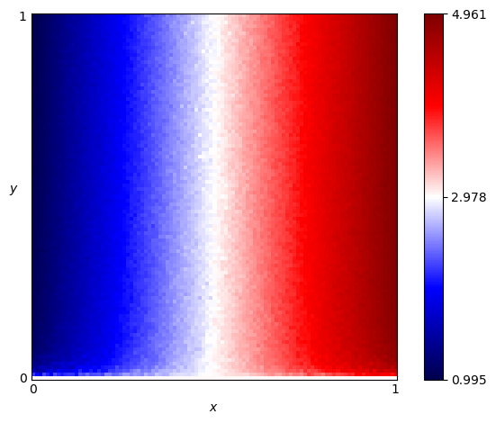

[data (csv)](./assets/NMWE_Memory_One.csv)

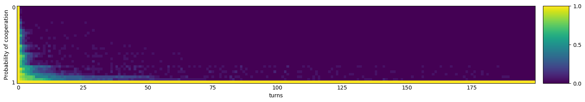

[data (csv)](./assets/transitive_NMWE_Memory_One.csv)


[data (csv)](./assets/transitive_v_short_NMWE_Memory_One.csv)
    